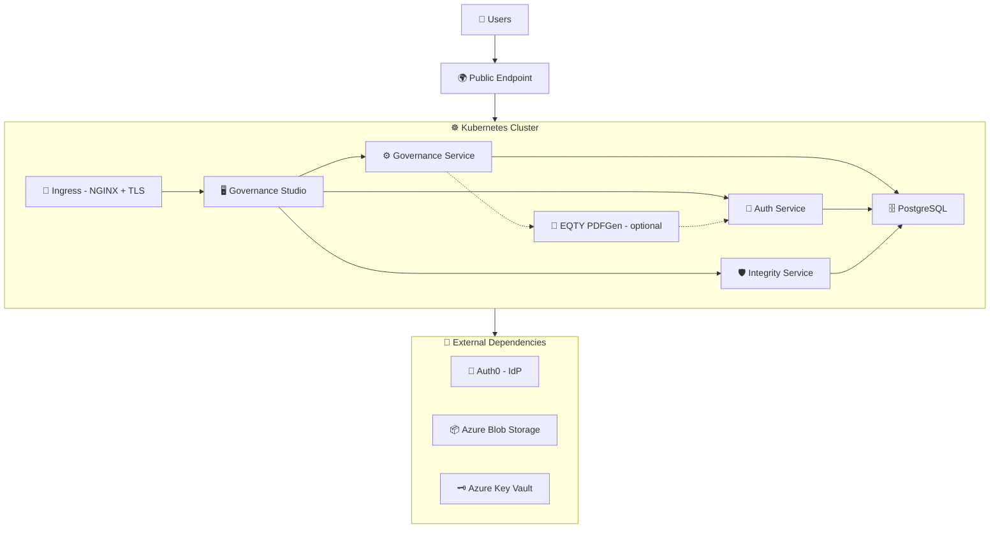

# Governance Platform Deployment Guide (Auth0 + Azure)

End-to-end guide for deploying the EQTY Lab Governance Platform on Kubernetes with Auth0 as the identity provider, Azure Blob Storage for object storage, and Azure Key Vault for key management.

> **Note on tenant IDs in this guide.** Auth0 hosts the **user** identity provider (a separate cloud service at `<your-tenant>.auth0.com`). Azure Key Vault still authenticates a separate service principal in an **Azure AD** tenant. These are two different tenants — wherever this doc says "Azure tenant ID", it means the Azure AD tenant that owns the Key Vault SP, not your Auth0 tenant.

## Table of Contents

1. [Overview](#1-overview)
2. [Prerequisites](#2-prerequisites)
3. [Infrastructure Setup](#3-infrastructure-setup)
4. [Domain & TLS Configuration](#4-domain--tls-configuration)
5. [Configuring Auth0](#5-configuring-auth0)
6. [Generating Configuration with govctl](#6-generating-configuration-with-govctl)
7. [Running Auth0 Bootstrap](#7-running-auth0-bootstrap)
8. [Creating Kubernetes Secrets](#8-creating-kubernetes-secrets)
9. [Configuring values.yaml](#9-configuring-valuesyaml)
10. [Deploying the Governance Platform](#10-deploying-the-governance-platform)
11. [Post-Install Setup & Verification](#11-post-install-setup--verification)

---

## 1. Overview

### What You're Deploying

The Governance Platform consists of four microservices deployed via a single Helm umbrella chart (`governance-platform`), backed by a PostgreSQL database, and integrated with Auth0 for identity and access management.

### Architecture



### Platform Services

| Service                | Language | Description                                   | Ingress Path          |
| ---------------------- | -------- | --------------------------------------------- | --------------------- |
| **auth-service**       | Go       | Authentication, authorization, token exchange | `/authService/`       |
| **eqty-pdfgen**        | Python   | Optional manifest → PDF/ZIP rendering         | Internal only         |
| **governance-service** | Go       | Backend API, workflow engine, worker          | `/governanceService/` |
| **governance-studio**  | React    | Web UI for governance workflows               | `/`                   |
| **integrity-service**  | Rust     | Verifiable credentials and lineage tracking   | `/integrityService/`  |
| **PostgreSQL**         | —        | Shared database (Bitnami Helm chart)          | Internal only         |

All four application services are exposed through a single domain via NGINX Ingress with path-based routing. PostgreSQL is internal to the cluster.

### External Dependencies

These components live **outside** the `governance-platform` Helm chart and must be provisioned separately before deploying.

| Dependency             | Purpose                                                            | Required? |
| ---------------------- | ------------------------------------------------------------------ | --------- |
| **Auth0**              | Identity provider — manages users, applications, OAuth flows       | Yes       |
| **Azure Blob Storage** | Artifact and document storage                                      | Yes       |
| **Azure Key Vault**    | DID signing key management for verifiable credentials              | Yes       |
| **DNS**                | A-record or CNAME pointing your domain to the cluster ingress      | Yes       |
| **TLS Certificates**   | cert-manager with a ClusterIssuer/Issuer, or pre-provisioned certs | Yes       |

### Helm Chart Structure

The deployment uses an **umbrella chart pattern**. You deploy a single chart (`governance-platform`) which pulls in all subcharts as dependencies:

```
charts/
├── governance-platform/     # Umbrella chart — deploy this
│   ├── Chart.yaml           # Declares subchart dependencies
│   ├── values.yaml          # Default values for all services
│   ├── templates/           # Shared resources (secrets, config)
│   └── examples/            # Ready-to-use values files
│       ├── values-auth0.yaml         # Auth0 deployment example
│       ├── values-entra.yaml         # Microsoft Entra ID deployment example
│       ├── values-keycloak.yaml      # Keycloak deployment example
│       └── secrets-sample.yaml       # Secrets template
├── auth-service/            # Authentication subchart
├── governance-service/      # Backend API subchart
├── governance-studio/       # Frontend subchart
├── integrity-service/       # Credentials/lineage subchart
└── auth0-bootstrap/         # Auth0 tenant configuration (standalone)
```

The `auth0-bootstrap` chart is deployed **separately** — it runs a one-time Kubernetes Job that creates applications, a resource server (the Governance Platform API), custom scopes, client grants, the platform admin user, and two Auth0 Actions that enrich tokens with organization, role, and service-account claims.

### Applications & API

The Auth0 bootstrap creates three applications and one resource server (API) in your Auth0 tenant:

| Resource                       | Type                          | Purpose                                                                                                           |
| ------------------------------ | ----------------------------- | ----------------------------------------------------------------------------------------------------------------- |
| `Governance Platform Frontend` | Single Page Application (SPA) | Browser-based authentication for governance-studio using PKCE auth code flow (`token_endpoint_auth_method: none`) |
| `Governance Platform Backend`  | Machine-to-Machine (M2M)      | `client_credentials` grant; token validation, Auth0 Management API user lookups                                   |
| `Governance Worker`            | Machine-to-Machine (M2M)      | `client_credentials` grant; automated governance workflow execution                                               |
| `Governance Platform API`      | Resource server               | Audience for backend/worker tokens; declares the custom scopes (`governance:declarations:create`, etc.)           |

### Deployment Flow

The end-to-end deployment follows this order:

```
1. Provision infrastructure (Azure Blob, Key Vault, DNS, TLS)
         │
2. Configure Auth0 (create bootstrap M2M application)
         │
3. Generate configuration with govctl (bootstrap, secrets, values files)
         │
4. Run auth0-bootstrap (creates applications, API, scopes, client grants, admin user, Actions in Auth0)
         │
5. Create Kubernetes secrets (uses backend / worker client credentials from bootstrap logs)
         │
6. Configure values.yaml
         │
7. Deploy governance-platform (Helm umbrella chart)
         │
         ├── PostgreSQL starts, initializes databases
         ├── governance-service starts, runs migrations
         ├── auth-service, integrity-service, governance-studio start
         ├── Post-install hook creates organization + admin user in DB (if enabled)
         │
8. Post-install verification
```

> **Key ordering note:** The `auth0-bootstrap` chart must be run **before** deploying the governance-platform, because the platform services need valid OAuth client credentials at startup. The governance-platform chart includes a Helm post-install hook that automatically creates the organization and platform-admin user in the database after deployment, resolving the Auth0 `user_id` via the Management API.

---

## 2. Prerequisites

### Tools

| Tool        | Minimum Version | Purpose                                                     |
| ----------- | --------------- | ----------------------------------------------------------- |
| **kubectl** | 1.29+           | Kubernetes cluster management                               |
| **Helm**    | 4.0+            | Chart deployment                                            |
| **az**      | 2.50+           | Azure CLI (for Blob Storage, Key Vault, and DNS setup only) |
| **jq**      | 1.6+            | JSON processing (used by helper scripts)                    |
| **openssl** | —               | Generating random secrets                                   |

> **No IdP-specific CLI is required.** Auth0 is configured entirely via its Management API by the `auth0-bootstrap` Kubernetes Job. The Azure CLI (`az`) is needed only for the Azure-side infrastructure (Blob Storage and Key Vault), not for the IdP — there is no `az ad` involvement in this guide.

### Kubernetes Cluster

- Kubernetes **1.29+** with RBAC enabled
- **NGINX Ingress Controller** installed and configured as the default ingress class (see [`scripts/nginx.sh`](../../scripts/nginx.sh))
- **cert-manager** installed with a ClusterIssuer or Issuer configured for TLS (see [`scripts/cert-issuer.sh`](../../scripts/cert-issuer.sh))
- Sufficient resources for the platform (recommended minimums):

| Component          | CPU Request | Memory Request | Storage  |
| ------------------ | ----------- | -------------- | -------- |
| auth-service       | 250m        | 256Mi          | —        |
| eqty-pdfgen        | 100m        | 256Mi          | —        |
| governance-service | 250m        | 256Mi          | —        |
| governance-studio  | 100m        | 128Mi          | —        |
| integrity-service  | 250m        | 256Mi          | —        |
| PostgreSQL         | 500m        | 1Gi            | 10Gi PVC |

### Auth0 Tenant

An Auth0 tenant with the following:

- **Tenant domain** (e.g., `your-tenant.us.auth0.com`)
- A **Machine-to-Machine application** in the Auth0 Dashboard, authorized for the **Auth0 Management API** with the following scopes:
  - `read:clients`, `create:clients`, `update:clients`
  - `read:resource_servers`, `create:resource_servers`, `update:resource_servers`
  - `read:client_grants`, `create:client_grants`, `update:client_grants`
  - `read:users`, `create:users`, `update:users`
  - `read:actions`, `create:actions`, `update:actions`, `delete:actions`
- A **platform admin email** — the user will be created in the configured Auth0 database connection (default: `Username-Password-Authentication`)
- Network connectivity from the Kubernetes cluster to `https://<your-tenant>.auth0.com`

You will need:

- **Auth0 tenant domain** — found in the Auth0 Dashboard under Settings → Tenant Settings
- **Bootstrap M2M client ID and client secret** — from your Management API M2M application's Settings tab
- **Platform admin email** — your choice; the bootstrap job will create this user in Auth0

### Container Registry Access

Platform images are hosted on GitHub Container Registry (GHCR). You need:

- A **GitHub Personal Access Token (PAT)** with `read:packages` scope
- Or access to a mirror registry containing the platform images

### Cloud Provider Resources

Provision the following **before** deployment:

- **Azure Blob Storage** — Storage account + containers for governance artifacts and integrity store
- **Azure Key Vault** — Vault + service principal with key create/delete/sign/verify permissions (the auth-service creates per-user DID signing keys at login time)

### DNS

A domain name (or subdomain) that you control, with the ability to create A-records or CNAMEs pointing to your cluster's ingress controller external IP.

The platform uses a **single domain** with path-based routing:

| URL Path                                                | Service                  |
| ------------------------------------------------------- | ------------------------ |
| `https://governance.your-domain.com/authService/`       | auth-service             |
| `https://governance.your-domain.com/governanceService/` | governance-service (API) |
| `https://governance.your-domain.com/`                   | governance-studio (UI)   |
| `https://governance.your-domain.com/integrityService/`  | integrity-service        |

No separate IdP domain is needed — Auth0 is a cloud-hosted service at `https://<your-tenant>.auth0.com`.

### Checklist

Before proceeding, confirm:

- [ ] Kubernetes cluster is running and `kubectl` is configured
- [ ] NGINX Ingress Controller is installed
- [ ] cert-manager is installed with a working Issuer/ClusterIssuer
- [ ] Auth0 tenant is accessible
- [ ] Bootstrap M2M application is created and authorized for the Management API with the required scopes
- [ ] Platform admin email is chosen
- [ ] Azure Storage account and containers are provisioned
- [ ] Azure Key Vault is provisioned with a service principal that has key + secret permissions
- [ ] DNS domain is available and you can create records
- [ ] GitHub PAT with `read:packages` scope is available
- [ ] Helm 4.0+ and kubectl 1.29+ are installed locally
- [ ] Azure CLI (`az`) is installed locally

---

## 3. Infrastructure Setup

Provision the following Azure resources before deploying. A running Kubernetes cluster with `kubectl` configured is assumed.

> **Terraform alternative:** These resources can also be provisioned using Terraform instead of the CLI commands below.

### Set Environment Variables

Export these once so that every command in this guide is copy-paste-safe:

```bash
export NS=governance                                       # Kubernetes namespace
export DOMAIN=governance.your-domain.com                   # Platform domain
export RG=your-resource-group                              # Azure resource group
export LOCATION=eastus                                     # Azure region
export STORAGE_ACCOUNT=yourstorageaccount                  # Azure Storage account name
export KEY_VAULT=your-keyvault                             # Azure Key Vault name
export AZURE_TENANT_ID=xxxxxxxx-xxxx-xxxx-xxxx-xxxxxxxxxxxx # Azure AD tenant ID (for the Key Vault SP — NOT your Auth0 tenant)
export AUTH0_DOMAIN=your-tenant.us.auth0.com               # Auth0 tenant domain (no scheme, no trailing slash)
```

> **Two tenants:** `AZURE_TENANT_ID` authenticates the service principal that the auth-service uses to access Key Vault. `AUTH0_DOMAIN` identifies the Auth0 tenant that hosts your users. They are unrelated.

### Object Storage

Create a storage account and two containers:

```bash
# Create storage account
az storage account create \
  --name $STORAGE_ACCOUNT \
  --resource-group $RG \
  --location $LOCATION \
  --sku Standard_LRS

# Create containers
az storage container create --name governance-artifacts --account-name $STORAGE_ACCOUNT
az storage container create --name integrity-store --account-name $STORAGE_ACCOUNT

# Get the account key (needed for secrets later)
az storage account keys list --account-name $STORAGE_ACCOUNT --query '[0].value' -o tsv
```

You'll need these values for your `values.yaml`:

| Value                | governance-service field    | integrity-service field          |
| -------------------- | --------------------------- | -------------------------------- |
| Storage account name | `azureStorageAccountName`   | `integrityAppBlobStoreAccount`   |
| Artifacts container  | `azureStorageContainerName` | —                                |
| Integrity container  | —                           | `integrityAppBlobStoreContainer` |

### Key Management

The auth-service uses Azure Key Vault for DID signing key management. It dynamically creates per-user signing keys.

The service principal needs key create/delete permissions in addition to sign/verify.

```bash
# Create Key Vault
az keyvault create \
  --name $KEY_VAULT \
  --resource-group $RG \
  --location $LOCATION

# Create service principal (this lives in your Azure AD tenant — NOT in Auth0)
az ad sp create-for-rbac --name governance-keyvault-sp

# Grant key and secret permissions to the service principal
az keyvault set-policy \
  --name $KEY_VAULT \
  --spn <service-principal-app-id> \
  --key-permissions create delete get list encrypt decrypt unwrapKey wrapKey sign verify \
  --secret-permissions get list set delete
```

> **Note:** The service principal requires `create` and `delete` key permissions because the auth-service creates individual DID signing keys per user in the Key Vault at login time.

> **Note:** The commands above assume your Key Vault uses the **Access Policy** permission model (the classic default). If your vault uses **Azure RBAC authorization** (now the default for new vaults), `az keyvault set-policy` will fail. Instead, assign these RBAC roles to the service principal:
>
> ```bash
> # Get the service principal object ID
> SP_OBJECT_ID=$(az ad sp list --display-name governance-keyvault-sp --query '[0].id' -o tsv)
>
> # Key Vault Crypto Officer — key create, delete, sign, verify, encrypt, decrypt
> az role assignment create --role "Key Vault Crypto Officer" \
>   --assignee-object-id $SP_OBJECT_ID --assignee-principal-type ServicePrincipal \
>   --scope $(az keyvault show --name $KEY_VAULT --query id -o tsv)
>
> # Key Vault Secrets Officer — secret get, list, set, delete
> az role assignment create --role "Key Vault Secrets Officer" \
>   --assignee-object-id $SP_OBJECT_ID --assignee-principal-type ServicePrincipal \
>   --scope $(az keyvault show --name $KEY_VAULT --query id -o tsv)
> ```
>
> To check which model your vault uses: `az keyvault show --name $KEY_VAULT --query properties.enableRbacAuthorization`

You'll need these values for your `values.yaml` and `secrets.yaml`:

| Value                           | Field                                                        |
| ------------------------------- | ------------------------------------------------------------ |
| Vault URL                       | `auth-service.config.keyManagement.azure_key_vault.vaultUrl` |
| Azure AD tenant ID              | `auth-service.config.keyManagement.azure_key_vault.tenantId` |
| Service principal client ID     | Secret: `platform-azure-key-vault` → `client-id`             |
| Service principal client secret | Secret: `platform-azure-key-vault` → `client-secret`         |

To retrieve the service principal credentials:

```bash
# The client ID (appId) is returned by az ad sp create-for-rbac
# To find it later:
az ad sp list --display-name governance-keyvault-sp --query '[0].appId' -o tsv

# The client secret (password) is returned at creation time only
# To generate a new one:
az ad sp credential reset --id <service-principal-app-id> --query password -o tsv
```

### Summary of Provisioned Resources

After completing this section, you should have:

| Resource           | What You Need for Later                                               |
| ------------------ | --------------------------------------------------------------------- |
| Azure Blob Storage | Storage account name, account key, 2 container names                  |
| Azure Key Vault    | Vault URL, Azure AD tenant ID, service principal client ID and secret |

These values will be used in [Section 8 (Creating Secrets)](#8-creating-kubernetes-secrets) and [Section 9 (Configuring values.yaml)](#9-configuring-valuesyaml).

---

## 4. Domain & TLS Configuration

### NGINX Ingress Controller

If not already installed, use the provided helper script:

```bash
./scripts/nginx.sh
```

This installs the `ingress-nginx` Helm chart into the `ingress-nginx` namespace.

### DNS Setup

The platform requires one domain for the governance services. No separate IdP domain is needed — Auth0 is hosted at `https://<your-tenant>.auth0.com`.

Create a DNS record pointing to your NGINX Ingress Controller's external IP:

```bash
# Find your ingress controller's external IP in the EXTERNAL-IP column
kubectl get svc -n ingress-nginx ingress-nginx-controller
```

Then create an A-record:

| Record                       | Type | Value                   |
| ---------------------------- | ---- | ----------------------- |
| `governance.your-domain.com` | A    | `<ingress-external-ip>` |

### TLS with cert-manager

The platform uses cert-manager to automatically provision TLS certificates from Let's Encrypt.

#### Install cert-manager

If not already installed, use the provided helper script:

```bash
./scripts/cert-issuer.sh
```

By default this installs cert-manager into the `ingress-nginx` namespace. The recommended practice is to install it into its own `cert-manager` namespace:

```bash
./scripts/cert-issuer.sh --namespace cert-manager
```

#### Create a Let's Encrypt Issuer

cert-manager supports two issuer types:

- **Issuer** — namespace-scoped. Can only issue certificates for ingress resources within the same namespace. Use the `cert-manager.io/issuer` annotation in your ingress.
- **ClusterIssuer** — cluster-wide. Can issue certificates for ingress resources in any namespace. Use the `cert-manager.io/cluster-issuer` annotation in your ingress.

The example values files use a namespace-scoped **Issuer** with the `cert-manager.io/issuer` annotation. If you prefer a ClusterIssuer (e.g., to share one issuer across multiple namespaces), adjust the kind and ingress annotations accordingly.

**Option A: Namespace-scoped Issuer (used by example values)**

```bash
kubectl apply -f - <<EOF
apiVersion: cert-manager.io/v1
kind: Issuer
metadata:
  name: letsencrypt-prod
  namespace: governance
spec:
  acme:
    server: https://acme-v02.api.letsencrypt.org/directory
    email: <email address>
    privateKeySecretRef:
      name: letsencrypt-production
    solvers:
      - http01:
          ingress:
            ingressClassName: nginx
EOF
```

Ingress annotation: `cert-manager.io/issuer: "letsencrypt-prod"`

**Option B: ClusterIssuer**

```bash
kubectl apply -f - <<EOF
apiVersion: cert-manager.io/v1
kind: ClusterIssuer
metadata:
  name: letsencrypt-prod
spec:
  acme:
    server: https://acme-v02.api.letsencrypt.org/directory
    email: <email address>
    privateKeySecretRef:
      name: letsencrypt-production
    solvers:
      - http01:
          ingress:
            ingressClassName: nginx
EOF
```

Ingress annotation: `cert-manager.io/cluster-issuer: "letsencrypt-prod"`

Replace `<email address>` with your actual email address. This email is used by Let's Encrypt for certificate expiration notifications.

> **Note:** The Issuer name (`letsencrypt-prod`) must match the corresponding annotation in your ingress configuration. If you switch from Issuer to ClusterIssuer, update all `cert-manager.io/issuer` annotations to `cert-manager.io/cluster-issuer` in your values file.

### How TLS Works in the Platform

Each service's ingress is configured with:

1. A `cert-manager.io/issuer` annotation that references the Issuer
2. A `tls` block specifying the TLS secret name and hostname

For example, from [`values-auth0.yaml`](../../charts/governance-platform/examples/values-auth0.yaml):

```yaml
ingress:
  enabled: true
  className: "nginx"
  annotations:
    cert-manager.io/issuer: "letsencrypt-prod"
  hosts:
    - host: governance.your-domain.com
      paths:
        - path: "/authService(/|$)(.*)"
          pathType: ImplementationSpecific
  tls:
    - secretName: prod-tls-secret
      hosts:
        - governance.your-domain.com
```

cert-manager watches for ingress resources with the `cert-manager.io/issuer` annotation and automatically requests and renews certificates. The certificate is stored in the Kubernetes secret specified by `secretName` (e.g., `prod-tls-secret`).

All four services share the **same TLS secret name and hostname** since they run on the same domain with different paths.

### Verify DNS and TLS

After DNS propagation:

```bash
# Verify DNS resolution
dig $DOMAIN

# After deploying (Section 10), verify TLS certificate
kubectl get certificate -n $NS
```

Expected certificate status when ready:

```
NAME              READY   SECRET            AGE
prod-tls-secret   True    prod-tls-secret   2m
```

> **Tip:** If `READY` shows `False`, run `kubectl describe certificate -n $NS` and check the `Events` section for details. Common causes: DNS not yet propagated, Let's Encrypt rate limits, or incorrect Issuer configuration.

---

## 5. Configuring Auth0

The Governance Platform requires applications and an API in Auth0 to handle authentication. The `auth0-bootstrap` chart automates this, but first you need to create a Machine-to-Machine application that the bootstrap job will use to call the Auth0 Management API.

### Create Namespace

If not already created:

```bash
kubectl create namespace $NS
```

### Create the Bootstrap M2M Application

The bootstrap job needs an M2M application with permission to create and configure applications, APIs, scopes, client grants, users, and Actions via the Auth0 Management API. This is a **dedicated secret** (`auth0-management`) separate from `platform-auth0`, which stores the application credentials used by the platform services at runtime.

1. In the **Auth0 Dashboard**, go to **Applications → Applications → Create Application**.
2. Choose **Machine to Machine Applications** and name it `Governance Bootstrap M2M`.
3. Authorize it for the **Auth0 Management API** and grant the scopes below.
4. Copy the **Client ID** and **Client Secret** from the application's **Settings** tab.

| Scope                                                                         | Purpose                                        |
| ----------------------------------------------------------------------------- | ---------------------------------------------- |
| `read:clients`, `create:clients`, `update:clients`                            | Create and update SPA / M2M applications       |
| `read:resource_servers`, `create:resource_servers`, `update:resource_servers` | Create and update the Governance Platform API  |
| `read:client_grants`, `create:client_grants`, `update:client_grants`          | Grant M2M clients access to APIs               |
| `read:users`, `create:users`, `update:users`                                  | Create the platform admin user and test users  |
| `read:actions`, `create:actions`, `update:actions`, `delete:actions`          | Create, update, deploy, and bind Auth0 Actions |

### Create the Kubernetes Secrets

Two secrets are required before the bootstrap can run:

```bash
# 1. Bootstrap M2M credentials + the shared bearer token used by the post-login action
kubectl create secret generic auth0-management \
  --from-literal=client-id=YOUR_MGMT_CLIENT_ID \
  --from-literal=client-secret=YOUR_MGMT_CLIENT_SECRET \
  --from-literal=auth-service-api-secret="$(openssl rand -base64 32)" \
  --namespace $NS

# 2. Initial password for the platform admin user that the bootstrap will create in Auth0
kubectl create secret generic platform-admin \
  --from-literal=password="$(openssl rand -base64 16)" \
  --namespace $NS
```

> **Important:** `auth0-management` is the **bootstrap** secret — it holds the Management API M2M credentials used by the auth0-bootstrap job. It is separate from `platform-auth0` (created later in [Section 8](#8-creating-kubernetes-secrets)), which will hold the **backend** application credentials produced by the bootstrap job.

> **About `auth-service-api-secret`:** This is a shared bearer token presented by the post-login Auth0 Action when it calls the auth-service claims-enrichment endpoint. The same value must later be placed into the `platform-auth-service` secret as `api-secret` (see [Section 8](#auth-service)) so that auth-service verifies the bearer correctly. Auth0 Action secrets are only written at action create/update time — rotating the token requires re-running the bootstrap job.

### Verify the M2M Credentials

Confirm the secret was created and that the credentials can mint a Management API token:

```bash
# Verify the Kubernetes secret exists
kubectl get secret auth0-management -n $NS -o jsonpath='{.data}' | jq 'keys'

# Pull the credentials out and exchange them for a Management API token
MGMT_ID=$(kubectl get secret auth0-management -n $NS -o jsonpath='{.data.client-id}' | base64 -d)
MGMT_SECRET=$(kubectl get secret auth0-management -n $NS -o jsonpath='{.data.client-secret}' | base64 -d)

curl -s -X POST "https://$AUTH0_DOMAIN/oauth/token" \
  -H "Content-Type: application/json" \
  -d "{
    \"grant_type\": \"client_credentials\",
    \"client_id\": \"$MGMT_ID\",
    \"client_secret\": \"$MGMT_SECRET\",
    \"audience\": \"https://$AUTH0_DOMAIN/api/v2/\"
  }" | jq '{token_type, expires_in}'
```

A response with `token_type: "Bearer"` confirms the bootstrap M2M is correctly configured.

### What's Next

With the bootstrap M2M created and both secrets stored in Kubernetes, proceed to [Section 6](#6-generating-configuration-with-govctl) to generate your deployment configuration files, or skip ahead to [Section 7](#7-running-auth0-bootstrap) if you prefer to configure files manually.

---

## 6. Generating Configuration with govctl

The `govctl` CLI tool generates the configuration files needed for the remaining deployment steps — bootstrap values, Helm values, and secrets. This is the recommended approach, as it produces a consistent, minimal configuration based on your environment.

> **Note:** This tool generates the minimum viable configuration to get up and running. For advanced or service-specific options, refer to the individual chart READMEs under `charts/`.

### Install govctl

Requires Python 3.10+. From the `govctl/` directory:

```bash
# With uv (recommended)
uv pip install -e .

# Or with pip
python3 -m venv env && source env/bin/activate
pip install -e .
```

Verify the installation:

```bash
govctl --help
```

### Run govctl init

The interactive wizard walks you through cloud provider, domain, environment, auth provider, and registry configuration:

```bash
govctl init
```

For non-interactive usage (all flags required):

```bash
govctl init -I \
  --cloud azure \
  --domain $DOMAIN \
  --environment staging \
  --auth auth0
```

| Flag                             | Short   | Description                                  |
| -------------------------------- | ------- | -------------------------------------------- |
| `--cloud`                        | `-c`    | Cloud provider (`gcp`, `aws`, `azure`)       |
| `--domain`                       | `-d`    | Deployment domain                            |
| `--environment`                  | `-e`    | Environment name                             |
| `--auth`                         | `-a`    | Auth provider (`auth0`, `keycloak`, `entra`) |
| `--output`                       | `-o`    | Output directory (default: `output`)         |
| `--interactive/--no-interactive` | `-i/-I` | Toggle interactive mode                      |

### Generated Files

govctl produces the following files in the output directory:

| File                   | Contents                                                        | Used In                                                                   |
| ---------------------- | --------------------------------------------------------------- | ------------------------------------------------------------------------- |
| `bootstrap-{env}.yaml` | Auth0 tenant domain, API identifier, frontend callbacks, scopes | [Section 7 — Running Auth0 Bootstrap](#7-running-auth0-bootstrap)         |
| `secrets-{env}.yaml`   | Secret values (some auto-generated, some to fill in)            | [Section 8 — Creating Kubernetes Secrets](#8-creating-kubernetes-secrets) |
| `values-{env}.yaml`    | Helm values for all platform services                           | [Section 9 — Configuring values.yaml](#9-configuring-valuesyaml)          |

### Next Steps

After generating your files:

1. **Review** `bootstrap-{env}.yaml` and `values-{env}.yaml` for correctness
2. **Fill in** any remaining placeholder values in `secrets-{env}.yaml` (marked with `# REQUIRED` comments)
3. Continue to [Section 7](#7-running-auth0-bootstrap) to run the Auth0 bootstrap using your generated bootstrap file

> **Skipping govctl:** If you prefer to configure files manually, you can start from the example values files in `charts/governance-platform/examples/` and `charts/auth0-bootstrap/examples/` instead. The subsequent sections cover both approaches.

---

## 7. Running Auth0 Bootstrap

The `auth0-bootstrap` chart runs a Kubernetes Job that configures Auth0 via the Management API. It creates applications, the resource server (Governance Platform API), custom scopes, client grants, the platform admin user, and two Auth0 Actions (post-login token enrichment and client-credentials-exchange service-account enrichment).

### Prepare the Bootstrap Values

> If you generated files with govctl in [Section 6](#6-generating-configuration-with-govctl), use your `bootstrap-{env}.yaml` and skip to [Run the Bootstrap](#run-the-bootstrap).

Start from the example values file and customize it for your environment:

```bash
cp charts/auth0-bootstrap/examples/values.yaml bootstrap-values.yaml
```

Edit `bootstrap-values.yaml` with your Auth0 tenant domain, API identifier, frontend URLs, and admin email:

```yaml
auth0:
  domain: "your-tenant.us.auth0.com"
  api:
    name: "Governance Platform API"
    identifier: "https://governance.your-domain.com"
    tokenLifetime: 86400
    allowOfflineAccess: false

applications:
  frontend:
    name: "Governance Platform Frontend"
    callbacks:
      - "https://governance.your-domain.com/callback"
      - "http://localhost:5173/callback"
    logoutUrls:
      - "https://governance.your-domain.com"
      - "http://localhost:5173"
    webOrigins:
      - "https://governance.your-domain.com"
      - "http://localhost:5173"

actions:
  enabled: true
  postLogin:
    enabled: true
    authService:
      urlProduction: "https://governance.your-domain.com/authService"
  clientCredentialsExchange:
    enabled: true

users:
  admin:
    enabled: true
    email: "admin@your-domain.com"
    firstName: "Platform"
    lastName: "Admin"
    connection: "Username-Password-Authentication"
```

### Run the Bootstrap

#### Option A: Using the Helper Script (Recommended)

```bash
./scripts/auth0/bootstrap-auth0.sh -f /path/to/bootstrap-values.yaml -n $NS
```

The script validates prerequisites (the `auth0-management` and `platform-admin` secrets must exist), loads the Auth0 action JavaScript sources from [`scripts/auth0/actions/`](../../scripts/auth0/actions/) into a ConfigMap named `auth0-actions-source`, runs the Helm chart, monitors the job to completion, and displays the results with next steps.

Pass `--skip-actions` to skip the ConfigMap creation and the Action deployment steps (the flag also sets `actions.enabled=false` for the Helm install).

#### Option B: Using Helm Directly

If invoking Helm directly, you must first create the `auth0-actions-source` ConfigMap that the bootstrap job mounts:

```bash
kubectl create configmap auth0-actions-source \
  --from-file=scripts/auth0/actions/ \
  -n $NS
```

Then run the Helm install:

```bash
helm upgrade --install auth0-bootstrap ./charts/auth0-bootstrap \
  --namespace $NS \
  --values /path/to/bootstrap-values.yaml \
  --wait \
  --timeout 10m
```

Monitor the job:

```bash
# Watch job status
kubectl get jobs -l app.kubernetes.io/name=auth0-bootstrap -n $NS -w

# View logs
kubectl logs -l app.kubernetes.io/name=auth0-bootstrap -n $NS -f
```

Expected job status when complete:

```
NAME              COMPLETIONS   DURATION   AGE
auth0-bootstrap   1/1           45s        1m
```

### What the Bootstrap Creates

| Resource                                   | Details                                                                                                                                                                                  |
| ------------------------------------------ | ---------------------------------------------------------------------------------------------------------------------------------------------------------------------------------------- |
| **Frontend application (SPA)**             | Public client; `token_endpoint_auth_method: none`; PKCE auth code flow; `oidc_conformant: true`; grants: `authorization_code`, `implicit`, `refresh_token`                               |
| **Backend application (M2M)**              | Confidential client; `token_endpoint_auth_method: client_secret_post`; `client_credentials` grant; client secret printed once in job logs                                                |
| **Worker application (M2M)**               | Confidential client; `client_credentials` grant; client secret printed once in job logs                                                                                                  |
| **Governance Platform API**                | Resource server identified by your `auth0.api.identifier` (e.g., `https://governance.your-domain.com`) with custom scopes                                                                |
| **Custom scopes**                          | `governance:declarations:create`, `integrity:statements:create`, `read:organizations`, `write:organizations`, `read:projects`, `write:projects`, `read:evaluations`, `write:evaluations` |
| **Backend client grant** on platform API   | Backend M2M granted the configured `apiScopes`                                                                                                                                           |
| **Backend client grant** on Management API | Backend M2M granted limited Management API scopes (`read:users`, `update:users`, `create:users`, `read:roles`, `create:role_members`) so the platform can perform user lookups           |
| **Worker client grant** on platform API    | Worker M2M granted the configured `apiScopes`                                                                                                                                            |
| **Platform admin user**                    | Created in the configured database connection with the password from the `platform-admin` secret (when `users.admin.enabled: true`)                                                      |
| **Post-login Action**                      | Enriches user tokens via the auth-service claims-enrichment endpoint; bound to the `post-login` trigger                                                                                  |
| **Client-credentials-exchange Action**     | Enriches M2M tokens with service-account user claims; bound to the `credentials-exchange` trigger                                                                                        |

### Bootstrap Execution Order

The bootstrap script executes in a specific order due to dependencies:

1. **Authenticate** against the Auth0 Management API using the bootstrap M2M credentials
2. **Create the Governance Platform API** (resource server) with the configured custom scopes
3. **Create the frontend SPA application** with callbacks, logout URLs, and CORS origins
4. **Create the backend M2M application** (client secret printed once in logs)
5. **Create the worker M2M application** (client secret printed once in logs)
6. **Grant the backend M2M client** the configured `apiScopes` on the Governance Platform API
7. **Grant the backend M2M client** the configured `managementApiScopes` on the Auth0 Management API
8. **Grant the worker M2M client** the configured `apiScopes` on the Governance Platform API
9. **Create the platform admin user** (if `users.admin.enabled` is `true`)
10. **Create test users** (if `users.testUsers.enabled` is `true`)
11. **Create / update / deploy the post-login Action** and bind it to the `post-login` trigger (if `actions.postLogin.enabled` is `true`)
12. **Create / update / deploy the client-credentials-exchange Action** and bind it to the `credentials-exchange` trigger (if `actions.clientCredentialsExchange.enabled` is `true`)

### Retrieve Application Credentials

The backend and worker client secrets are **auto-generated by Auth0** during bootstrap and only emitted once. You must retrieve them from the job logs to create the platform's Kubernetes secrets in the next step.

```bash
# View the complete bootstrap logs (secrets are printed at the end)
kubectl logs -l app.kubernetes.io/name=auth0-bootstrap -n $NS
```

The logs will contain output like:

```
=== SUMMARY ===
Frontend Client ID:    xxxxxxxxxxxxxxxxxxxxxxxxxxxxxxxx
Backend Client ID:     xxxxxxxxxxxxxxxxxxxxxxxxxxxxxxxx
Backend Client Secret: <secret-value>
Worker Client ID:      xxxxxxxxxxxxxxxxxxxxxxxxxxxxxxxx
Worker Client Secret:  <secret-value>
```

> **Save these values** — you'll need them in [Section 8](#8-creating-kubernetes-secrets) to create the `platform-auth0` and `platform-governance-worker` Kubernetes secrets.

If the applications already existed (idempotent re-run), no new client secrets are printed. Rotate them manually in the Auth0 Dashboard under **Applications → [app] → Settings → Rotate** if needed.

### Verify the Bootstrap

```bash
# Verify the OpenID Connect discovery endpoint for your tenant
curl -s "https://$AUTH0_DOMAIN/.well-known/openid-configuration" | jq '.issuer'

# Expected output: "https://$AUTH0_DOMAIN/"   (note the trailing slash — Auth0 issuers always have one)

# Verify the platform API resource server exists
MGMT_TOKEN=$(curl -s -X POST "https://$AUTH0_DOMAIN/oauth/token" \
  -H "Content-Type: application/json" \
  -d "{\"grant_type\":\"client_credentials\",\"client_id\":\"$MGMT_ID\",\"client_secret\":\"$MGMT_SECRET\",\"audience\":\"https://$AUTH0_DOMAIN/api/v2/\"}" \
  | jq -r .access_token)

curl -s -H "Authorization: Bearer $MGMT_TOKEN" \
  "https://$AUTH0_DOMAIN/api/v2/resource-servers" \
  | jq '.[] | select(.name == "Governance Platform API") | {name, identifier}'
```

### Troubleshooting

| Issue                                                                           | Solution                                                                                                                                                                                                                                 |
| ------------------------------------------------------------------------------- | ---------------------------------------------------------------------------------------------------------------------------------------------------------------------------------------------------------------------------------------- |
| Job fails with `Failed to get Management API token`                             | Verify the `auth0-management` secret credentials; confirm the M2M is authorized for the Auth0 Management API; ensure `auth0.domain` matches your tenant exactly (no `https://`, no trailing slash)                                       |
| Application already exists                                                      | The job is idempotent — it skips existing applications by name. To start over, delete the application from the Auth0 Dashboard                                                                                                           |
| Client secret not shown in logs                                                 | Client secrets are only shown once during creation. If the app already existed, rotate the secret manually via **Applications → [app] → Settings → Rotate**                                                                              |
| Failed to create API / `HTTP 422`                                               | An API with the same identifier may exist with conflicting settings. Confirm `auth0.api.identifier` is unique. The job updates scopes on an existing API but does not change signing algorithm, token lifetime, or offline-access policy |
| Failed to create user / `HTTP 400` (password strength)                          | Auth0 password policies apply. Ensure the `platform-admin` secret password meets your tenant's policy (configure under **Authentication → Database → [Connection] → Password Policy**)                                                   |
| Timeout or deadline exceeded                                                    | Increase `bootstrap.activeDeadlineSeconds`; check connectivity from the cluster to `https://<tenant>.auth0.com`                                                                                                                          |
| Wrong connection name                                                           | Default `users.admin.connection` is `Username-Password-Authentication`. If you've renamed or deleted it, set `users.admin.connection` to the actual connection name                                                                      |
| Action create / deploy fails with `HTTP 403 insufficient_scope`                 | Add `read:actions`, `create:actions`, `update:actions`, `delete:actions` to the bootstrap M2M's Management API authorization; re-run the bootstrap job                                                                                   |
| Action source ConfigMap not found                                               | When deploying the chart by hand, create the ConfigMap first: `kubectl create configmap auth0-actions-source --from-file=scripts/auth0/actions/ -n $NS`. Pass `--skip-actions` to bypass                                                 |
| Post-login action runs but `event.secrets.AUTH_SERVICE_API_SECRET` is undefined | The `auth-service-api-secret` key was missing from `auth0-management` when the bootstrap ran. Patch the secret and re-run the bootstrap to re-deploy the action with the value                                                           |

---

## 8. Creating Kubernetes Secrets

The governance-platform chart requires several Kubernetes secrets to be available at deploy time. There are three ways to create them — **choose one approach and follow only that subsection**.

> **Already created in Section 5:** `auth0-management` and `platform-admin`. The remaining secrets below complete the set required to deploy the platform.

### Choose Your Approach

| Approach                                                              | Best For                                                            | What You Do                                                                                                                                   |
| --------------------------------------------------------------------- | ------------------------------------------------------------------- | --------------------------------------------------------------------------------------------------------------------------------------------- |
| **[Option A — kubectl](#option-a-manual-creation-with-kubectl)**      | Environments without file-based secrets management                  | Run `kubectl create secret` commands yourself. Secrets live outside of Helm and persist across `helm uninstall` / `helm install` cycles.      |
| **[Option B — Helm-managed secrets](#option-b-helm-managed-secrets)** | Teams with encrypted secrets workflows (SOPS, sealed-secrets, etc.) | Fill in a secrets values file and pass it to `helm install`. Helm creates the Secret objects for you. Keeps everything declarative.           |
| **[Option C — govctl](#option-c-govctl-generated-secrets)**           | Any environment (generates files for Option B)                      | Run `govctl init` to auto-generate random values; fill in provider credentials; then use the output as a Helm values file (same as Option B). |

> **Important:** Do not mix approaches. If you use Option B or C (Helm-managed), do **not** also create the same secrets with `kubectl` — Helm will fail if the Secret objects already exist. Conversely, if you use Option A (`kubectl`), leave `global.secrets.create` at its default value of `false`.

### Secret Reference

| Secret Name                  | Used By                                             | Keys                                                                 |
| ---------------------------- | --------------------------------------------------- | -------------------------------------------------------------------- |
| `auth0-management`           | auth0-bootstrap job + post-login Action             | `client-id`, `client-secret`, `auth-service-api-secret`              |
| `platform-admin`             | auth0-bootstrap job                                 | `password`                                                           |
| `platform-database`          | governance-service, auth-service, integrity-service | `username`, `password`                                               |
| `platform-auth0`             | auth-service, governance-service                    | `client-id`, `client-secret`, `mgmt-client-id`, `mgmt-client-secret` |
| `platform-auth-service`      | auth-service                                        | `api-secret`, `jwt-secret`                                           |
| `platform-encryption-key`    | governance-service, auth-service                    | `encryption-key`                                                     |
| `platform-governance-worker` | governance-service worker                           | `encryption-key`, `client-id`, `client-secret`                       |
| `platform-azure-blob`        | governance-service, integrity-service               | `account-key`, `connection-string`                                   |
| `platform-azure-key-vault`   | auth-service                                        | `client-id`, `client-secret`, `tenant-id`, `vault-url`               |
| `platform-image-pull-secret` | All services                                        | Docker registry credentials                                          |

> **Note on `platform-auth0`:** the `mgmt-client-id` / `mgmt-client-secret` keys are typically the **same** as `client-id` / `client-secret` (the backend application). This works because the backend M2M is granted both the platform API scopes and a limited set of Management API scopes (`read:users`, `update:users`, etc.) during bootstrap, so the same client can perform user lookups directly. If you prefer a dedicated Management API client, create another M2M application in Auth0 and use those credentials for the `mgmt-*` keys.

### Option A: Manual Creation with kubectl

Create each secret manually. Secrets are managed outside of Helm, so they persist across `helm uninstall` / `helm install` cycles.

Run these commands in order, replacing placeholder values with your actual credentials.

#### Database

```bash
kubectl create secret generic platform-database \
  --from-literal=username=postgres \
  --from-literal=password="$(openssl rand -hex 32)" \
  --namespace $NS
```

#### Auth0 Application Credentials

Use the **backend** application's client ID and client secret retrieved from the bootstrap logs in [Section 7](#retrieve-application-credentials):

```bash
kubectl create secret generic platform-auth0 \
  --from-literal=client-id=YOUR_BACKEND_CLIENT_ID \
  --from-literal=client-secret=YOUR_BACKEND_CLIENT_SECRET \
  --from-literal=mgmt-client-id=YOUR_BACKEND_CLIENT_ID \
  --from-literal=mgmt-client-secret=YOUR_BACKEND_CLIENT_SECRET \
  --namespace $NS
```

#### Auth Service

The `api-secret` here **must equal** the `auth-service-api-secret` you put into the `auth0-management` secret in [Section 5](#create-the-kubernetes-secrets). The post-login Auth0 Action sends that value as a bearer token to the auth-service claims-enrichment endpoint, and auth-service verifies it against this `api-secret`. Pull the value back out of `auth0-management` so the two stay in sync:

```bash
API_SECRET=$(kubectl get secret auth0-management -n $NS -o jsonpath='{.data.auth-service-api-secret}' | base64 -d)

kubectl create secret generic platform-auth-service \
  --from-literal=api-secret="$API_SECRET" \
  --from-literal=jwt-secret="$(openssl rand -base64 32)" \
  --namespace $NS
```

#### Encryption Key

```bash
kubectl create secret generic platform-encryption-key \
  --from-literal=encryption-key="$(openssl rand -base64 32)" \
  --namespace $NS
```

#### Governance Worker

Use the **worker** application's client ID and client secret from the bootstrap logs in [Section 7](#retrieve-application-credentials):

```bash
kubectl create secret generic platform-governance-worker \
  --from-literal=encryption-key="$(openssl rand -base64 32)" \
  --from-literal=client-id=YOUR_WORKER_CLIENT_ID \
  --from-literal=client-secret=YOUR_WORKER_CLIENT_SECRET \
  --namespace $NS
```

#### Azure Blob Storage Credentials

```bash
kubectl create secret generic platform-azure-blob \
  --from-literal=account-key=YOUR_AZURE_STORAGE_ACCOUNT_KEY \
  --from-literal=connection-string="DefaultEndpointsProtocol=https;AccountName=${STORAGE_ACCOUNT};AccountKey=YOUR_KEY;EndpointSuffix=core.windows.net" \
  --namespace $NS
```

#### Azure Key Vault Credentials

```bash
kubectl create secret generic platform-azure-key-vault \
  --from-literal=client-id=YOUR_AZURE_SP_CLIENT_ID \
  --from-literal=client-secret=YOUR_AZURE_SP_CLIENT_SECRET \
  --from-literal=tenant-id=$AZURE_TENANT_ID \
  --from-literal=vault-url=https://${KEY_VAULT}.vault.azure.net/ \
  --namespace $NS
```

> **Important:** `tenant-id` here is the **Azure AD tenant ID** that owns the Key Vault service principal — it is NOT your Auth0 tenant.

#### Image Pull Secret

```bash
kubectl create secret docker-registry platform-image-pull-secret \
  --docker-server=ghcr.io \
  --docker-username=YOUR_GITHUB_USERNAME \
  --docker-password=YOUR_GITHUB_PAT \
  --docker-email=YOUR_EMAIL \
  --namespace $NS
```

After creating all secrets, skip ahead to [Verify Secrets](#verify-secrets-option-a-only).

### Option B: Helm-Managed Secrets

Instead of creating secrets with `kubectl`, you can declare secret values in a YAML file and let Helm create the Secret objects during `helm install`.

1. Copy the sample secrets file to a secure location **outside your repo**:

```bash
cp charts/governance-platform/examples/secrets-sample.yaml my-secrets.yaml
```

2. Open `my-secrets.yaml` and:
   - Ensure `global.secrets.create` is set to `true`
   - Set `global.secrets.auth.provider` to `auth0`
   - Uncomment the `auth0` block under `global.secrets.auth` and fill in the backend client ID and client secret from [Section 7](#retrieve-application-credentials) (reuse them for the `mgmt-*` keys)
   - Fill in all `REPLACE_WITH_*` values for Azure Blob Storage and Azure Key Vault
   - Generate random values where indicated (e.g., `openssl rand -base64 32` for encryption keys)
   - For `auth.apiSecret`, reuse the `auth-service-api-secret` value from the `auth0-management` secret so the post-login Action can authenticate to auth-service

3. When deploying in [Section 10](#10-deploying-the-governance-platform), pass **both** your secrets file and values file to Helm:

```bash
helm upgrade --install governance-platform ./charts/governance-platform \
  --namespace $NS \
  --values my-secrets.yaml \
  --values my-values.yaml \
  --wait --timeout 15m
```

> **Warning:** Never commit `my-secrets.yaml` to version control. Add it to `.gitignore`.

### Option C: govctl-Generated Secrets

If you ran `govctl init` in [Section 6](#6-generating-configuration-with-govctl), it generated a `secrets-{env}.yaml` file with random values already filled in for database password, API secrets, JWT secret, and encryption keys.

1. Open `secrets-{env}.yaml` and fill in the remaining values marked with `# REQUIRED` comments:
   - Auth0 backend client ID and secret (from [Section 7](#retrieve-application-credentials))
   - Auth0 worker client ID and secret (from [Section 7](#retrieve-application-credentials))
   - Azure Storage account name and account key (or connection string)
   - Azure Key Vault service principal client ID, client secret, Azure AD tenant ID, and vault URL
   - Image registry credentials

2. Replace the auto-generated `apiSecret` for auth-service with the value already stored in `auth0-management` so the post-login Action's bearer token matches what auth-service verifies.

3. The generated file has `global.secrets.create: true`, so Helm will create the secrets for you. When deploying in [Section 10](#10-deploying-the-governance-platform), pass it alongside your values file:

```bash
helm upgrade --install governance-platform ./charts/governance-platform \
  --namespace $NS \
  --values secrets-staging.yaml \
  --values values-staging.yaml \
  --wait --timeout 15m
```

### Verify Secrets (Option A only)

If you created secrets with `kubectl` (Option A), verify they exist before proceeding:

```bash
# List all platform secrets
kubectl get secrets -n $NS | grep -E 'platform-|auth0-'

# Verify a specific secret has the expected keys
kubectl get secret platform-auth0 -n $NS -o jsonpath='{.data}' | jq 'keys'

# Confirm the shared bearer token matches between auth0-management and platform-auth-service
diff \
  <(kubectl get secret auth0-management   -n $NS -o jsonpath='{.data.auth-service-api-secret}') \
  <(kubectl get secret platform-auth-service -n $NS -o jsonpath='{.data.api-secret}') \
  && echo "OK: api-secret matches auth0-management.auth-service-api-secret"
```

If you used Option B or C, Helm creates the secrets during `helm install` — skip this step and continue to [Section 9](#9-configuring-valuesyaml).

---

## 9. Configuring values.yaml

The governance-platform Helm chart is configured through a single values file. Start from the Auth0 example and customize it for your environment.

### Start from the Example

You can either copy the example values file manually or use `govctl` to generate both values and secrets files interactively:

```bash
# Option A: Copy the example and customize manually
cp charts/governance-platform/examples/values-auth0.yaml my-values.yaml

# Option B: Use govctl to generate values and secrets
govctl init
```

If using `govctl`, it will generate a `values-{env}.yaml` and `secrets-{env}.yaml` pre-configured for your cloud provider, domain, and auth provider. See the [`govctl` README](../../govctl/) for details.

If starting from the example file, [`values-auth0.yaml`](../../charts/governance-platform/examples/values-auth0.yaml) has all four services pre-configured for Auth0 with placeholder values you need to replace.

### Global Configuration

Set the domain at the top of your values file:

```yaml
global:
  domain: "governance.your-domain.com"
  environmentType: "production" # Options: development, staging, production
```

The `global.secrets.create` setting controls how secrets are provided. Leave it at `false` (default) if you created secrets with `kubectl` ([Section 8, Option A](#option-a-manual-creation-with-kubectl)). Set it to `true` only if you are using Helm-managed secrets via a secrets file ([Section 8, Option B](#option-b-helm-managed-secrets) or [Option C](#option-c-govctl-generated-secrets)).

### Auth Service

The auth-service handles authentication and authorization. Key configuration areas:

```yaml
auth-service:
  config:
    # Identity Provider — must match your Auth0 setup
    idp:
      provider: "auth0"
      issuer: "https://your-tenant.us.auth0.com/" # NOTE: trailing slash is required
      skipIssuerVerification: false
      auth0:
        domain: "your-tenant.us.auth0.com"
        managementAudience: "https://your-tenant.us.auth0.com/api/v2/"
        apiIdentifier: "https://governance.your-domain.com" # Must match auth0.api.identifier from the bootstrap

    # Key Management — Azure Key Vault for DID signing keys
    keyManagement:
      provider: "azure_key_vault"
      azure_key_vault:
        vaultUrl: "https://your-keyvault.vault.azure.net/"
        tenantId: "your-azure-ad-tenant-id" # Azure AD tenant of the Key Vault SP — NOT your Auth0 tenant
```

| Field                                    | Description                                               | Where to Get It                                                        |
| ---------------------------------------- | --------------------------------------------------------- | ---------------------------------------------------------------------- |
| `idp.issuer`                             | Auth0 issuer URL (trailing slash required)                | `https://<your-tenant>.auth0.com/`                                     |
| `idp.auth0.domain`                       | Auth0 tenant domain                                       | Auth0 Dashboard → Settings → Tenant Settings                           |
| `idp.auth0.managementAudience`           | Auth0 Management API audience                             | Always `https://<your-tenant>.auth0.com/api/v2/`                       |
| `idp.auth0.apiIdentifier`                | Identifier of the Governance Platform API resource server | Whatever you set as `auth0.api.identifier` in bootstrap values         |
| `keyManagement.azure_key_vault.vaultUrl` | Azure Key Vault URL                                       | `https://<your-keyvault>.vault.azure.net/`                             |
| `keyManagement.azure_key_vault.tenantId` | **Azure AD** tenant ID for the Key Vault SP               | Azure Portal → Microsoft Entra ID → Overview (cloud tenant, not Auth0) |

### Governance Service

The governance-service is the main backend API. Configure storage:

```yaml
governance-service:
  config:
    # Storage — Azure Blob Storage
    storageProvider: "azure_blob"
    azureStorageAccountName: "yourstorageaccount"
    azureStorageContainerName: "governance-artifacts"
```

> **Note:** Unlike the Entra variant, Auth0 deployments do not require any IdP-specific fields on governance-service (no `entraTenantId`). All Auth0 configuration lives under `auth-service.config.idp.auth0` and `governance-studio.config.auth0*`.

### Governance Studio

The frontend application. Configure Auth0 connection and feature flags:

```yaml
governance-studio:
  config:
    # Auth0
    auth0Domain: "your-tenant.us.auth0.com"
    auth0ClientId: "your-frontend-spa-client-id" # Frontend application client ID from bootstrap logs
    auth0Audience: "https://your-tenant.us.auth0.com/api/v2/"

    # Feature flags
    features:
      governance: true # Governance workflows
      lineage: true # Lineage tracking
```

> **Important:** `auth0ClientId` is the **Frontend SPA** client ID from [Section 7](#retrieve-application-credentials) — not the backend M2M. The studio runs in the browser and uses the PKCE auth code flow against the public SPA client.

### Integrity Service

The integrity-service handles verifiable credentials. Configure its Azure Blob Storage:

```yaml
integrity-service:
  config:
    integrityAppBlobStoreType: "azure_blob"
    integrityAppBlobStoreAccount: "yourstorageaccount"
    integrityAppBlobStoreContainer: "integrity-store"
```

### Ingress Configuration

Each service needs an ingress block. All four services share the same domain with path-based routing, but annotations vary per service. If you used `govctl` or started from [`values-auth0.yaml`](../../charts/governance-platform/examples/values-auth0.yaml), the ingress is already configured correctly.

Key differences between services:

| Service            | Path Pattern                   | Notes                                                                                                                           |
| ------------------ | ------------------------------ | ------------------------------------------------------------------------------------------------------------------------------- |
| auth-service       | `/authService(/\|$)(.*)`       | Regex rewrite + extra buffer size annotations (`proxy-buffer-size`, `client-header-buffer-size`, `large-client-header-buffers`) |
| governance-service | `/governanceService(/\|$)(.*)` | Regex rewrite to `/$2`                                                                                                          |
| governance-studio  | `/` (pathType: Prefix)         | No regex or rewrite annotations                                                                                                 |
| integrity-service  | `/integrityService(/\|$)(.*)`  | Regex rewrite + `proxy-body-size: "0"` (unlimited)                                                                              |

> **Note:** All four services must use the same `tls.secretName` (e.g., `prod-tls-secret`). cert-manager creates this secret automatically when it provisions the TLS certificate.

### PostgreSQL

The Bitnami PostgreSQL chart is included as a dependency. Configure storage and resources:

```yaml
postgresql:
  enabled: true
  primary:
    persistence:
      enabled: true
      size: 10Gi
      storageClass: "managed-csi" # AKS default StorageClass
    resources:
      requests:
        cpu: 500m
        memory: 1Gi
      limits:
        cpu: 2000m
        memory: 2Gi
```

The database password is pulled from the `platform-database` secret created in [Section 8](#database).

### Organization & Admin Setup (Auth0 Post-Install Hook)

The governance-platform chart includes a Helm post-install/post-upgrade hook that automatically creates the organization and platform-admin user in the database after deployment. The admin user is looked up via the **Auth0 Management API** using their email (the auth0-bootstrap job has already created this user in Auth0). Enable it in your values file:

```yaml
auth0:
  createOrganization: true
  organizationName: "governance"
  displayName: "Governance Studio"
  createPlatformAdmin: true
  platformAdminEmail: "admin@your-domain.com" # Must match the user created by auth0-bootstrap
  domain: "your-tenant.us.auth0.com" # Auth0 tenant domain — used to call the Management API for user lookup
```

| Field                 | Description                                             | Where to Get It                                                |
| --------------------- | ------------------------------------------------------- | -------------------------------------------------------------- |
| `createOrganization`  | Enable organization creation in the database            | Set to `true`                                                  |
| `organizationName`    | Organization name (used as the internal identifier)     | Your choice (e.g., `governance`)                               |
| `displayName`         | Human-readable organization display name                | Your choice                                                    |
| `createPlatformAdmin` | Enable platform-admin user creation in the database     | Set to `true`                                                  |
| `platformAdminEmail`  | Email of the platform admin user in Auth0               | Must match `users.admin.email` from the auth0-bootstrap values |
| `domain`              | Auth0 tenant domain used for Management API user lookup | Your Auth0 tenant domain (e.g., `your-tenant.us.auth0.com`)    |

The hook runs as a Kubernetes Job after Helm install/upgrade. It waits for database migrations to complete, looks up the platform admin's Auth0 `user_id` by email via the Management API, then creates (or updates) the organization and admin user records. The hook is idempotent — it's safe to run on every upgrade.

> **Important:** `platformAdminEmail` must match an existing user in your Auth0 tenant. The hook will fail if the user cannot be found via the Management API. If you set `users.admin.enabled: false` in the auth0-bootstrap values, create the admin user manually in the Auth0 Dashboard (Authentication → Database → Users) before deploying.

### Configuration Checklist

Before deploying, verify your values file has:

- [ ] `global.domain` set to your actual domain
- [ ] `auth-service.config.idp.provider` set to `auth0`
- [ ] `auth-service.config.idp.issuer` set to `https://<your-tenant>.auth0.com/` (with trailing slash)
- [ ] `auth-service.config.idp.auth0.domain` set to your Auth0 tenant domain
- [ ] `auth-service.config.idp.auth0.managementAudience` set to `https://<your-tenant>.auth0.com/api/v2/`
- [ ] `auth-service.config.idp.auth0.apiIdentifier` set to match the bootstrap `auth0.api.identifier`
- [ ] `auth-service.config.keyManagement.provider` set to `azure_key_vault`
- [ ] `auth-service.config.keyManagement.azure_key_vault.vaultUrl` set
- [ ] `auth-service.config.keyManagement.azure_key_vault.tenantId` set to the **Azure AD** tenant ID (not Auth0)
- [ ] `governance-service.config.storageProvider` set to `azure_blob`
- [ ] `governance-service.config.azureStorageAccountName` and `azureStorageContainerName` set
- [ ] `governance-studio.config.auth0Domain` set to your Auth0 tenant domain
- [ ] `governance-studio.config.auth0ClientId` set to the **Frontend SPA** client ID
- [ ] `governance-studio.config.auth0Audience` set to `https://<your-tenant>.auth0.com/api/v2/`
- [ ] `integrity-service.config.integrityAppBlobStoreType` set to `azure_blob`
- [ ] `integrity-service.config.integrityAppBlobStoreAccount` and `integrityAppBlobStoreContainer` set
- [ ] All ingress `host` fields set to your domain
- [ ] All ingress `tls` blocks using the same `secretName`
- [ ] `auth0.createOrganization` set to `true`
- [ ] `auth0.platformAdminEmail` matches the bootstrap admin email
- [ ] `auth0.domain` set to your Auth0 tenant domain

---

## 10. Deploying the Governance Platform

### Update Chart Dependencies

Before installing, pull the subchart dependencies:

```bash
helm dependency update ./charts/governance-platform
```

This downloads the Bitnami PostgreSQL chart and links the local subcharts (auth-service, governance-service, governance-studio, integrity-service).

### Install

**If you created secrets with kubectl (Section 8, Option A):**

```bash
helm upgrade --install governance-platform ./charts/governance-platform \
  --namespace $NS \
  --create-namespace \
  --values /path/to/my-values.yaml \
  --wait \
  --timeout 15m
```

**If you are using Helm-managed secrets (Section 8, Option B or C):** pass the secrets file _before_ the values file so that values can override if needed:

```bash
helm upgrade --install governance-platform ./charts/governance-platform \
  --namespace $NS \
  --create-namespace \
  --values /path/to/my-secrets.yaml \
  --values /path/to/my-values.yaml \
  --wait \
  --timeout 15m
```

### What Happens During Install

The Helm install proceeds in this order:

1. **PostgreSQL** starts and initializes the `governance` database
2. **governance-service** starts, runs database migrations on startup
3. **auth-service** and **integrity-service** start (depend on database being ready)
4. **governance-studio** starts (static frontend, no database dependency)
5. **Post-install hook** runs — waits for migrations to complete, then creates the organization and platform-admin user in the database (if `auth0.createOrganization` is enabled). The hook calls the Auth0 Management API to look up the admin user's `user_id` by email.

The `--wait` flag ensures Helm waits for all pods to reach `Ready` state before returning.

### Monitor the Deployment

```bash
# Watch all pods come up
kubectl get pods -n $NS -w

# Check deployment status
kubectl get deployments -n $NS
```

Expected pod status once healthy:

```
NAME                                                    READY   STATUS      AGE
governance-platform-auth-service-xxxxx-xxxxx            1/1     Running     2m
governance-platform-governance-service-xxxxx-xxxxx      1/1     Running     2m
governance-platform-governance-studio-xxxxx-xxxxx       1/1     Running     2m
governance-platform-integrity-service-xxxxx-xxxxx       1/1     Running     2m
governance-platform-postgresql-0                        1/1     Running     3m
```

### Troubleshooting Deployment Issues

**Pod stuck in CrashLoopBackOff:**

```bash
# Check pod logs
kubectl logs -l app.kubernetes.io/instance=governance-platform -n $NS --all-containers

# Check specific service
kubectl logs deployment/governance-platform-auth-service -n $NS
```

**Pod stuck in ImagePullBackOff:**

```bash
# Verify image pull secret exists and is correct
kubectl get secret platform-image-pull-secret -n $NS -o jsonpath='{.data.\.dockerconfigjson}' | base64 -d | jq .
```

**Database connection errors:**

```bash
# Check PostgreSQL is running
kubectl get pod governance-platform-postgresql-0 -n $NS

# Verify database secret
kubectl get secret platform-database -n $NS -o jsonpath='{.data.password}' | base64 -d
```

**Ingress not working:**

```bash
# Check ingress resources were created
kubectl get ingress -n $NS

# Check cert-manager certificate status
kubectl get certificate -n $NS
kubectl describe certificate -n $NS
```

### Rollback & Uninstall

**Roll back to a previous revision:**

```bash
# List revision history
helm history governance-platform -n $NS

# Roll back to a specific revision
helm rollback governance-platform <revision-number> -n $NS
```

**Uninstall the platform:**

```bash
helm uninstall governance-platform -n $NS
```

> **What `helm uninstall` does and does not delete:**
>
> | Resource                                             | Deleted? | Notes                                                 |
> | ---------------------------------------------------- | -------- | ----------------------------------------------------- |
> | Deployments, Services, Ingress                       | Yes      | All Helm-managed workloads are removed                |
> | Helm-managed Secrets (`global.secrets.create: true`) | Yes      | Created by the chart, so Helm owns them               |
> | kubectl-created Secrets (Option A)                   | **No**   | Created outside Helm — persist until manually deleted |
> | PersistentVolumeClaims (PostgreSQL data)             | **No**   | Helm does not delete PVCs to prevent data loss        |
> | Namespace                                            | **No**   | Must be deleted manually if desired                   |
> | Auth0 applications, API, scopes, users               | **No**   | Live in your Auth0 tenant — delete manually if needed |
>
> To fully clean up after uninstall:
>
> ```bash
> # Delete PVCs (WARNING: destroys database data)
> kubectl delete pvc -l app.kubernetes.io/instance=governance-platform -n $NS
>
> # Delete manually-created secrets (Option A only)
> kubectl delete secret platform-database platform-auth0 platform-auth-service \
>   platform-encryption-key platform-governance-worker platform-azure-blob \
>   platform-azure-key-vault platform-image-pull-secret \
>   auth0-management platform-admin -n $NS 2>/dev/null
>
> # Delete the namespace (optional)
> kubectl delete namespace $NS
> ```

---

## 11. Post-Install Setup & Verification

### Verify the Post-Install Hook

If you enabled `auth0.createOrganization` in your values file (see [Section 9](#organization--admin-setup-auth0-post-install-hook)), the Helm post-install hook automatically creates the organization and platform-admin user in the database. Verify the hook job completed successfully:

```bash
# Check the hook job status
kubectl get jobs -n $NS -l "app.kubernetes.io/component=auth0-org-setup"

# View hook job logs if needed
kubectl logs -n $NS -l "app.kubernetes.io/component=auth0-org-setup" --tail=50
```

The hook:

1. Waits for database migrations to complete (checks for required tables)
2. Creates (or updates) the organization in the database using the configured `organizationName`
3. Calls the Auth0 Management API to look up the platform admin's `user_id` by email
4. Creates (or updates) the platform-admin user in the database with the resolved Auth0 `user_id`
5. Sets up the organization membership with `organization_owner` role

The hook is idempotent — it runs on every `helm upgrade` and safely skips records that already exist.

### Manual Post-Install Setup (Alternative)

If you prefer to run the post-install setup manually (or need to re-run it outside of a Helm upgrade), use the helper script:

```bash
./scripts/auth0/post-install-auth0-setup.sh \
  -n $NS \
  -d $AUTH0_DOMAIN \
  -e admin@your-domain.com
```

The script waits for the governance platform to be running, verifies database migrations are complete, looks up the admin user via the Auth0 Management API, creates the organization and platform-admin user, and verifies the integration. This performs the same steps as the Helm post-install hook but can be run independently.

| Flag             | Short | Description                               |
| ---------------- | ----- | ----------------------------------------- |
| `--namespace`    | `-n`  | Kubernetes namespace (required)           |
| `--auth0-domain` | `-d`  | Auth0 tenant domain (required)            |
| `--admin-email`  | `-e`  | Platform admin email in Auth0 (required)  |
| `--org-name`     | `-o`  | Organization name (default: `governance`) |

### Verify Service Health

```bash
# All services should return healthy responses (uses $DOMAIN from environment variables)

# Auth Service health
curl -s https://$DOMAIN/authService/health | jq .

# Auth Service readiness
curl -s https://$DOMAIN/authService/health/ready | jq .

# Governance Service health
curl -s https://$DOMAIN/governanceService/health | jq .

# Governance Service readiness
curl -s https://$DOMAIN/governanceService/health/ready | jq .

# Governance Studio (should return 200)
curl -s -o /dev/null -w "%{http_code}" https://$DOMAIN/

# Integrity Service health
curl -s https://$DOMAIN/integrityService/health/v1 | jq .
```

### Verify Auth0 Integration

```bash
# OpenID Connect discovery endpoint (should return JSON with issuer matching $AUTH0_DOMAIN with a trailing slash)
curl -s "https://$AUTH0_DOMAIN/.well-known/openid-configuration" | jq '.issuer'

# Verify the backend application can obtain a token using client credentials against the platform API
BACKEND_ID=$(kubectl get secret platform-auth0 -n $NS -o jsonpath='{.data.client-id}' | base64 -d)
BACKEND_SECRET=$(kubectl get secret platform-auth0 -n $NS -o jsonpath='{.data.client-secret}' | base64 -d)

curl -s -X POST "https://$AUTH0_DOMAIN/oauth/token" \
  -H "Content-Type: application/json" \
  -d "{
    \"grant_type\": \"client_credentials\",
    \"client_id\": \"$BACKEND_ID\",
    \"client_secret\": \"$BACKEND_SECRET\",
    \"audience\": \"https://$DOMAIN\"
  }" | jq '{token_type, expires_in}'

# Verify the backend application can also mint a Management API token (for user lookups)
curl -s -X POST "https://$AUTH0_DOMAIN/oauth/token" \
  -H "Content-Type: application/json" \
  -d "{
    \"grant_type\": \"client_credentials\",
    \"client_id\": \"$BACKEND_ID\",
    \"client_secret\": \"$BACKEND_SECRET\",
    \"audience\": \"https://$AUTH0_DOMAIN/api/v2/\"
  }" | jq '{token_type, expires_in}'
```

### Verify Database Records

```bash
# Check organization was created
kubectl exec -n $NS governance-platform-postgresql-0 -- \
  env PGPASSWORD=$(kubectl get secret platform-database -n $NS -o jsonpath='{.data.password}' | base64 -d) \
  psql -U postgres -d governance -c \
  "SELECT id, name, display_name, idp_provider FROM organization;"

# Check platform-admin user exists
kubectl exec -n $NS governance-platform-postgresql-0 -- \
  env PGPASSWORD=$(kubectl get secret platform-database -n $NS -o jsonpath='{.data.password}' | base64 -d) \
  psql -U postgres -d governance -c \
  "SELECT u.email, u.display_name, u.idp_provider, uom.roles
   FROM users u
   JOIN user_organization_memberships uom ON u.id = uom.user_id
   WHERE u.idp_provider = 'auth0';"
```

### Test Login

1. Navigate to `https://governance.your-domain.com` in your browser
2. You should be redirected to the **Auth0 Universal Login** page
3. Log in with the platform-admin email and the password from the `platform-admin` secret:

   ```bash
   kubectl get secret platform-admin -n $NS -o jsonpath='{.data.password}' | base64 -d
   ```

4. After login, you should be redirected back to Governance Studio with full access

### Deployment Complete

Your Governance Platform is now running with:

- Auth0 managing identity and access
- Three applications (frontend SPA, backend M2M, worker M2M) and a Governance Platform API resource server
- Two Auth0 Actions enriching access tokens with organization/role/service-account claims
- Azure Blob Storage for document and artifact storage
- Azure Key Vault for DID signing key management
- Platform-admin user with `organization_owner` role
- All four services accessible via path-based routing on a single domain
- TLS certificates managed by cert-manager
- PostgreSQL with all required schemas

### Next Steps

#### Adding Users

Users must exist in **Auth0** before they can be added to Governance Studio:

1. **Ensure the user exists in Auth0:**
   - Create the user in the Auth0 Dashboard under **Authentication → Database → [Connection] → Users**, or
   - Enable self-sign-up on your database connection (**Authentication → Database → [Connection] → Settings → Disable Sign Ups**) and have the user sign up via the Universal Login

2. **Add the user in Governance Studio:**
   - Log in as the platform admin
   - Navigate to **Organization** → **Members** (`https://governance.your-domain.com/organization/members`)
   - Add the user by email and assign a role

The user can then log in to Governance Studio with their Auth0 credentials.

### Quick Reference

| Resource               | URL / Endpoint                                                     |
| ---------------------- | ------------------------------------------------------------------ |
| Auth Service API       | `https://governance.your-domain.com/authService/`                  |
| Governance Service API | `https://governance.your-domain.com/governanceService/`            |
| Governance Studio      | `https://governance.your-domain.com/`                              |
| Integrity Service API  | `https://governance.your-domain.com/integrityService/`             |
| Auth0 OIDC Discovery   | `https://<your-tenant>.auth0.com/.well-known/openid-configuration` |
| Auth0 Management API   | `https://<your-tenant>.auth0.com/api/v2/`                          |
| Auth0 Dashboard        | `https://manage.auth0.com/`                                        |
| Azure Portal           | `https://portal.azure.com/`                                        |
