# Governance Platform Deployment Guide (Keycloak)

End-to-end guide for deploying the EQTY Lab Governance Platform on Kubernetes with Keycloak as the identity provider.

## Table of Contents

1. [Overview](#1-overview)
2. [Prerequisites](#2-prerequisites)
3. [Infrastructure Setup](#3-infrastructure-setup)
4. [Domain & TLS Configuration](#4-domain--tls-configuration)
5. [Deploying Keycloak](#5-deploying-keycloak)
6. [Generating Configuration with govctl](#6-generating-configuration-with-govctl)
7. [Running Keycloak Bootstrap](#7-running-keycloak-bootstrap)
8. [Creating Kubernetes Secrets](#8-creating-kubernetes-secrets)
9. [Configuring values.yaml](#9-configuring-valuesyaml)
10. [Deploying the Governance Platform](#10-deploying-the-governance-platform)
11. [Post-Install Setup & Verification](#11-post-install-setup--verification)

---

## 1. Overview

### What You're Deploying

The Governance Platform consists of four microservices deployed via a single Helm umbrella chart (`governance-platform`), backed by a PostgreSQL database, and integrated with an external Keycloak instance for identity and access management.

### Architecture

```mermaid
flowchart TD

  A[👥 Users] --> PE[🌍 Public Endpoint]
  PE --> K8s

  subgraph K8s[☸️ Kubernetes Cluster]
    I[🚦 Ingress - NGINX + TLS] --> GS[🖥️ Governance Studio]

    GS --> GSV[⚙️ Governance Service]
    GS --> AUTH[🔐 Auth Service]
    GS --> INT[🛡️ Integrity Service]

    GSV --> DB[🗄️ PostgreSQL]
    AUTH --> DB
    INT --> DB
  end

  subgraph EXT[🧩 External Dependencies]
    KC[🔑 Keycloak - IdP]
    OS[📦 Object Storage]
    KV[🗝️ Azure Key Vault]
  end

  K8s --> EXT
```



### Platform Services

| Service                | Language | Description                                   | Ingress Path          |
| ---------------------- | -------- | --------------------------------------------- | --------------------- |
| **governance-studio**  | React    | Web UI for governance workflows               | `/`                   |
| **governance-service** | Go       | Backend API, workflow engine, worker          | `/governanceService/` |
| **auth-service**       | Go       | Authentication, authorization, token exchange | `/authService/`       |
| **integrity-service**  | Rust     | Verifiable credentials and lineage tracking   | `/integrityService/`  |
| **PostgreSQL**         | —        | Shared database (Bitnami Helm chart)          | Internal only         |

All four application services are exposed through a single domain via NGINX Ingress with path-based routing. PostgreSQL is internal to the cluster.

### External Dependencies

These components live **outside** the `governance-platform` Helm chart and must be provisioned separately before deploying.

| Dependency           | Purpose                                                            | Required? |
| -------------------- | ------------------------------------------------------------------ | --------- |
| **Keycloak**         | Identity provider — manages users, realms, OAuth clients           | Yes       |
| **Object Storage**   | Artifact and document storage (Azure Blob, GCS, or AWS S3)         | Yes       |
| **Azure Key Vault**  | DID signing key management for verifiable credentials (VC signing) | Yes       |
| **DNS**              | A-record or CNAME pointing your domain to the cluster ingress      | Yes       |
| **TLS Certificates** | cert-manager with a ClusterIssuer/Issuer, or pre-provisioned certs | Yes       |

### Helm Chart Structure

The deployment uses an **umbrella chart pattern**. You deploy a single chart (`governance-platform`) which pulls in all subcharts as dependencies:

```
charts/
├── governance-platform/     # Umbrella chart — deploy this
│   ├── Chart.yaml           # Declares subchart dependencies
│   ├── values.yaml          # Default values for all services
│   ├── templates/           # Shared resources (secrets, config)
│   └── examples/            # Ready-to-use values files
│       ├── values-keycloak.yaml    # Keycloak deployment example
│       ├── values-auth0.yaml       # Auth0 deployment example
│       ├── values-entra.yaml       # Microsoft Entra ID deployment example
│       └── secrets-sample.yaml     # Secrets template
├── governance-studio/       # Frontend subchart
├── governance-service/      # Backend API subchart
├── integrity-service/       # Credentials/lineage subchart
├── auth-service/            # Authentication subchart
└── keycloak-bootstrap/      # Keycloak realm/client configuration (standalone)
```

The `keycloak-bootstrap` chart is deployed **separately** — it runs a one-time Kubernetes Job that configures the Keycloak realm, OAuth clients, scopes, and an initial admin user.

### OAuth Clients

The Keycloak bootstrap creates three OAuth clients in the `governance` realm:

| Client ID                      | Type                                | Purpose                                                                                |
| ------------------------------ | ----------------------------------- | -------------------------------------------------------------------------------------- |
| `governance-platform-frontend` | Public (SPA)                        | Browser-based authentication for governance-studio                                     |
| `governance-platform-backend`  | Confidential                        | Service-to-service auth, has service account with `query-users` and `view-users` roles |
| `governance-worker`            | Confidential (service account only) | Automated governance workflow execution                                                |

### Deployment Flow

The end-to-end deployment follows this order:

```
1. Provision infrastructure (storage, key vault, DNS, TLS)
         │
2. Deploy Keycloak (if self-hosted)
         │
3. Generate configuration with govctl (bootstrap, secrets, values files)
         │
4. Run keycloak-bootstrap (creates realm, clients, admin user in Keycloak)
         │
5. Create Kubernetes secrets (uses Keycloak-generated client secrets)
         │
6. Configure values.yaml
         │
7. Deploy governance-platform (Helm umbrella chart)
         │
         ├── PostgreSQL starts, initializes databases
         ├── governance-service starts, runs migrations
         ├── auth-service, integrity-service, governance-studio start
         ├── Post-install hook creates organization + admin user in DB
         │
8. Post-install verification
```

> **Key ordering note:** The `keycloak-bootstrap` chart must be run **before** deploying the governance-platform, because the platform services need valid OAuth client credentials at startup. The governance-platform chart includes a Helm post-install hook that automatically creates the organization and platform-admin user in the database after deployment.

---

## 2. Prerequisites

### Tools

| Tool        | Minimum Version | Purpose                                  |
| ----------- | --------------- | ---------------------------------------- |
| **kubectl** | 1.21+           | Kubernetes cluster management            |
| **Helm**    | 3.8+            | Chart deployment                         |
| **jq**      | 1.6+            | JSON processing (used by helper scripts) |
| **curl**    | —               | API calls (used by helper scripts)       |
| **openssl** | —               | Generating random secrets                |

### Kubernetes Cluster

- Kubernetes **1.21+** with RBAC enabled
- **NGINX Ingress Controller** installed and configured as the default ingress class (see [`scripts/nginx.sh`](../scripts/nginx.sh))
- **cert-manager** installed with a ClusterIssuer or Issuer configured for TLS (see [`scripts/cert-issuer.sh`](../scripts/cert-issuer.sh))
- Sufficient resources for the platform (recommended minimums):

| Component          | CPU Request | Memory Request | Storage  |
| ------------------ | ----------- | -------------- | -------- |
| governance-service | 250m        | 256Mi          | —        |
| auth-service       | 250m        | 256Mi          | —        |
| integrity-service  | 250m        | 256Mi          | —        |
| governance-studio  | 100m        | 128Mi          | —        |
| PostgreSQL         | 500m        | 1Gi            | 10Gi PVC |

### Keycloak Instance

A running Keycloak server accessible from within the Kubernetes cluster. This can be:

- **Self-hosted in the same cluster** — deployed via the [Bitnami Keycloak Helm chart](https://github.com/bitnami/charts/tree/main/bitnami/keycloak) or the official [Keycloak Operator](https://www.keycloak.org/operator/installation)
- **Self-hosted on a separate cluster or VM**
- **Managed Keycloak service** (e.g., Red Hat SSO)

Requirements:

- Keycloak admin credentials available (username + password for the `master` realm)
- Network connectivity from the governance namespace pods to Keycloak's HTTP port
- If using an external Keycloak, a publicly accessible URL (e.g., `https://keycloak.your-domain.com`)
- If using an in-cluster Keycloak, internal service DNS is sufficient (e.g., `http://keycloak:8080/keycloak`)

### Container Registry Access

Platform images are hosted on GitHub Container Registry (GHCR). You need:

- A **GitHub Personal Access Token (PAT)** with `read:packages` scope
- Or access to a mirror registry containing the platform images

### Cloud Provider Resources

Depending on your cloud provider, provision the following **before** deployment:

**Object Storage** (one of):

- **Azure Blob Storage** — storage account + container(s) for governance artifacts and integrity store
- **Google Cloud Storage** — bucket(s) + service account with storage admin permissions
- **AWS S3** — bucket(s) + IAM user/role with read/write access

**Key Vault** (for verifiable credential signing):

- **Azure Key Vault** — vault instance + service principal with key sign/verify permissions

### DNS

A domain name (or subdomain) that you control, with the ability to create A-records or CNAMEs pointing to your cluster's ingress controller external IP.

The platform uses a **single domain** with path-based routing:

| URL Path                                                | Service                  |
| ------------------------------------------------------- | ------------------------ |
| `https://governance.your-domain.com/`                   | governance-studio (UI)   |
| `https://governance.your-domain.com/governanceService/` | governance-service (API) |
| `https://governance.your-domain.com/authService/`       | auth-service             |
| `https://governance.your-domain.com/integrityService/`  | integrity-service        |

Keycloak typically runs on a **separate domain** (e.g., `https://keycloak.your-domain.com`) or on the **same domain** under a subpath (e.g., `https://governance.your-domain.com/keycloak`).

### Checklist

Before proceeding, confirm:

- [ ] Kubernetes cluster is running and `kubectl` is configured
- [ ] NGINX Ingress Controller is installed
- [ ] cert-manager is installed with a working Issuer/ClusterIssuer
- [ ] Keycloak is deployed and accessible
- [ ] Keycloak admin credentials are known
- [ ] Object storage is provisioned (Azure Blob, GCS, or S3)
- [ ] Azure Key Vault is provisioned (if using VC signing)
- [ ] DNS domain is available and you can create records
- [ ] GitHub PAT with `read:packages` scope is available
- [ ] Helm 3.8+ and kubectl 1.21+ are installed locally

---

## 3. Infrastructure Setup

Provision the following cloud resources before deploying. The platform requires object storage and Azure Key Vault for DID signing. A running Kubernetes cluster with `kubectl` configured is assumed.

> **Terraform alternative:** These resources can also be provisioned using Terraform instead of the CLI commands below.

### Object Storage

Choose one storage provider. Each service has its own provider setting (`config.storageProvider` for governance-service, `config.integrityAppBlobStoreType` for integrity-service), so they can be configured independently if needed.

#### Option A: Azure Blob Storage

Create a storage account and two containers:

```bash
# Create storage account
az storage account create \
  --name yourstorageaccount \
  --resource-group your-resource-group \
  --location eastus \
  --sku Standard_LRS

# Create containers
az storage container create --name governance-artifacts --account-name yourstorageaccount
az storage container create --name integrity-store --account-name yourstorageaccount

# Get the account key (needed for secrets later)
az storage account keys list --account-name yourstorageaccount --query '[0].value' -o tsv
```

You'll need these values for your `values.yaml`:

| Value                | governance-service field    | integrity-service field          |
| -------------------- | --------------------------- | -------------------------------- |
| Storage account name | `azureStorageAccountName`   | `integrityAppBlobStoreAccount`   |
| Artifacts container  | `azureStorageContainerName` | —                                |
| Integrity container  | —                           | `integrityAppBlobStoreContainer` |

#### Option B: Google Cloud Storage

Create two buckets and a service account:

```bash
# Create buckets
gcloud storage buckets create gs://your-governance-artifacts --location=us-central1
gcloud storage buckets create gs://your-integrity-store --location=us-central1

# Create service account
gcloud iam service-accounts create governance-storage \
  --display-name="Governance Platform Storage"

# Grant access
for BUCKET in your-governance-artifacts your-integrity-store; do
  gcloud storage buckets add-iam-policy-binding gs://$BUCKET \
    --member="serviceAccount:governance-storage@your-project.iam.gserviceaccount.com" \
    --role="roles/storage.objectAdmin"
done

# Create key (needed for secrets later)
gcloud iam service-accounts keys create service-account.json \
  --iam-account=governance-storage@your-project.iam.gserviceaccount.com
```

You'll need these values for your `values.yaml`:

| Value                       | governance-service field | integrity-service field          |
| --------------------------- | ------------------------ | -------------------------------- |
| Artifacts bucket            | `gcsBucketName`          | —                                |
| Integrity bucket            | —                        | `integrityAppBlobStoreGcsBucket` |
| Integrity folder (optional) | —                        | `integrityAppBlobStoreGcsFolder` |

#### Option C: AWS S3

Create two buckets and an IAM user:

```bash
# Create buckets
aws s3 mb s3://your-governance-artifacts --region us-east-1
aws s3 mb s3://your-integrity-store --region us-east-1

# Create IAM user with programmatic access
aws iam create-user --user-name governance-storage
aws iam attach-user-policy --user-name governance-storage \
  --policy-arn arn:aws:iam::policy/AmazonS3FullAccess  # Or a scoped policy

# Create access key (needed for secrets later)
aws iam create-access-key --user-name governance-storage
```

You'll need these values for your `values.yaml`:

| Value                       | governance-service field | integrity-service field          |
| --------------------------- | ------------------------ | -------------------------------- |
| Region                      | `awsS3Region`            | `integrityAppBlobStoreAwsRegion` |
| Artifacts bucket            | `awsS3BucketName`        | —                                |
| Integrity bucket            | —                        | `integrityAppBlobStoreAwsBucket` |
| Integrity folder (optional) | —                        | `integrityAppBlobStoreAwsFolder` |

### Azure Key Vault

The auth-service uses Azure Key Vault for DID signing key management. It dynamically creates per-user signing keys, so the service principal needs key create/delete permissions in addition to sign/verify.

```bash
# Create Key Vault
az keyvault create \
  --name your-keyvault \
  --resource-group your-resource-group \
  --location eastus

# Create service principal
az ad sp create-for-rbac --name governance-keyvault-sp

# Grant key and secret permissions to the service principal
az keyvault set-policy \
  --name your-keyvault \
  --spn <service-principal-app-id> \
  --key-permissions create delete get list encrypt decrypt unwrapKey wrapKey sign verify \
  --secret-permissions get list set delete
```

> **Note:** The service principal requires `create` and `delete` key permissions because the auth-service creates individual DID signing keys per user in the Key Vault at login time.

You'll need these values for your `values.yaml` and `secrets.yaml`:

| Value                           | Field                                               |
| ------------------------------- | --------------------------------------------------- |
| Vault URL                       | `auth-service.config.keyVault.azure.vaultUrl`       |
| Tenant ID                       | `auth-service.config.keyVault.azure.tenantId`       |
| Service principal client ID     | Secret: `platform-azure-key-vault` → `clientId`     |
| Service principal client secret | Secret: `platform-azure-key-vault` → `clientSecret` |

To retrieve the service principal credentials:

```bash
# The client ID (appId) is returned by az ad sp create-for-rbac
# To find it later:
az ad sp list --display-name governance-keyvault-sp --query '[0].appId' -o tsv

# The client secret (password) is returned at creation time only
# To generate a new one:
az ad sp credential reset --id <service-principal-app-id> --query password -o tsv
```

### Summary of Provisioned Resources

After completing this section, you should have:

| Resource        | What You Need for Later                                      |
| --------------- | ------------------------------------------------------------ |
| Object storage  | Account name/keys, 2 container/bucket names                  |
| Azure Key Vault | Vault URL, tenant ID, service principal client ID and secret |

These values will be used in [Section 8 (Creating Secrets)](#8-creating-kubernetes-secrets) and [Section 9 (Configuring values.yaml)](#9-configuring-valuesyaml).

---

## 4. Domain & TLS Configuration

### NGINX Ingress Controller

If not already installed, use the provided helper script:

```bash
./scripts/nginx.sh
```

This installs the `ingress-nginx` Helm chart into the `ingress-nginx` namespace.

### DNS Setup

The platform requires one domain for the governance services. Keycloak can run on a separate domain or on the same domain under `/keycloak`.

Create DNS records pointing to your NGINX Ingress Controller's external IP:

```bash
# copy the ingress controller external IP
kubectl get svc -n ingress-nginx ingress-nginx-controller
```

Then create A-records (or CNAMEs if using a load balancer hostname):

| Record                                          | Type | Value                   |
| ----------------------------------------------- | ---- | ----------------------- |
| `governance.your-domain.com`                    | A    | `<ingress-external-ip>` |
| `keycloak.your-domain.com` (if separate domain) | A    | `<ingress-external-ip>` |
### TLS with cert-manager

The platform uses cert-manager to automatically provision TLS certificates from Let's Encrypt.

#### Install cert-manager

If not already installed, use the provided helper script:

```bash
./scripts/cert-issuer.sh
```

This installs cert-manager into the `ingress-nginx` namespace. To install into a different namespace:

```bash
./scripts/cert-issuer.sh --namespace cert-manager
```

#### Create a Let's Encrypt Issuer

cert-manager supports two issuer types:

- **Issuer** — namespace-scoped. Can only issue certificates for ingress resources within the same namespace. Use the `cert-manager.io/issuer` annotation in your ingress.
- **ClusterIssuer** — cluster-wide. Can issue certificates for ingress resources in any namespace. Use the `cert-manager.io/cluster-issuer` annotation in your ingress.

The example values files use a namespace-scoped **Issuer** with the `cert-manager.io/issuer` annotation. If you prefer a ClusterIssuer (e.g., to share one issuer across multiple namespaces), adjust the kind and ingress annotations accordingly.

**Option A: Namespace-scoped Issuer (used by example values)**

```bash
kubectl apply -f - <<EOF
apiVersion: cert-manager.io/v1
kind: Issuer
metadata:
  name: letsencrypt-prod
  namespace: governance
spec:
  acme:
    server: https://acme-v02.api.letsencrypt.org/directory
    email: <email address>
    privateKeySecretRef:
      name: letsencrypt-production
    solvers:
      - http01:
          ingress:
            ingressClassName: nginx
EOF
```

Ingress annotation: `cert-manager.io/issuer: "letsencrypt-prod"`

**Option B: ClusterIssuer**

```bash
kubectl apply -f - <<EOF
apiVersion: cert-manager.io/v1
kind: ClusterIssuer
metadata:
  name: letsencrypt-prod
spec:
  acme:
    server: https://acme-v02.api.letsencrypt.org/directory
    email: <email address>
    privateKeySecretRef:
      name: letsencrypt-production
    solvers:
      - http01:
          ingress:
            ingressClassName: nginx
EOF
```

Ingress annotation: `cert-manager.io/cluster-issuer: "letsencrypt-prod"`

Replace `<email address>` with your actual email address. This email is used by Let's Encrypt for certificate expiration notifications.

> **Note:** The Issuer name (`letsencrypt-prod`) must match the corresponding annotation in your ingress configuration. If you switch from Issuer to ClusterIssuer, update all `cert-manager.io/issuer` annotations to `cert-manager.io/cluster-issuer` in your values file.

### How TLS Works in the Platform

Each service's ingress is configured with:

1. A `cert-manager.io/issuer` annotation that references the Issuer
2. A `tls` block specifying the TLS secret name and hostname

For example, from [`values-keycloak.yaml`](../charts/governance-platform/examples/values-keycloak.yaml):

```yaml
ingress:
  enabled: true
  className: "nginx"
  annotations:
    cert-manager.io/issuer: "letsencrypt-prod"
  hosts:
    - host: governance.your-domain.com
      paths:
        - path: "/authService(/|$)(.*)"
          pathType: ImplementationSpecific
  tls:
    - secretName: prod-tls-secret
      hosts:
        - governance.your-domain.com
```

cert-manager watches for ingress resources with the `cert-manager.io/issuer` annotation and automatically requests and renews certificates. The certificate is stored in the Kubernetes secret specified by `secretName` (e.g., `prod-tls-secret`).

All four services share the **same TLS secret name and hostname** since they run on the same domain with different paths.

### Verify DNS and TLS

After DNS propagation:

```bash
# Verify DNS resolution
dig governance.your-domain.com

# After deploying (Section 10), verify TLS certificate
kubectl get certificate -n governance
kubectl describe certificate -n governance
```

---

## 5. Deploying Keycloak

The Governance Platform requires a running Keycloak instance. This section covers deploying Keycloak into the same Kubernetes cluster. If you already have a Keycloak instance running, skip to [creating the required secrets](#pre-bootstrap-secrets) and then proceed to [Section 7](#7-running-keycloak-bootstrap).

### Create Namespace

If not already created:

```bash
kubectl create namespace governance
```

### Deploy Keycloak with Bitnami Helm Chart

The recommended approach for in-cluster Keycloak is the Bitnami Helm chart:

```bash
helm repo add bitnami https://charts.bitnami.com/bitnami
helm repo update
```

Create a values file for your Keycloak deployment (e.g., `keycloak-values.yaml`):

```yaml
# Keycloak server configuration
auth:
  adminUser: admin
  adminPassword: "" # Will be set via existing secret
  existingSecret: "keycloak-admin"
  passwordSecretKey: "password"

# Run Keycloak under /keycloak subpath
httpRelativePath: "/keycloak/"

# Production mode with TLS termination at ingress
production: true

# PostgreSQL - use a dedicated database or the platform's shared database
postgresql:
  enabled: true
  auth:
    postgresPassword: "" # Set via secret or generate
    database: keycloak

# Ingress configuration
ingress:
  enabled: true
  ingressClassName: "nginx"
  hostname: governance.your-domain.com # Or keycloak.your-domain.com
  path: /keycloak
  annotations:
    cert-manager.io/issuer: "letsencrypt-prod"
  tls: true

# Resource limits
resources:
  requests:
    cpu: 500m
    memory: 512Mi
  limits:
    cpu: 1000m
    memory: 1Gi
```

### Pre-Bootstrap Secrets

Before deploying Keycloak, create the secrets that both Keycloak and the bootstrap job will need:

```bash
# Keycloak admin password (master realm)
kubectl create secret generic keycloak-admin \
  --from-literal=password="$(openssl rand -base64 32)" \
  --namespace governance

# Platform admin password (governance realm user — created by bootstrap)
kubectl create secret generic platform-admin \
  --from-literal=password="$(openssl rand -base64 32)" \
  --namespace governance
```

### Install Keycloak

```bash
helm upgrade --install keycloak bitnami/keycloak \
  --namespace governance \
  --values keycloak-values.yaml \
  --wait \
  --timeout 10m
```

### Verify Keycloak is Running

```bash
# Check pod status
kubectl get pods -l app.kubernetes.io/name=keycloak -n governance

# Check readiness
kubectl get pod -l app.kubernetes.io/name=keycloak -n governance \
  -o jsonpath='{.items[0].status.conditions[?(@.type=="Ready")].status}'

# Test internal connectivity (should return HTML or redirect)
kubectl run curl-test --rm -it --image=curlimages/curl --restart=Never -n governance -- \
  curl -s -o /dev/null -w "%{http_code}" http://keycloak:9000/keycloak/health/ready
```

You should see `Ready: True` and an HTTP 200 from the health endpoint.

### Using an External Keycloak

If Keycloak is running outside the cluster, you need to ensure:

1. **Network reachability** — pods in the governance namespace can reach the Keycloak URL
2. **Internal URL** — the bootstrap chart defaults to `http://keycloak:8080/keycloak`. Override this in the bootstrap values if your Keycloak uses a different internal URL:

```yaml
keycloak:
  url: "https://keycloak.your-domain.com"
```

3. **Admin credentials** — the `keycloak-admin` secret must still be created in the governance namespace with the external Keycloak's admin password

### What's Next

With Keycloak running, proceed to [Section 6](#6-generating-configuration-with-govctl) to generate your deployment configuration files, or skip ahead to [Section 7](#7-running-keycloak-bootstrap) if you prefer to configure files manually.

---

## 6. Generating Configuration with govctl

The `govctl` CLI tool generates the configuration files needed for the remaining deployment steps — bootstrap values, Helm values, and secrets. This is the recommended approach, as it produces a consistent, minimal configuration based on your environment.

> **Note:** This tool generates the minimum viable configuration to get up and running. For advanced or service-specific options, refer to the individual chart READMEs under `charts/`.

### Install govctl

Requires Python 3.10+. From the `govctl/` directory:

```bash
# With uv (recommended)
uv pip install -e .

# Or with pip
python3 -m venv env && source env/bin/activate
pip install -e .
```

Verify the installation:

```bash
govctl --help
```

### Run govctl init

The interactive wizard walks you through cloud provider, domain, environment, auth provider, and registry configuration:

```bash
govctl init
```

For non-interactive usage (all flags required):

```bash
govctl init -I \
  --cloud <gcp|aws|azure> \
  --domain governance.your-domain.com \
  --environment staging \
  --auth keycloak
```

| Flag                             | Short   | Description                                  |
| -------------------------------- | ------- | -------------------------------------------- |
| `--cloud`                        | `-c`    | Cloud provider (`gcp`, `aws`, `azure`)       |
| `--domain`                       | `-d`    | Deployment domain                            |
| `--environment`                  | `-e`    | Environment name                             |
| `--auth`                         | `-a`    | Auth provider (`auth0`, `keycloak`, `entra`) |
| `--output`                       | `-o`    | Output directory (default: `output`)         |
| `--interactive/--no-interactive` | `-i/-I` | Toggle interactive mode                      |

### Generated Files

govctl produces the following files in the output directory:

| File                   | Contents                                             | Used In                                                                   |
| ---------------------- | ---------------------------------------------------- | ------------------------------------------------------------------------- |
| `bootstrap-{env}.yaml` | Keycloak realm, clients, scopes, admin user config   | [Section 7 — Running Keycloak Bootstrap](#7-running-keycloak-bootstrap)   |
| `secrets-{env}.yaml`   | Secret values (some auto-generated, some to fill in) | [Section 8 — Creating Kubernetes Secrets](#8-creating-kubernetes-secrets) |
| `values-{env}.yaml`    | Helm values for all platform services                | [Section 9 — Configuring values.yaml](#9-configuring-valuesyaml)          |

### Next Steps

After generating your files:

1. **Review** `bootstrap-{env}.yaml` and `values-{env}.yaml` for correctness
2. **Fill in** any remaining placeholder values in `secrets-{env}.yaml` (marked with `# REQUIRED` comments)
3. Continue to [Section 7](#7-running-keycloak-bootstrap) to run the Keycloak bootstrap using your generated bootstrap file

> **Skipping govctl:** If you prefer to configure files manually, you can start from the example values files in `charts/governance-platform/examples/` and `charts/keycloak-bootstrap/examples/` instead. The subsequent sections cover both approaches.

---

## 7. Running Keycloak Bootstrap

The `keycloak-bootstrap` chart runs a Kubernetes Job that configures Keycloak via its Admin REST API. It creates the governance realm, OAuth clients, custom scopes, service account roles, and an initial platform-admin user.

### Prepare the Bootstrap Values

> If you generated files with govctl in [Section 6](#6-generating-configuration-with-govctl), use your `bootstrap-{env}.yaml` and skip to [Run the Bootstrap](#run-the-bootstrap).

Start from the example values file and customize it for your environment:

```bash
cp charts/keycloak-bootstrap/examples/values.yaml bootstrap-values.yaml
```

Edit `bootstrap-values.yaml` and replace all `CHANGE_ME_DOMAIN_HERE` placeholders with your actual domain:

```yaml
# Client redirect URIs and web origins
clients:
  frontend:
    redirectUris:
      - "https://governance.your-domain.com/*"
      - "http://localhost:5173/*"
    webOrigins:
      - "https://governance.your-domain.com"
      - "http://localhost:5173"

  backend:
    redirectUris:
      - "https://governance.your-domain.com/authService/*"
    webOrigins:
      - "https://governance.your-domain.com"

# Admin user email
users:
  admin:
    email: "admin@your-domain.com"
```

If your Keycloak is not reachable at the default `http://keycloak:8080/keycloak`, update the connection settings:

```yaml
keycloak:
  url: "https://keycloak.your-domain.com"  # External URL
  # or
  url: "http://keycloak.other-namespace.svc:8080/keycloak"  # Cross-namespace
```

Optionally, customize the Keycloak login page branding for the governance realm:

```yaml
keycloak:
  realm:
    displayName: "Governance Platform"
    displayNameHtml: '<div class="kc-logo-text"><span>Your Organization</span></div>'
```

The `displayNameHtml` field controls the HTML branding shown on the Keycloak login page for the governance realm. It defaults to a generic Keycloak logo text if not set.

### Run the Bootstrap

#### Option A: Using the Helper Script (Recommended)

```bash
./scripts/keycloak/bootstrap-keycloak.sh -f /path/to/bootstrap-values.yaml -n governance
```

The script validates prerequisites (Keycloak running, secrets exist), runs the Helm chart, monitors the job, and displays the results.

#### Option B: Using Helm Directly

```bash
helm upgrade --install keycloak-bootstrap ./charts/keycloak-bootstrap \
  --namespace governance \
  --values /path/to/bootstrap-values.yaml \
  --wait \
  --timeout 10m
```

Monitor the job:

```bash
# Watch job status
kubectl get jobs -l app.kubernetes.io/instance=keycloak-bootstrap -n governance -w

# View logs
kubectl logs job/keycloak-bootstrap -n governance -f
```

### What the Bootstrap Creates

| Resource                | Details                                                                                                 |
| ----------------------- | ------------------------------------------------------------------------------------------------------- |
| **Realm**               | `governance` with brute force protection, SSO sessions, token lifespans                                 |
| **Frontend client**     | `governance-platform-frontend` — public SPA client                                                      |
| **Backend client**      | `governance-platform-backend` — confidential, service account with `query-users` and `view-users` roles |
| **Worker client**       | `governance-worker` — confidential, service account only                                                |
| **Custom scopes**       | 8 authorization scopes (governance, integrity, organizations, projects, evaluations)                    |
| **Platform admin user** | `platform-admin` in the governance realm                                                                |

### Retrieve Auto-Generated Client Secrets

The backend and worker client secrets are **auto-generated by Keycloak** during bootstrap. You must retrieve them to create the platform's Kubernetes secrets in the next step.

#### Option A: Using port-forward and local curl (Recommended)

```bash
# Port-forward the Keycloak service
kubectl port-forward svc/keycloak 8080:8080 -n governance &

# Get admin password
ADMIN_PASS=$(kubectl get secret keycloak-admin -n governance -o jsonpath='{.data.password}' | base64 -d)

# Get admin token
TOKEN=$(curl -s -X POST "http://localhost:8080/keycloak/realms/master/protocol/openid-connect/token" \
  -d "username=admin" \
  -d "password=$ADMIN_PASS" \
  -d "grant_type=password" \
  -d "client_id=admin-cli" | jq -r '.access_token')

# Get backend client secret
curl -s -H "Authorization: Bearer $TOKEN" \
  "http://localhost:8080/keycloak/admin/realms/governance/clients?clientId=governance-platform-backend" \
  | jq -r '.[0].secret'

# Get worker client secret
curl -s -H "Authorization: Bearer $TOKEN" \
  "http://localhost:8080/keycloak/admin/realms/governance/clients?clientId=governance-worker" \
  | jq -r '.[0].secret'

# Stop port-forward
kill %1
```

If Keycloak is accessible via an external URL, you can skip the port-forward and use the external URL directly (e.g., `https://governance.your-domain.com/keycloak`).

#### Option B: Using the Keycloak Admin Console

1. Navigate to `https://governance.your-domain.com/keycloak/admin`
2. Select the **governance** realm
3. Go to **Clients** > **governance-platform-backend** > **Credentials** tab
4. Copy the **Client secret**
5. Repeat for **governance-worker**

> **Save these secrets** — you'll need them in [Section 8](#8-creating-kubernetes-secrets) to create the `platform-keycloak` and `platform-governance-worker` Kubernetes secrets.

### Verify the Bootstrap

```bash
# Test realm discovery endpoint
curl -s https://governance.your-domain.com/keycloak/realms/governance/.well-known/openid-configuration | jq '.issuer'

# Expected output: "https://governance.your-domain.com/keycloak/realms/governance"
```

### Troubleshooting

| Issue                                      | Solution                                                                                 |
| ------------------------------------------ | ---------------------------------------------------------------------------------------- |
| Job fails with "Failed to get admin token" | Verify `keycloak-admin` secret password matches the actual Keycloak admin password       |
| Job fails with connection refused          | Check `keycloak.url` in values — ensure Keycloak is reachable from within the cluster    |
| Realm already exists                       | The bootstrap is idempotent — it updates existing resources rather than failing          |
| Job times out                              | Check Keycloak pod logs: `kubectl logs -l app.kubernetes.io/name=keycloak -n governance` |

---

## 8. Creating Kubernetes Secrets

The governance-platform chart expects secrets to be pre-created in the namespace. There are two approaches:

- **Option A (Recommended for production):** Create secrets manually with `kubectl` (documented below)
- **Option B:** Use the [`secrets-sample.yaml`](../charts/governance-platform/examples/secrets-sample.yaml) template with `global.secrets.create: true` to have Helm create them
- **Option C:** Use [`govctl init`](../govctl/) to generate a `secrets-{env}.yaml` file with auto-generated values for random secrets (database password, API secrets, JWT secret, encryption keys, RSA private key) — you only need to fill in provider-specific credentials

> **Note:** The `keycloak-admin` and `platform-admin` secrets were already created in [Section 5](#pre-bootstrap-secrets). The commands below cover all remaining secrets.

### Secret Reference

| Secret Name                  | Used By                                             | Keys                                                                                       |
| ---------------------------- | --------------------------------------------------- | ------------------------------------------------------------------------------------------ |
| `keycloak-admin`             | Keycloak, bootstrap                                 | `password`                                                                                 |
| `platform-admin`             | Bootstrap                                           | `password`                                                                                 |
| `platform-database`          | governance-service, auth-service, integrity-service | `username`, `password`                                                                     |
| `platform-keycloak`          | auth-service, governance-service                    | `service-account-client-id`, `service-account-client-secret`, `token-exchange-private-key` |
| `platform-auth-service`      | auth-service                                        | `api-secret`, `jwt-secret`                                                                 |
| `platform-encryption-key`    | governance-service, auth-service                    | `encryption-key`                                                                           |
| `platform-governance-worker` | governance-service worker                           | `encryption-key`, `client-id`, `client-secret`                                             |
| `platform-azure-blob`        | governance-service, integrity-service (Azure)       | `account-key`, `connection-string`                                                         |
| `platform-aws-s3`            | governance-service, integrity-service (AWS)         | `access-key-id`, `secret-access-key`                                                       |
| `platform-gcs`               | governance-service, integrity-service (GCS)         | `service-account-json`                                                                     |
| `platform-azure-key-vault`   | auth-service                                        | `client-id`, `client-secret`, `tenant-id`, `vault-url`                                     |
| `platform-image-pull-secret` | All services                                        | Docker registry credentials                                                                |

### Create Secrets

Run these commands in order, replacing placeholder values with your actual credentials.

#### Database

```bash
kubectl create secret generic platform-database \
  --from-literal=username=postgres \
  --from-literal=password="$(openssl rand -hex 32)" \
  --namespace governance
```

#### Keycloak (Service Account Credentials)

Use the backend client secret retrieved from Keycloak in [Section 7](#retrieve-auto-generated-client-secrets).

Generate an RSA private key for token exchange signing:

```bash
openssl genrsa -out token-exchange-key.pem 2048
```

Create the secret:

```bash
kubectl create secret generic platform-keycloak \
  --from-literal=service-account-client-id=governance-platform-backend \
  --from-literal=service-account-client-secret=YOUR_BACKEND_CLIENT_SECRET \
  --from-file=token-exchange-private-key=token-exchange-key.pem \
  --namespace governance
```

> **Note:** The token exchange private key is used by auth-service to sign token exchange requests with Keycloak. If you used `govctl init`, this key is auto-generated in your secrets file.

#### Auth Service

```bash
kubectl create secret generic platform-auth-service \
  --from-literal=api-secret="$(openssl rand -base64 32)" \
  --from-literal=jwt-secret="$(openssl rand -base64 32)" \
  --namespace governance
```

#### Encryption Key

```bash
kubectl create secret generic platform-encryption-key \
  --from-literal=encryption-key="$(openssl rand -base64 32)" \
  --namespace governance
```

#### Governance Worker

Use the worker client secret retrieved from Keycloak in [Section 7](#retrieve-auto-generated-client-secrets):

```bash
kubectl create secret generic platform-governance-worker \
  --from-literal=encryption-key="$(openssl rand -base64 32)" \
  --from-literal=client-id=governance-worker \
  --from-literal=client-secret=YOUR_WORKER_CLIENT_SECRET \
  --namespace governance
```

#### Storage Credentials (choose one)

**Azure Blob:**

```bash
kubectl create secret generic platform-azure-blob \
  --from-literal=account-key=YOUR_AZURE_STORAGE_ACCOUNT_KEY \
  --from-literal=connection-string="DefaultEndpointsProtocol=https;AccountName=yourstorageaccount;AccountKey=YOUR_KEY;EndpointSuffix=core.windows.net" \
  --namespace governance
```

**AWS S3:**

```bash
kubectl create secret generic platform-aws-s3 \
  --from-literal=access-key-id=YOUR_AWS_ACCESS_KEY_ID \
  --from-literal=secret-access-key=YOUR_AWS_SECRET_ACCESS_KEY \
  --namespace governance
```

**GCS:**

```bash
kubectl create secret generic platform-gcs \
  --from-file=service-account-json=service-account.json \
  --namespace governance
```

#### Azure Key Vault

```bash
kubectl create secret generic platform-azure-key-vault \
  --from-literal=client-id=YOUR_AZURE_CLIENT_ID \
  --from-literal=client-secret=YOUR_AZURE_CLIENT_SECRET \
  --from-literal=tenant-id=YOUR_AZURE_TENANT_ID \
  --from-literal=vault-url=https://your-vault.vault.azure.net/ \
  --namespace governance
```

#### Image Pull Secret

```bash
kubectl create secret docker-registry platform-image-pull-secret \
  --docker-server=ghcr.io \
  --docker-username=YOUR_GITHUB_USERNAME \
  --docker-password=YOUR_GITHUB_PAT \
  --docker-email=YOUR_EMAIL \
  --namespace governance
```

### Verify Secrets

```bash
# List all platform secrets
kubectl get secrets -n governance | grep platform

# Verify a specific secret has the expected keys
kubectl get secret platform-keycloak -n governance -o jsonpath='{.data}' | jq 'keys'
```

---

## 9. Configuring values.yaml

The governance-platform Helm chart is configured through a single values file. Start from the Keycloak example and customize it for your environment.

### Start from the Example

You can either copy the example values file manually or use `govctl` to generate both values and secrets files interactively:

```bash
# Option A: Copy the example and customize manually
cp charts/governance-platform/examples/values-keycloak.yaml my-values.yaml

# Option B: Use govctl to generate values and secrets
govctl init
```

If using `govctl`, it will generate a `values-{env}.yaml` and `secrets-{env}.yaml` pre-configured for your cloud provider, domain, and auth provider. See the [`govctl` README](../govctl/) for details.

If starting from the example file, [`values-keycloak.yaml`](../charts/governance-platform/examples/values-keycloak.yaml) has all four services pre-configured for Keycloak with placeholder values you need to replace.

### Global Configuration

Set the domain and auth provider at the top of your values file:

```yaml
global:
  domain: "governance.your-domain.com"
  environmentType: "production" # Options: development, staging, production
```

The `global.secrets.create` setting defaults to `false`, which means secrets must be pre-created (as done in [Section 8](#8-creating-kubernetes-secrets)). If you prefer Helm-managed secrets, set `create: true` and provide values via [`secrets-sample.yaml`](../charts/governance-platform/examples/secrets-sample.yaml).

### Auth Service

The auth-service handles authentication, authorization, and token exchange. Key configuration areas:

```yaml
auth-service:
  config:
    # Identity Provider — must match your Keycloak setup
    idp:
      provider: "keycloak"
      issuer: "https://governance.your-domain.com/keycloak/realms/governance"
      keycloak:
        realm: "governance"
        adminUrl: "https://governance.your-domain.com/keycloak"
        clientId: "governance-platform-frontend"
        enableUserManagement: true

    # Token Exchange — enables service-to-service token exchange
    tokenExchange:
      enabled: true
      keyId: "auth-service-prod-001" # Unique key identifier

    # Key Vault — for DID signing keys
    keyVault:
      provider: "azure_key_vault"
      azure:
        vaultUrl: "https://your-keyvault.vault.azure.net/"
        tenantId: "your-azure-tenant-id"
```

| Field                     | Description                                  | Where to Get It                                       |
| ------------------------- | -------------------------------------------- | ----------------------------------------------------- |
| `idp.issuer`              | Keycloak realm issuer URL                    | `https://<domain>/keycloak/realms/governance`         |
| `idp.keycloak.adminUrl`   | Keycloak base URL (used for Admin API calls) | Your Keycloak URL without `/realms/...`               |
| `idp.keycloak.clientId`   | Frontend client ID                           | Set during [bootstrap](#7-running-keycloak-bootstrap) |
| `keyVault.azure.vaultUrl` | Azure Key Vault URL                          | From [Section 3](#azure-key-vault)                    |
| `keyVault.azure.tenantId` | Azure AD tenant ID                           | From your Azure subscription                          |

### Governance Service

The governance-service is the main backend API. Configure storage and Keycloak:

```yaml
governance-service:
  config:
    # Storage — choose one provider
    storageProvider: "azure_blob" # Options: azure_blob, gcs, aws_s3
    azureStorageAccountName: "your-storage-account"
    azureStorageContainerName: "your-governance-artifacts"

    # GCS alternative:
    # storageProvider: "gcs"
    # gcsBucketName: "your-governance-artifacts-bucket"

    # AWS S3 alternative:
    # storageProvider: "aws_s3"
    # awsS3Region: "us-east-1"
    # awsS3BucketName: "your-governance-artifacts-bucket"

    # Keycloak — must match auth-service config
    keycloakUrl: "https://governance.your-domain.com/keycloak"
    keycloakRealm: "governance"
```

### Governance Studio

The frontend application. Configure Keycloak connection and feature flags:

```yaml
governance-studio:
  config:
    keycloakUrl: "https://governance.your-domain.com/keycloak"
    keycloakRealm: "governance"
    keycloakClientId: "governance-platform-frontend"

    # Feature flags
    features:
      governance: true # Governance workflows
      lineage: true # Lineage tracking
```

> **Important:** The `keycloakClientId` must match the frontend client ID created during [bootstrap](#7-running-keycloak-bootstrap) (`governance-platform-frontend`).

### Integrity Service

The integrity-service handles verifiable credentials. Configure its storage (can use a different provider than governance-service if needed):

```yaml
integrity-service:
  config:
    integrityAppBlobStoreType: "azure_blob"
    integrityAppBlobStoreAccount: "your-storage-account"
    integrityAppBlobStoreContainer: "your-integrity-store"

    # AWS S3 alternative:
    # integrityAppBlobStoreType: "aws_s3"
    # integrityAppBlobStoreAwsRegion: "us-east-1"
    # integrityAppBlobStoreAwsBucket: "your-integrity-store-bucket"

    # GCS alternative:
    # integrityAppBlobStoreType: "gcs"
    # integrityAppBlobStoreGcsBucket: "your-integrity-store-bucket"
```

### Ingress Configuration

Each service needs an ingress block. All four services share the same domain with path-based routing, but annotations vary per service. If you used `govctl` or started from [`values-keycloak.yaml`](../charts/governance-platform/examples/values-keycloak.yaml), the ingress is already configured correctly.

Key differences between services:

| Service            | Path Pattern                   | Notes                                                                                                                           |
| ------------------ | ------------------------------ | ------------------------------------------------------------------------------------------------------------------------------- |
| governance-studio  | `/` (pathType: Prefix)         | No regex or rewrite annotations                                                                                                 |
| governance-service | `/governanceService(/\|$)(.*)` | Regex rewrite to `/$2`                                                                                                          |
| auth-service       | `/authService(/\|$)(.*)`       | Regex rewrite + extra buffer size annotations (`proxy-buffer-size`, `client-header-buffer-size`, `large-client-header-buffers`) |
| integrity-service  | `/integrityService(/\|$)(.*)`  | Regex rewrite + `proxy-body-size: "0"` (unlimited)                                                                              |

> **Note:** All four services must use the same `tls.secretName` (e.g., `prod-tls-secret`). cert-manager creates this secret automatically when it provisions the TLS certificate.

### PostgreSQL

The Bitnami PostgreSQL chart is included as a dependency. Configure storage and resources:

```yaml
postgresql:
  enabled: true
  primary:
    persistence:
      enabled: true
      size: 10Gi
      # Uses cluster default StorageClass when set to "".
      # Override per CSP if needed: GKE="standard", AKS="managed-csi", EKS="gp3", etc.
      storageClass: ""
    resources:
      requests:
        cpu: 500m
        memory: 1Gi
      limits:
        cpu: 2000m
        memory: 2Gi
```

The database password is pulled from the `platform-database` secret created in [Section 8](#database).

### Keycloak Post-Install Hook

The governance-platform chart includes a Helm post-install/post-upgrade hook that automatically creates the organization and platform-admin user in the database after deployment. Enable it in your values file:

```yaml
keycloak:
  createOrganization: true
  realmName: "governance" # Must match your Keycloak realm name
  displayName: "Governance Studio" # Human-readable organization name
  createPlatformAdmin: true
  platformAdminEmail: "" # Defaults to admin@<global.domain>
```

| Field                 | Description                                         | Where to Get It                                     |
| --------------------- | --------------------------------------------------- | --------------------------------------------------- |
| `createOrganization`  | Enable organization creation in the database        | Set to `true`                                       |
| `realmName`           | Keycloak realm name (used as the organization name) | Must match `auth-service.config.idp.keycloak.realm` |
| `displayName`         | Human-readable organization display name            | Your choice                                         |
| `createPlatformAdmin` | Enable platform-admin user creation in the database | Set to `true`                                       |
| `platformAdminEmail`  | Email of the platform admin user in Keycloak        | Defaults to `admin@<global.domain>` if left empty   |

The hook runs as a Kubernetes Job after Helm install/upgrade. It waits for database migrations to complete, looks up the platform admin's Keycloak user ID by email, then creates (or updates) the organization and admin user records. The hook is idempotent — it's safe to run on every upgrade.

### Configuration Checklist

Before deploying, verify your values file has:

- [ ] `global.domain` set to your actual domain
- [ ] `auth-service.config.idp.issuer` pointing to your Keycloak realm
- [ ] `auth-service.config.idp.keycloak.adminUrl` pointing to your Keycloak
- [ ] `auth-service.config.keyVault.azure.vaultUrl` and `tenantId` set
- [ ] `governance-service.config.storageProvider` and storage fields set
- [ ] `governance-studio.config.keycloakUrl` and `keycloakRealm` set
- [ ] `integrity-service.config.integrityAppBlobStoreType` and storage fields set
- [ ] All ingress `host` fields set to your domain
- [ ] All ingress `tls` blocks using the same `secretName`
- [ ] `keycloak.createOrganization` set to `true`
- [ ] `keycloak.platformAdminEmail` set (if `createPlatformAdmin` is `true`, or leave empty to default to `admin@<global.domain>`)

---

## 10. Deploying the Governance Platform

### Update Chart Dependencies

Before installing, pull the subchart dependencies:

```bash
helm dependency update ./charts/governance-platform
```

This downloads the Bitnami PostgreSQL chart and links the local subcharts (auth-service, governance-service, governance-studio, integrity-service).

### Install

```bash
helm upgrade --install governance-platform ./charts/governance-platform \
  --namespace governance \
  --create-namespace \
  --values /path/to/my-values.yaml \
  --wait \
  --timeout 15m
```

> If using Helm-managed secrets instead of pre-created secrets, include the secrets file:
>
> ```bash
> --values /path/to/secrets.yaml --values /path/to/my-values.yaml
> ```

### What Happens During Install

The Helm install proceeds in this order:

1. **PostgreSQL** starts and initializes the `governance` database
2. **governance-service** starts, runs database migrations on startup
3. **auth-service** and **integrity-service** start (depend on database being ready)
4. **governance-studio** starts (static frontend, no database dependency)
5. **Post-install hook** runs — waits for migrations to complete, then creates the organization and platform-admin user in the database (if `keycloak.createOrganization` is enabled)

The `--wait` flag ensures Helm waits for all pods to reach `Ready` state before returning.

### Monitor the Deployment

```bash
# Watch all pods come up
kubectl get pods -n governance -w

# Check deployment status
kubectl get deployments -n governance

```

Expected pod status once healthy:

```
NAME                                                    READY   STATUS      AGE
governance-platform-auth-service-xxxxx-xxxxx            1/1     Running     2m
governance-platform-governance-service-xxxxx-xxxxx      1/1     Running     2m
governance-platform-governance-studio-xxxxx-xxxxx       1/1     Running     2m
governance-platform-integrity-service-xxxxx-xxxxx       1/1     Running     2m
governance-platform-postgresql-0                        1/1     Running     3m
```

### Troubleshooting Deployment Issues

**Pod stuck in CrashLoopBackOff:**

```bash
# Check pod logs
kubectl logs -l app.kubernetes.io/instance=governance-platform -n governance --all-containers

# Check specific service
kubectl logs deployment/governance-platform-auth-service -n governance
```

**Pod stuck in ImagePullBackOff:**

```bash
# Verify image pull secret exists and is correct
kubectl get secret platform-image-pull-secret -n governance -o jsonpath='{.data.\.dockerconfigjson}' | base64 -d | jq .
```

**Database connection errors:**

```bash
# Check PostgreSQL is running
kubectl get pod governance-platform-postgresql-0 -n governance

# Verify database secret
kubectl get secret platform-database -n governance -o jsonpath='{.data.password}' | base64 -d
```

**Ingress not working:**

```bash
# Check ingress resources were created
kubectl get ingress -n governance

# Check cert-manager certificate status
kubectl get certificate -n governance
kubectl describe certificate -n governance
```

---

## 11. Post-Install Setup & Verification

### Verify the Post-Install Hook

If you enabled `keycloak.createOrganization` in your values file (see [Section 9](#keycloak-post-install-hook)), the Helm post-install hook automatically creates the organization and platform-admin user in the database. Verify the hook job completed successfully:

```bash
# Check the hook job status
kubectl get jobs -n governance -l "app.kubernetes.io/component=keycloak-setup"

# View hook job logs if needed
kubectl logs -n governance -l "app.kubernetes.io/component=keycloak-setup" --tail=50
```

The hook:

1. Waits for database migrations to complete (checks for required tables)
2. Creates (or updates) the organization in the database using the configured `realmName`
3. Looks up the platform admin's Keycloak user ID by email (using `platformAdminEmail` or defaulting to `admin@<global.domain>`)
4. Creates (or updates) the platform-admin user in the database with the resolved Keycloak ID
5. Sets up the organization membership with `organization_owner` role

The hook is idempotent — it runs on every `helm upgrade` and safely skips records that already exist.

### Verify Service Health

```bash
# All services should return healthy responses
DOMAIN="governance.your-domain.com"

# Governance Studio (should return 200)
curl -s -o /dev/null -w "%{http_code}" https://$DOMAIN/

# Governance Service health
curl -s https://$DOMAIN/governanceService/health | jq .

# Auth Service health
curl -s https://$DOMAIN/authService/health | jq .

# Integrity Service health
curl -s https://$DOMAIN/integrityService/health/v1 | jq .
```

### Verify Keycloak Integration

```bash
# OpenID Connect discovery endpoint (should return JSON with issuer)
curl -s https://$DOMAIN/keycloak/realms/governance/.well-known/openid-configuration | jq '.issuer'

# Test token exchange — get a token using the backend service account
BACKEND_SECRET=$(kubectl get secret platform-keycloak -n governance -o jsonpath='{.data.service-account-client-secret}' | base64 -d)

curl -s -X POST "https://$DOMAIN/keycloak/realms/governance/protocol/openid-connect/token" \
  -d "grant_type=client_credentials" \
  -d "client_id=governance-platform-backend" \
  -d "client_secret=$BACKEND_SECRET" \
  | jq '.access_token | split(".") | .[1] | @base64d | fromjson | {sub, azp, realm_access}'
```

### Verify Database Records

```bash
# Check organization was created
kubectl exec -n governance governance-platform-postgresql-0 -- \
  env PGPASSWORD=$(kubectl get secret platform-database -n governance -o jsonpath='{.data.password}' | base64 -d) \
  psql -U postgres -d governance -c \
  "SELECT id, name, display_name, idp_provider FROM organization;"

# Check platform-admin user exists
kubectl exec -n governance governance-platform-postgresql-0 -- \
  env PGPASSWORD=$(kubectl get secret platform-database -n governance -o jsonpath='{.data.password}' | base64 -d) \
  psql -U postgres -d governance -c \
  "SELECT u.email, u.display_name, u.idp_provider, uom.roles
   FROM users u
   JOIN user_organization_memberships uom ON u.id = uom.user_id
   WHERE u.email LIKE 'admin@%';"
```

### Test Login

1. Navigate to `https://governance.your-domain.com` in your browser
2. You should be redirected to the Keycloak login page for the `governance` realm
3. Log in with the platform-admin credentials:
   - **Username:** `platform-admin`
   - **Password:** retrieve from the secret:
     ```bash
     kubectl get secret platform-admin -n governance -o jsonpath='{.data.password}' | base64 -d
     ```
4. After login, you should be redirected back to Governance Studio with full access

### Deployment Complete

Your Governance Platform is now running with:

- Keycloak managing identity and access for the `governance` realm
- Three OAuth clients (frontend, backend, worker)
- Platform-admin user with `organization_owner` role
- All four services accessible via path-based routing on a single domain
- TLS certificates managed by cert-manager
- PostgreSQL with all required schemas

### Next Steps

#### Adding Users

Users must be created in **Keycloak first** before they can be added to Governance Studio:

1. **Create the user in Keycloak:**
   - Go to the Keycloak Admin Console > **governance** realm > **Users** > **Add user**
   - Set username, email, first/last name, and enable the account
   - Under the **Credentials** tab, set a password (or configure email verification)

2. **Add the user in Governance Studio:**
   - Log in as `platform-admin`
   - Navigate to **Organization** > **Members** (`https://governance.your-domain.com/organization/members`)
   - Add the user by email and assign a role

The user can then log in to Governance Studio with their Keycloak credentials.

### Quick Reference

| Resource                | URL                                                                                              |
| ----------------------- | ------------------------------------------------------------------------------------------------ |
| Governance Studio       | `https://governance.your-domain.com/`                                                            |
| Governance Service API  | `https://governance.your-domain.com/governanceService/`                                          |
| Auth Service API        | `https://governance.your-domain.com/authService/`                                                |
| Integrity Service API   | `https://governance.your-domain.com/integrityService/`                                           |
| Keycloak Admin Console  | `https://governance.your-domain.com/keycloak/admin`                                              |
| Keycloak Realm Settings | `https://governance.your-domain.com/keycloak/admin/governance/console`                           |
| OIDC Discovery          | `https://governance.your-domain.com/keycloak/realms/governance/.well-known/openid-configuration` |
