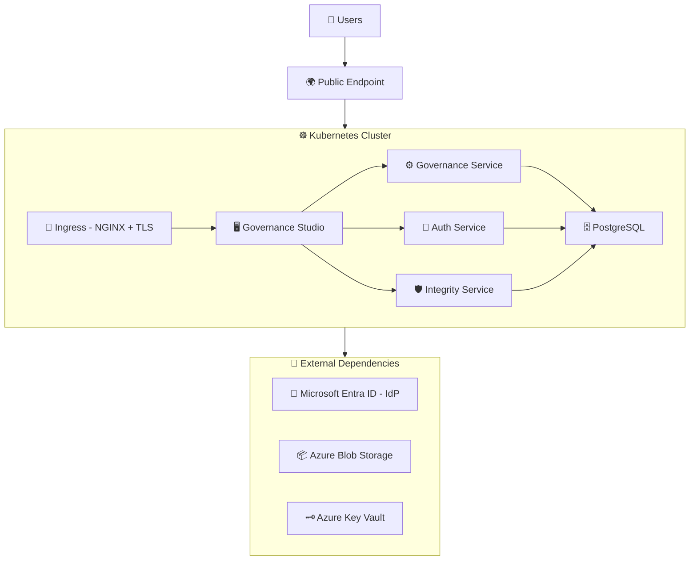

# Governance Platform Deployment Guide (Entra ID + Azure)

End-to-end guide for deploying the EQTY Lab Governance Platform on Kubernetes with Microsoft Entra ID as the identity provider, Azure Blob Storage for object storage, and Azure Key Vault for key management.

## Table of Contents

1. [Overview](#1-overview)
2. [Prerequisites](#2-prerequisites)
3. [Infrastructure Setup](#3-infrastructure-setup)
4. [Domain & TLS Configuration](#4-domain--tls-configuration)
5. [Configuring Microsoft Entra ID](#5-configuring-microsoft-entra-id)
6. [Generating Configuration with govctl](#6-generating-configuration-with-govctl)
7. [Running Entra Bootstrap](#7-running-entra-bootstrap)
8. [Creating Kubernetes Secrets](#8-creating-kubernetes-secrets)
9. [Configuring values.yaml](#9-configuring-valuesyaml)
10. [Deploying the Governance Platform](#10-deploying-the-governance-platform)
11. [Post-Install Setup & Verification](#11-post-install-setup--verification)

---

## 1. Overview

### What You're Deploying

The Governance Platform consists of four microservices deployed via a single Helm umbrella chart (`governance-platform`), backed by a PostgreSQL database, and integrated with Microsoft Entra ID for identity and access management.

### Architecture



### Platform Services

| Service                | Language | Description                                   | Ingress Path          |
| ---------------------- | -------- | --------------------------------------------- | --------------------- |
| **auth-service**       | Go       | Authentication, authorization, token exchange | `/authService/`       |
| **governance-service** | Go       | Backend API, workflow engine, worker          | `/governanceService/` |
| **governance-studio**  | React    | Web UI for governance workflows               | `/`                   |
| **integrity-service**  | Rust     | Verifiable credentials and lineage tracking   | `/integrityService/`  |
| **PostgreSQL**         | —        | Shared database (Bitnami Helm chart)          | Internal only         |

All four application services are exposed through a single domain via NGINX Ingress with path-based routing. PostgreSQL is internal to the cluster.

### External Dependencies

These components live **outside** the `governance-platform` Helm chart and must be provisioned separately before deploying.

| Dependency             | Purpose                                                            | Required? |
| ---------------------- | ------------------------------------------------------------------ | --------- |
| **Microsoft Entra ID** | Identity provider — manages users, app registrations, OAuth flows  | Yes       |
| **Azure Blob Storage** | Artifact and document storage                                      | Yes       |
| **Azure Key Vault**    | DID signing key management for verifiable credentials              | Yes       |
| **DNS**                | A-record or CNAME pointing your domain to the cluster ingress      | Yes       |
| **TLS Certificates**   | cert-manager with a ClusterIssuer/Issuer, or pre-provisioned certs | Yes       |

### Helm Chart Structure

The deployment uses an **umbrella chart pattern**. You deploy a single chart (`governance-platform`) which pulls in all subcharts as dependencies:

```
charts/
├── governance-platform/     # Umbrella chart — deploy this
│   ├── Chart.yaml           # Declares subchart dependencies
│   ├── values.yaml          # Default values for all services
│   ├── templates/           # Shared resources (secrets, config)
│   └── examples/            # Ready-to-use values files
│       ├── values-auth0.yaml       # Auth0 deployment example
│       ├── values-entra.yaml       # Microsoft Entra ID deployment example
│       ├── values-keycloak.yaml    # Keycloak deployment example
│       └── secrets-sample.yaml     # Secrets template
├── auth-service/            # Authentication subchart
├── governance-service/      # Backend API subchart
├── governance-studio/       # Frontend subchart
├── integrity-service/       # Credentials/lineage subchart
└── entra-bootstrap/         # Entra ID app registration configuration (standalone)
```

The `entra-bootstrap` chart is deployed **separately** — it runs a one-time Kubernetes Job that creates app registrations, configures OAuth scopes, and grants API permissions in Microsoft Entra ID.

### App Registrations

The Entra bootstrap creates three app registrations in your Entra tenant:

| App Registration               | Type                                | Purpose                                                                      |
| ------------------------------ | ----------------------------------- | ---------------------------------------------------------------------------- |
| `Governance Platform Frontend` | Public (SPA)                        | Browser-based authentication for governance-studio using PKCE auth code flow |
| `Governance Platform Backend`  | Confidential                        | Token validation, Graph API access, exposes `access_as_user` scope           |
| `Governance Worker`            | Confidential (service account only) | Automated governance workflow execution                                      |

### Deployment Flow

The end-to-end deployment follows this order:

```
1. Provision infrastructure (Azure Blob Storage, Azure Key Vault, DNS, TLS)
         │
2. Configure Microsoft Entra ID (create bootstrap service principal)
         │
3. Generate configuration with govctl (bootstrap, secrets, values files)
         │
4. Run entra-bootstrap (creates app registrations, scopes, permissions in Entra)
         │
5. Create Kubernetes secrets (uses Entra-generated client secrets)
         │
6. Configure values.yaml
         │
7. Deploy governance-platform (Helm umbrella chart)
         │
         ├── PostgreSQL starts, initializes databases
         ├── governance-service starts, runs migrations
         ├── auth-service, integrity-service, governance-studio start
         ├── Post-install hook creates organization + admin user in DB
         │
8. Post-install verification
```

> **Key ordering note:** The `entra-bootstrap` chart must be run **before** deploying the governance-platform, because the platform services need valid OAuth client credentials at startup. The governance-platform chart includes a Helm post-install hook that automatically creates the organization and platform-admin user in the database after deployment.

---

## 2. Prerequisites

### Tools

| Tool        | Minimum Version | Purpose                                           |
| ----------- | --------------- | ------------------------------------------------- |
| **kubectl** | 1.29+           | Kubernetes cluster management                     |
| **Helm**    | 4.0+            | Chart deployment                                  |
| **az**      | 2.50+           | Azure CLI (for Entra ID, Blob Storage, Key Vault) |
| **jq**      | 1.6+            | JSON processing (used by helper scripts)          |
| **openssl** | —               | Generating random secrets                         |

### Kubernetes Cluster

- Kubernetes **1.29+** with RBAC enabled
- **NGINX Ingress Controller** installed and configured as the default ingress class (see [`scripts/nginx.sh`](../../scripts/nginx.sh))
- **cert-manager** installed with a ClusterIssuer or Issuer configured for TLS (see [`scripts/cert-issuer.sh`](../../scripts/cert-issuer.sh))
- Sufficient resources for the platform (recommended minimums):

| Component          | CPU Request | Memory Request | Storage  |
| ------------------ | ----------- | -------------- | -------- |
| auth-service       | 250m        | 256Mi          | —        |
| governance-service | 250m        | 256Mi          | —        |
| governance-studio  | 100m        | 128Mi          | —        |
| integrity-service  | 250m        | 256Mi          | —        |
| PostgreSQL         | 500m        | 1Gi            | 10Gi PVC |

### Microsoft Entra ID Tenant

A Microsoft Entra ID (Azure AD) tenant with the following:

- **Global Administrator** or **Application Administrator** role — needed to create app registrations and grant admin consent
- Network connectivity from the Kubernetes cluster to `login.microsoftonline.com` and `graph.microsoft.com`
- A user account that will serve as the initial platform admin (the user must already exist in the Entra tenant)

You will need:

- **Tenant ID** (Directory ID) — found in Azure Portal > Entra ID > Overview
- **Platform admin email** — the email of an existing Entra user who will be the initial admin

### Container Registry Access

Platform images are hosted on GitHub Container Registry (GHCR). You need:

- A **GitHub Personal Access Token (PAT)** with `read:packages` scope
- Or access to a mirror registry containing the platform images

### Cloud Provider Resources

Provision the following **before** deployment:

- **Azure Blob Storage** — storage account + container(s) for governance artifacts and integrity store
- **Azure Key Vault** — vault instance + service principal with key sign/verify permissions

### DNS

A domain name (or subdomain) that you control, with the ability to create A-records or CNAMEs pointing to your cluster's ingress controller external IP.

The platform uses a **single domain** with path-based routing:

| URL Path                                                | Service                  |
| ------------------------------------------------------- | ------------------------ |
| `https://governance.your-domain.com/authService/`       | auth-service             |
| `https://governance.your-domain.com/governanceService/` | governance-service (API) |
| `https://governance.your-domain.com/`                   | governance-studio (UI)   |
| `https://governance.your-domain.com/integrityService/`  | integrity-service        |

No separate IdP domain is needed — Microsoft Entra ID is a cloud-hosted service at `login.microsoftonline.com`.

### Checklist

Before proceeding, confirm:

- [ ] Kubernetes cluster is running and `kubectl` is configured
- [ ] NGINX Ingress Controller is installed
- [ ] cert-manager is installed with a working Issuer/ClusterIssuer
- [ ] Microsoft Entra ID tenant is accessible
- [ ] You have Application Administrator (or Global Administrator) role in the Entra tenant
- [ ] Platform admin user exists in the Entra tenant
- [ ] Azure Blob Storage account and containers are provisioned
- [ ] Azure Key Vault is provisioned with a service principal
- [ ] DNS domain is available and you can create records
- [ ] GitHub PAT with `read:packages` scope is available
- [ ] Helm 4.0+ and kubectl 1.29+ are installed locally
- [ ] Azure CLI (`az`) is installed locally

---

## 3. Infrastructure Setup

Provision the following Azure resources before deploying. A running Kubernetes cluster with `kubectl` configured is assumed.

> **Terraform alternative:** These resources can also be provisioned using Terraform instead of the CLI commands below.

### Set Environment Variables

Export these once so that every command in this guide is copy-paste-safe:

```bash
export NS=governance                                   # Kubernetes namespace
export DOMAIN=governance.your-domain.com               # Platform domain
export RG=your-resource-group                          # Azure resource group
export LOCATION=eastus                                 # Azure region
export STORAGE_ACCOUNT=yourstorageaccount              # Azure Storage account name
export KEY_VAULT=your-keyvault                         # Azure Key Vault name
export TENANT_ID=xxxxxxxx-xxxx-xxxx-xxxx-xxxxxxxxxxxx  # Microsoft Entra tenant ID
```

### Object Storage

Create a storage account and two containers:

```bash
# Create storage account
az storage account create \
  --name $STORAGE_ACCOUNT \
  --resource-group $RG \
  --location $LOCATION \
  --sku Standard_LRS

# Create containers
az storage container create --name governance-artifacts --account-name $STORAGE_ACCOUNT
az storage container create --name integrity-store --account-name $STORAGE_ACCOUNT

# Get the account key (needed for secrets later)
az storage account keys list --account-name $STORAGE_ACCOUNT --query '[0].value' -o tsv
```

You'll need these values for your `values.yaml`:

| Value                | governance-service field    | integrity-service field          |
| -------------------- | --------------------------- | -------------------------------- |
| Storage account name | `azureStorageAccountName`   | `integrityAppBlobStoreAccount`   |
| Artifacts container  | `azureStorageContainerName` | —                                |
| Integrity container  | —                           | `integrityAppBlobStoreContainer` |

### Key Management

The auth-service uses Azure Key Vault for DID signing key management. It dynamically creates per-user signing keys.

The service principal needs key create/delete permissions in addition to sign/verify.

```bash
# Create Key Vault
az keyvault create \
  --name $KEY_VAULT \
  --resource-group $RG \
  --location $LOCATION

# Create service principal
az ad sp create-for-rbac --name governance-keyvault-sp

# Grant key and secret permissions to the service principal
az keyvault set-policy \
  --name $KEY_VAULT \
  --spn <service-principal-app-id> \
  --key-permissions create delete get list encrypt decrypt unwrapKey wrapKey sign verify \
  --secret-permissions get list set delete
```

> **Note:** The service principal requires `create` and `delete` key permissions because the auth-service creates individual DID signing keys per user in the Key Vault at login time.

> **Note:** The commands above assume your Key Vault uses the **Access Policy** permission model (the classic default). If your vault uses **Azure RBAC authorization** (now the default for new vaults), `az keyvault set-policy` will fail. Instead, assign these RBAC roles to the service principal:
>
> ```bash
> # Get the service principal object ID
> SP_OBJECT_ID=$(az ad sp list --display-name governance-keyvault-sp --query '[0].id' -o tsv)
>
> # Key Vault Crypto Officer — key create, delete, sign, verify, encrypt, decrypt
> az role assignment create --role "Key Vault Crypto Officer" \
>   --assignee-object-id $SP_OBJECT_ID --assignee-principal-type ServicePrincipal \
>   --scope $(az keyvault show --name $KEY_VAULT --query id -o tsv)
>
> # Key Vault Secrets Officer — secret get, list, set, delete
> az role assignment create --role "Key Vault Secrets Officer" \
>   --assignee-object-id $SP_OBJECT_ID --assignee-principal-type ServicePrincipal \
>   --scope $(az keyvault show --name $KEY_VAULT --query id -o tsv)
> ```
>
> To check which model your vault uses: `az keyvault show --name $KEY_VAULT --query properties.enableRbacAuthorization`

You'll need these values for your `values.yaml` and `secrets.yaml`:

| Value                           | Field                                                        |
| ------------------------------- | ------------------------------------------------------------ |
| Vault URL                       | `auth-service.config.keyManagement.azure_key_vault.vaultUrl` |
| Tenant ID                       | `auth-service.config.keyManagement.azure_key_vault.tenantId` |
| Service principal client ID     | Secret: `platform-azure-key-vault` → `client-id`             |
| Service principal client secret | Secret: `platform-azure-key-vault` → `client-secret`         |

To retrieve the service principal credentials:

```bash
# The client ID (appId) is returned by az ad sp create-for-rbac
# To find it later:
az ad sp list --display-name governance-keyvault-sp --query '[0].appId' -o tsv

# The client secret (password) is returned at creation time only
# To generate a new one:
az ad sp credential reset --id <service-principal-app-id> --query password -o tsv
```

### Summary of Provisioned Resources

After completing this section, you should have:

| Resource           | What You Need for Later                                      |
| ------------------ | ------------------------------------------------------------ |
| Azure Blob Storage | Storage account name, account key, 2 container names         |
| Azure Key Vault    | Vault URL, tenant ID, service principal client ID and secret |

These values will be used in [Section 8 (Creating Secrets)](#8-creating-kubernetes-secrets) and [Section 9 (Configuring values.yaml)](#9-configuring-valuesyaml).

---

## 4. Domain & TLS Configuration

### NGINX Ingress Controller

If not already installed, use the provided helper script:

```bash
./scripts/nginx.sh
```

This installs the `ingress-nginx` Helm chart into the `ingress-nginx` namespace.

### DNS Setup

The platform requires one domain for the governance services. No separate IdP domain is needed — Microsoft Entra ID is hosted by Microsoft at `login.microsoftonline.com`.

Create a DNS record pointing to your NGINX Ingress Controller's external IP:

```bash
# Find your ingress controller's external IP or hostname in the EXTERNAL-IP column
kubectl get svc -n ingress-nginx ingress-nginx-controller
```

Then create an A-record:

| Record                       | Type | Value                   |
| ---------------------------- | ---- | ----------------------- |
| `governance.your-domain.com` | A    | `<ingress-external-ip>` |

### TLS with cert-manager

The platform uses cert-manager to automatically provision TLS certificates from Let's Encrypt.

#### Install cert-manager

If not already installed, use the provided helper script:

```bash
./scripts/cert-issuer.sh
```

By default this installs cert-manager into the `ingress-nginx` namespace. The recommended practice is to install it into its own `cert-manager` namespace:

```bash
./scripts/cert-issuer.sh --namespace cert-manager
```

#### Create a Let's Encrypt Issuer

cert-manager supports two issuer types:

- **Issuer** — namespace-scoped. Can only issue certificates for ingress resources within the same namespace. Use the `cert-manager.io/issuer` annotation in your ingress.
- **ClusterIssuer** — cluster-wide. Can issue certificates for ingress resources in any namespace. Use the `cert-manager.io/cluster-issuer` annotation in your ingress.

The example values files use a namespace-scoped **Issuer** with the `cert-manager.io/issuer` annotation. If you prefer a ClusterIssuer (e.g., to share one issuer across multiple namespaces), adjust the kind and ingress annotations accordingly.

**Option A: Namespace-scoped Issuer (used by example values)**

```bash
kubectl apply -f - <<EOF
apiVersion: cert-manager.io/v1
kind: Issuer
metadata:
  name: letsencrypt-prod
  namespace: governance
spec:
  acme:
    server: https://acme-v02.api.letsencrypt.org/directory
    email: <email address>
    privateKeySecretRef:
      name: letsencrypt-production
    solvers:
      - http01:
          ingress:
            ingressClassName: nginx
EOF
```

Ingress annotation: `cert-manager.io/issuer: "letsencrypt-prod"`

**Option B: ClusterIssuer**

```bash
kubectl apply -f - <<EOF
apiVersion: cert-manager.io/v1
kind: ClusterIssuer
metadata:
  name: letsencrypt-prod
spec:
  acme:
    server: https://acme-v02.api.letsencrypt.org/directory
    email: <email address>
    privateKeySecretRef:
      name: letsencrypt-production
    solvers:
      - http01:
          ingress:
            ingressClassName: nginx
EOF
```

Ingress annotation: `cert-manager.io/cluster-issuer: "letsencrypt-prod"`

Replace `<email address>` with your actual email address. This email is used by Let's Encrypt for certificate expiration notifications.

> **Note:** The Issuer name (`letsencrypt-prod`) must match the corresponding annotation in your ingress configuration. If you switch from Issuer to ClusterIssuer, update all `cert-manager.io/issuer` annotations to `cert-manager.io/cluster-issuer` in your values file.

### How TLS Works in the Platform

Each service's ingress is configured with:

1. A `cert-manager.io/issuer` annotation that references the Issuer
2. A `tls` block specifying the TLS secret name and hostname

For example, from [`values-entra.yaml`](../../charts/governance-platform/examples/values-entra.yaml):

```yaml
ingress:
  enabled: true
  className: "nginx"
  annotations:
    cert-manager.io/issuer: "letsencrypt-prod"
  hosts:
    - host: governance.your-domain.com
      paths:
        - path: "/authService(/|$)(.*)"
          pathType: ImplementationSpecific
  tls:
    - secretName: prod-tls-secret
      hosts:
        - governance.your-domain.com
```

cert-manager watches for ingress resources with the `cert-manager.io/issuer` annotation and automatically requests and renews certificates. The certificate is stored in the Kubernetes secret specified by `secretName` (e.g., `prod-tls-secret`).

All four services share the **same TLS secret name and hostname** since they run on the same domain with different paths.

### Verify DNS and TLS

After DNS propagation:

```bash
# Verify DNS resolution
dig $DOMAIN

# After deploying (Section 10), verify TLS certificate
kubectl get certificate -n $NS
```

Expected certificate status when ready:

```
NAME              READY   SECRET            AGE
prod-tls-secret   True    prod-tls-secret   2m
```

> **Tip:** If `READY` shows `False`, run `kubectl describe certificate -n $NS` and check the `Events` section for details. Common causes: DNS not yet propagated, Let's Encrypt rate limits, or incorrect Issuer configuration.

---

## 5. Configuring Microsoft Entra ID

The Governance Platform requires app registrations in Microsoft Entra ID to handle authentication. The `entra-bootstrap` chart automates this, but first you need to create a service principal that the bootstrap job will use to call the Microsoft Graph API.

### Create Namespace

If not already created:

```bash
kubectl create namespace $NS
```

### Create the Bootstrap Service Principal

The bootstrap job needs a service principal with permissions to create and configure app registrations via the Microsoft Graph API. This is a **dedicated secret** (`entra-bootstrap-sp`) separate from `platform-entra`, which stores the app registration credentials for the platform services.

```bash
# 1. Create a new app registration for bootstrap and capture the appId
APP_ID=$(az ad app create --display-name "Governance Bootstrap SP" --query appId -o tsv)
echo "Created app registration: $APP_ID"

# 2. Create a service principal
az ad sp create --id $APP_ID

# 3. Grant required permissions (Application type)
#    - Application.ReadWrite.All: create/update app registrations
#    - DelegatedPermissionGrant.ReadWrite.All: grant admin consent
az ad app permission add \
  --id $APP_ID \
  --api 00000003-0000-0000-c000-000000000000 \
  --api-permissions 1bfefb4e-e0b5-418b-a88f-73c46d2cc8e9=Role

az ad app permission add \
  --id $APP_ID \
  --api 00000003-0000-0000-c000-000000000000 \
  --api-permissions 8e8e4742-1d2d-4f22-b4fa-e31d2a2e3798=Role

# 4. Grant admin consent for the service principal itself
az ad app permission admin-consent --id $APP_ID

# 5. Create a client secret (save the output password)
az ad app credential reset --id $APP_ID --display-name "bootstrap" --years 2

# 6. Create the Kubernetes secret with the SP credentials
kubectl create secret generic entra-bootstrap-sp \
  --from-literal=client-id=$APP_ID \
  --from-literal=client-secret=<password from step 5> \
  --namespace $NS
```

| Permission                               | ID                                     | Type        | Purpose                                       |
| ---------------------------------------- | -------------------------------------- | ----------- | --------------------------------------------- |
| `Application.ReadWrite.All`              | `1bfefb4e-e0b5-418b-a88f-73c46d2cc8e9` | Application | Create and configure app registrations        |
| `DelegatedPermissionGrant.ReadWrite.All` | `8e8e4742-1d2d-4f22-b4fa-e31d2a2e3798` | Application | Grant admin consent for delegated permissions |

> **Important:** Admin consent (step 4) may require a Global Administrator to approve the permissions in the Azure Portal if your tenant has admin consent workflows enabled. Navigate to: Azure Portal > Entra ID > Enterprise applications > Admin consent requests.

### Verify the Service Principal

```bash
# Verify the app registration exists
az ad app show --id $APP_ID --query '{appId: appId, displayName: displayName}' -o table

# Verify permissions were granted
az ad app permission list --id $APP_ID --query '[].{resource: resourceAppId, permissions: resourceAccess[].id}' -o table
```

### What's Next

With the bootstrap service principal created and its secret stored in Kubernetes, proceed to [Section 6](#6-generating-configuration-with-govctl) to generate your deployment configuration files, or skip ahead to [Section 7](#7-running-entra-bootstrap) if you prefer to configure files manually.

---

## 6. Generating Configuration with govctl

The `govctl` CLI tool generates the configuration files needed for the remaining deployment steps — bootstrap values, Helm values, and secrets. This is the recommended approach, as it produces a consistent, minimal configuration based on your environment.

> **Note:** This tool generates the minimum viable configuration to get up and running. For advanced or service-specific options, refer to the individual chart READMEs under `charts/`.

### Install govctl

Requires Python 3.10+. From the `govctl/` directory:

```bash
# With uv (recommended)
uv pip install -e .

# Or with pip
python3 -m venv env && source env/bin/activate
pip install -e .
```

Verify the installation:

```bash
govctl --help
```

### Run govctl init

The interactive wizard walks you through cloud provider, domain, environment, auth provider, and registry configuration:

```bash
govctl init
```

For non-interactive usage (all flags required):

```bash
govctl init -I \
  --cloud azure \
  --domain $DOMAIN \
  --environment staging \
  --auth entra
```

| Flag                             | Short   | Description                                  |
| -------------------------------- | ------- | -------------------------------------------- |
| `--cloud`                        | `-c`    | Cloud provider (`gcp`, `aws`, `azure`)       |
| `--domain`                       | `-d`    | Deployment domain                            |
| `--environment`                  | `-e`    | Environment name                             |
| `--auth`                         | `-a`    | Auth provider (`auth0`, `keycloak`, `entra`) |
| `--output`                       | `-o`    | Output directory (default: `output`)         |
| `--interactive/--no-interactive` | `-i/-I` | Toggle interactive mode                      |

### Generated Files

govctl produces the following files in the output directory:

| File                   | Contents                                                | Used In                                                                   |
| ---------------------- | ------------------------------------------------------- | ------------------------------------------------------------------------- |
| `bootstrap-{env}.yaml` | Entra tenant ID, domain, app registration display names | [Section 7 — Running Entra Bootstrap](#7-running-entra-bootstrap)         |
| `secrets-{env}.yaml`   | Secret values (some auto-generated, some to fill in)    | [Section 8 — Creating Kubernetes Secrets](#8-creating-kubernetes-secrets) |
| `values-{env}.yaml`    | Helm values for all platform services                   | [Section 9 — Configuring values.yaml](#9-configuring-valuesyaml)          |

### Next Steps

After generating your files:

1. **Review** `bootstrap-{env}.yaml` and `values-{env}.yaml` for correctness
2. **Fill in** any remaining placeholder values in `secrets-{env}.yaml` (marked with `# REQUIRED` comments)
3. Continue to [Section 7](#7-running-entra-bootstrap) to run the Entra bootstrap using your generated bootstrap file

> **Skipping govctl:** If you prefer to configure files manually, you can start from the example values files in `charts/governance-platform/examples/` and `charts/entra-bootstrap/examples/` instead. The subsequent sections cover both approaches.

---

## 7. Running Entra Bootstrap

The `entra-bootstrap` chart runs a Kubernetes Job that configures Microsoft Entra ID via the Azure CLI and Microsoft Graph API. It creates app registrations, configures OAuth scopes, sets token versions, and grants API permissions.

### Prepare the Bootstrap Values

> If you generated files with govctl in [Section 6](#6-generating-configuration-with-govctl), use your `bootstrap-{env}.yaml` and skip to [Run the Bootstrap](#run-the-bootstrap).

Start from the example values file and customize it for your environment:

```bash
cp charts/entra-bootstrap/examples/values.yaml bootstrap-values.yaml
```

Edit `bootstrap-values.yaml` with your Entra tenant ID and domain:

```yaml
entra:
  tenantId: "your-entra-tenant-id" # Directory (tenant) ID from Azure Portal
  domain: "governance.your-domain.com"

apps:
  frontend:
    displayName: "Governance Platform Frontend"
    redirectUris:
      - "https://governance.your-domain.com"
      - "http://localhost:5173"
  backend:
    displayName: "Governance Platform Backend"
  worker:
    displayName: "Governance Worker"
```

### Run the Bootstrap

#### Option A: Using the Helper Script (Recommended)

```bash
./scripts/entra/bootstrap-entra.sh -f /path/to/bootstrap-values.yaml -n $NS
```

The script validates prerequisites (bootstrap service principal secret exists), runs the Helm chart, monitors the job to completion, and displays the results with next steps.

#### Option B: Using Helm Directly

```bash
helm upgrade --install entra-bootstrap ./charts/entra-bootstrap \
  --namespace $NS \
  --values /path/to/bootstrap-values.yaml \
  --wait \
  --timeout 10m
```

Monitor the job:

```bash
# Watch job status
kubectl get jobs -l app.kubernetes.io/name=entra-bootstrap -n $NS -w

# View logs
kubectl logs -l app.kubernetes.io/name=entra-bootstrap -n $NS -f
```

Expected job status when complete:

```
NAME              COMPLETIONS   DURATION   AGE
entra-bootstrap   1/1           45s        1m
```

### What the Bootstrap Creates

| Resource                     | Details                                                                                 |
| ---------------------------- | --------------------------------------------------------------------------------------- |
| **Frontend app**             | SPA (public client) with PKCE auth code flow, ID token issuance                         |
| **Backend app**              | Confidential client with `access_as_user` scope, Graph API permissions, admin consent   |
| **Worker app**               | Confidential client for background job execution                                        |
| **Token configuration**      | `accessTokenAcceptedVersion: 2` on all apps (v2.0 tokens)                               |
| **Application ID URI**       | `api://<backendAppId>` on backend app (required for custom scopes)                      |
| **Graph API permissions**    | `User.Read`, `profile`, `openid` (delegated) + `User.Read.All` (application) on backend |
| **Frontend→Backend linking** | Frontend granted `access_as_user` delegated permission to backend                       |

### Bootstrap Execution Order

The bootstrap script executes in a specific order due to dependencies:

1. **Create backend app** (confidential client)
2. **Set token version v2** on backend
3. **Set Application ID URI** (`api://<appId>`) on backend — required for custom scopes
4. **Create `access_as_user` scope** on backend — exports scope ID for frontend
5. **Add Graph API permissions** to backend
6. **Grant admin consent** for backend
7. **Create frontend app** (SPA) — references backend's `access_as_user` scope
8. **Set token version v2** on frontend
9. **Create worker app** (confidential client)

### Retrieve App Registration Credentials

The backend and worker client secrets are **auto-generated by Entra** during bootstrap. You must retrieve them from the job logs to create the platform's Kubernetes secrets in the next step.

```bash
# View the complete bootstrap logs (secrets are printed at the end)
kubectl logs -l app.kubernetes.io/name=entra-bootstrap -n $NS
```

The logs will contain output like:

```
=== SUMMARY ===
Frontend App ID: xxxxxxxx-xxxx-xxxx-xxxx-xxxxxxxxxxxx
Backend App ID: xxxxxxxx-xxxx-xxxx-xxxx-xxxxxxxxxxxx
Backend Client Secret: <secret-value>
Worker App ID: xxxxxxxx-xxxx-xxxx-xxxx-xxxxxxxxxxxx
Worker Client Secret: <secret-value>
```

> **Save these values** — you'll need them in [Section 8](#8-creating-kubernetes-secrets) to create the `platform-entra` and `platform-governance-worker` Kubernetes secrets.

If the apps already existed (idempotent re-run), no new secrets are created. Use `az ad app credential reset` to generate new secrets manually:

```bash
# Generate a new secret for the backend app
az ad app credential reset --id <backend-app-id> --display-name "platform" --years 2

# Generate a new secret for the worker app
az ad app credential reset --id <worker-app-id> --display-name "worker" --years 2
```

### Verify the Bootstrap

```bash
# Verify the OpenID Connect discovery endpoint for your tenant
curl -s "https://login.microsoftonline.com/$TENANT_ID/v2.0/.well-known/openid-configuration" | jq '.issuer'

# Expected output: "https://login.microsoftonline.com/$TENANT_ID/v2.0"

# Verify app registrations were created
az ad app list --display-name "Governance Platform" --query '[].{name:displayName, appId:appId}' -o table
```

### Troubleshooting

| Issue                                   | Solution                                                                                                                |
| --------------------------------------- | ----------------------------------------------------------------------------------------------------------------------- |
| Job fails with authentication error     | Verify `entra-bootstrap-sp` secret credentials; check SP has `Application.ReadWrite.All` permission                     |
| Admin consent fails                     | Grant consent manually: Azure Portal > Entra ID > App registrations > [app] > API permissions                           |
| App registration already exists         | The bootstrap is idempotent — it skips existing resources                                                               |
| Job times out                           | Increase `bootstrap.activeDeadlineSeconds`; check connectivity to `login.microsoftonline.com`                           |
| Client secret not shown in logs         | Secrets are only shown once during creation. Use `az ad app credential reset` to generate new ones                      |
| Token validation errors after bootstrap | Verify `accessTokenAcceptedVersion` is 2; check issuer URL matches `https://login.microsoftonline.com/{tenant-id}/v2.0` |

---

## 8. Creating Kubernetes Secrets

The governance-platform chart requires several Kubernetes secrets to be available at deploy time. There are three ways to create them — **choose one approach and follow only that subsection**.

### Choose Your Approach

| Approach                                                              | Best For                                                            | What You Do                                                                                                                                   |
| --------------------------------------------------------------------- | ------------------------------------------------------------------- | --------------------------------------------------------------------------------------------------------------------------------------------- |
| **[Option A — kubectl](#option-a-manual-creation-with-kubectl)**      | Environments without file-based secrets management                  | Run `kubectl create secret` commands yourself. Secrets live outside of Helm and persist across `helm uninstall` / `helm install` cycles.      |
| **[Option B — Helm-managed secrets](#option-b-helm-managed-secrets)** | Teams with encrypted secrets workflows (SOPS, sealed-secrets, etc.) | Fill in a secrets values file and pass it to `helm install`. Helm creates the Secret objects for you. Keeps everything declarative.           |
| **[Option C — govctl](#option-c-govctl-generated-secrets)**           | Any environment (generates files for Option B)                      | Run `govctl init` to auto-generate random values; fill in provider credentials; then use the output as a Helm values file (same as Option B). |

> **Important:** Do not mix approaches. If you use Option B or C (Helm-managed), do **not** also create the same secrets with `kubectl` — Helm will fail if the Secret objects already exist. Conversely, if you use Option A (`kubectl`), leave `global.secrets.create` at its default value of `false`.

### Secret Reference

| Secret Name                  | Used By                                             | Keys                                                                                |
| ---------------------------- | --------------------------------------------------- | ----------------------------------------------------------------------------------- |
| `entra-bootstrap-sp`         | Entra bootstrap job                                 | `client-id`, `client-secret`                                                        |
| `platform-database`          | governance-service, auth-service, integrity-service | `username`, `password`                                                              |
| `platform-entra`             | auth-service, governance-service                    | `client-id`, `client-secret`, `tenant-id`, `graph-client-id`, `graph-client-secret` |
| `platform-auth-service`      | auth-service                                        | `api-secret`, `jwt-secret`                                                          |
| `platform-encryption-key`    | governance-service, auth-service                    | `encryption-key`                                                                    |
| `platform-governance-worker` | governance-service worker                           | `encryption-key`, `client-id`, `client-secret`                                      |
| `platform-azure-blob`        | governance-service, integrity-service               | `account-key`, `connection-string`                                                  |
| `platform-azure-key-vault`   | auth-service                                        | `client-id`, `client-secret`, `tenant-id`, `vault-url`                              |
| `platform-image-pull-secret` | All services                                        | Docker registry credentials                                                         |

### Option A: Manual Creation with kubectl

Create each secret manually. Secrets are managed outside of Helm, so they persist across `helm uninstall` / `helm install` cycles.

Run these commands in order, replacing placeholder values with your actual credentials.

#### Database

```bash
kubectl create secret generic platform-database \
  --from-literal=username=postgres \
  --from-literal=password="$(openssl rand -hex 32)" \
  --namespace $NS
```

#### Microsoft Entra ID (App Registration Credentials)

Use the backend app ID and client secret retrieved from the bootstrap logs in [Section 7](#retrieve-app-registration-credentials):

```bash
kubectl create secret generic platform-entra \
  --from-literal=client-id=YOUR_BACKEND_APP_ID \
  --from-literal=client-secret=YOUR_BACKEND_CLIENT_SECRET \
  --from-literal=tenant-id=$TENANT_ID \
  --from-literal=graph-client-id=YOUR_BACKEND_APP_ID \
  --from-literal=graph-client-secret=YOUR_BACKEND_CLIENT_SECRET \
  --namespace $NS
```

> **Note:** The `graph-client-id` and `graph-client-secret` are typically the same as the backend app's `client-id` and `client-secret`. This works because the backend app registration is granted Microsoft Graph permissions (`User.Read.All`) during bootstrap, so it can perform user lookups directly.

#### Auth Service

```bash
kubectl create secret generic platform-auth-service \
  --from-literal=api-secret="$(openssl rand -base64 32)" \
  --from-literal=jwt-secret="$(openssl rand -base64 32)" \
  --namespace $NS
```

#### Encryption Key

```bash
kubectl create secret generic platform-encryption-key \
  --from-literal=encryption-key="$(openssl rand -base64 32)" \
  --namespace $NS
```

#### Governance Worker

Use the worker app ID and client secret from the bootstrap logs in [Section 7](#retrieve-app-registration-credentials):

```bash
kubectl create secret generic platform-governance-worker \
  --from-literal=encryption-key="$(openssl rand -base64 32)" \
  --from-literal=client-id=YOUR_WORKER_APP_ID \
  --from-literal=client-secret=YOUR_WORKER_CLIENT_SECRET \
  --namespace $NS
```

#### Azure Blob Storage Credentials

```bash
kubectl create secret generic platform-azure-blob \
  --from-literal=account-key=YOUR_AZURE_STORAGE_ACCOUNT_KEY \
  --from-literal=connection-string="DefaultEndpointsProtocol=https;AccountName=${STORAGE_ACCOUNT};AccountKey=YOUR_KEY;EndpointSuffix=core.windows.net" \
  --namespace $NS
```

#### Azure Key Vault Credentials

```bash
kubectl create secret generic platform-azure-key-vault \
  --from-literal=client-id=YOUR_AZURE_CLIENT_ID \
  --from-literal=client-secret=YOUR_AZURE_CLIENT_SECRET \
  --from-literal=tenant-id=$TENANT_ID \
  --from-literal=vault-url=https://${KEY_VAULT}.vault.azure.net/ \
  --namespace $NS
```

#### Image Pull Secret

```bash
kubectl create secret docker-registry platform-image-pull-secret \
  --docker-server=ghcr.io \
  --docker-username=YOUR_GITHUB_USERNAME \
  --docker-password=YOUR_GITHUB_PAT \
  --docker-email=YOUR_EMAIL \
  --namespace $NS
```

After creating all secrets, skip ahead to [Verify Secrets](#verify-secrets-option-a-only).

### Option B: Helm-Managed Secrets

Instead of creating secrets with `kubectl`, you can declare secret values in a YAML file and let Helm create the Secret objects during `helm install`.

1. Copy the sample secrets file to a secure location **outside your repo**:

```bash
cp charts/governance-platform/examples/secrets-sample.yaml my-secrets.yaml
```

2. Open `my-secrets.yaml` and:
   - Ensure `global.secrets.create` is set to `true`
   - Set `global.secrets.auth.provider` to `entra`
   - Uncomment the `entra` block under `global.secrets.auth` and fill in the backend app ID, client secret, and tenant ID from [Section 7](#retrieve-app-registration-credentials)
   - Fill in all `REPLACE_WITH_*` values for Azure Blob Storage and Azure Key Vault
   - Generate random values where indicated (e.g., `openssl rand -base64 32` for encryption keys)

3. When deploying in [Section 10](#10-deploying-the-governance-platform), pass **both** your secrets file and values file to Helm:

```bash
helm upgrade --install governance-platform ./charts/governance-platform \
  --namespace $NS \
  --values my-secrets.yaml \
  --values my-values.yaml \
  --wait --timeout 15m
```

> **Warning:** Never commit `my-secrets.yaml` to version control. Add it to `.gitignore`.

### Option C: govctl-Generated Secrets

If you ran `govctl init` in [Section 6](#6-generating-configuration-with-govctl), it generated a `secrets-{env}.yaml` file with random values already filled in for database password, API secrets, JWT secret, and encryption keys.

1. Open `secrets-{env}.yaml` and fill in the remaining values marked with `# REQUIRED` comments:
   - Entra backend app client ID and secret (from [Section 7](#retrieve-app-registration-credentials))
   - Entra worker app client ID and secret (from [Section 7](#retrieve-app-registration-credentials))
   - Azure Blob Storage account key and connection string
   - Azure Key Vault service principal credentials
   - Image registry credentials

2. The generated file has `global.secrets.create: true`, so Helm will create the secrets for you. When deploying in [Section 10](#10-deploying-the-governance-platform), pass it alongside your values file:

```bash
helm upgrade --install governance-platform ./charts/governance-platform \
  --namespace $NS \
  --values secrets-staging.yaml \
  --values values-staging.yaml \
  --wait --timeout 15m
```

### Verify Secrets (Option A only)

If you created secrets with `kubectl` (Option A), verify they exist before proceeding:

```bash
# List all platform secrets
kubectl get secrets -n $NS | grep platform

# Verify a specific secret has the expected keys
kubectl get secret platform-entra -n $NS -o jsonpath='{.data}' | jq 'keys'
```

If you used Option B or C, Helm creates the secrets during `helm install` — skip this step and continue to [Section 9](#9-configuring-valuesyaml).

---

## 9. Configuring values.yaml

The governance-platform Helm chart is configured through a single values file. Start from the Entra example and customize it for your environment.

### Start from the Example

You can either copy the example values file manually or use `govctl` to generate both values and secrets files interactively:

```bash
# Option A: Copy the example and customize manually
cp charts/governance-platform/examples/values-entra.yaml my-values.yaml

# Option B: Use govctl to generate values and secrets
govctl init
```

If using `govctl`, it will generate a `values-{env}.yaml` and `secrets-{env}.yaml` pre-configured for your cloud provider, domain, and auth provider. See the [`govctl` README](../../govctl/) for details.

If starting from the example file, [`values-entra.yaml`](../../charts/governance-platform/examples/values-entra.yaml) has all four services pre-configured for Entra ID with placeholder values you need to replace.

### Global Configuration

Set the domain at the top of your values file:

```yaml
global:
  domain: "governance.your-domain.com"
  environmentType: "production" # Options: development, staging, production
```

The `global.secrets.create` setting controls how secrets are provided. Leave it at `false` (default) if you created secrets with `kubectl` ([Section 8, Option A](#option-a-manual-creation-with-kubectl)). Set it to `true` only if you are using Helm-managed secrets via a secrets file ([Section 8, Option B](#option-b-helm-managed-secrets) or [Option C](#option-c-govctl-generated-secrets)).

### Auth Service

The auth-service handles authentication and authorization. Key configuration areas:

```yaml
auth-service:
  config:
    # Identity Provider — must match your Entra ID setup
    idp:
      provider: "entra"
      issuer: "https://login.microsoftonline.com/your-tenant-id/v2.0"
      skipIssuerVerification: false
      entra:
        tenantId: "your-tenant-id"
        defaultRoles: "user"

    # Key Management — Azure Key Vault for DID signing keys
    keyManagement:
      provider: "azure_key_vault"
      azure_key_vault:
        vaultUrl: "https://your-keyvault.vault.azure.net/"
        tenantId: "your-azure-tenant-id"
```

| Field                                    | Description                             | Where to Get It                                      |
| ---------------------------------------- | --------------------------------------- | ---------------------------------------------------- |
| `idp.issuer`                             | Entra ID v2.0 issuer URL                | `https://login.microsoftonline.com/{tenant-id}/v2.0` |
| `idp.entra.tenantId`                     | Entra Directory (tenant) ID             | Azure Portal > Entra ID > Overview                   |
| `keyManagement.azure_key_vault.vaultUrl` | Azure Key Vault URL                     | From [Section 3](#key-management)                    |
| `keyManagement.azure_key_vault.tenantId` | Azure AD tenant ID for Key Vault access | From your Azure subscription                         |

### Governance Service

The governance-service is the main backend API. Configure storage and Entra:

```yaml
governance-service:
  config:
    # Storage — Azure Blob Storage
    storageProvider: "azure_blob"
    azureStorageAccountName: "your-storage-account"
    azureStorageContainerName: "governance-artifacts"

    # Microsoft Entra ID
    entraTenantId: "your-tenant-id"
```

### Governance Studio

The frontend application. Configure Entra connection and feature flags:

```yaml
governance-studio:
  config:
    # Microsoft Entra ID
    entraTenantId: "your-tenant-id"
    entraClientId: "your-frontend-app-id" # Frontend app registration ID from bootstrap
    entraScopes: "openid profile email offline_access api://<backend-app-id>/access_as_user"

    # Feature flags
    features:
      governance: true # Governance workflows
      lineage: true # Lineage tracking
```

> **Important:** Replace `<backend-app-id>` in `entraScopes` with the actual Backend app registration ID from [Section 7](#retrieve-app-registration-credentials). The `entraClientId` should be the Frontend app registration ID.

### Integrity Service

The integrity-service handles verifiable credentials. Configure its Azure Blob Storage:

```yaml
integrity-service:
  config:
    integrityAppBlobStoreType: "azure_blob"
    integrityAppBlobStoreAccount: "your-storage-account"
    integrityAppBlobStoreContainer: "integrity-store"
```

### Ingress Configuration

Each service needs an ingress block. All four services share the same domain with path-based routing, but annotations vary per service. If you used `govctl` or started from [`values-entra.yaml`](../../charts/governance-platform/examples/values-entra.yaml), the ingress is already configured correctly.

Key differences between services:

| Service            | Path Pattern                   | Notes                                                                                                                           |
| ------------------ | ------------------------------ | ------------------------------------------------------------------------------------------------------------------------------- |
| auth-service       | `/authService(/\|$)(.*)`       | Regex rewrite + extra buffer size annotations (`proxy-buffer-size`, `client-header-buffer-size`, `large-client-header-buffers`) |
| governance-service | `/governanceService(/\|$)(.*)` | Regex rewrite to `/$2`                                                                                                          |
| governance-studio  | `/` (pathType: Prefix)         | No regex or rewrite annotations                                                                                                 |
| integrity-service  | `/integrityService(/\|$)(.*)`  | Regex rewrite + `proxy-body-size: "0"` (unlimited)                                                                              |

> **Note:** All four services must use the same `tls.secretName` (e.g., `prod-tls-secret`). cert-manager creates this secret automatically when it provisions the TLS certificate.

### PostgreSQL

The Bitnami PostgreSQL chart is included as a dependency. Configure storage and resources:

```yaml
postgresql:
  enabled: true
  primary:
    persistence:
      enabled: true
      size: 10Gi
      storageClass: "managed-csi" # AKS default StorageClass
    resources:
      requests:
        cpu: 500m
        memory: 1Gi
      limits:
        cpu: 2000m
        memory: 2Gi
```

The database password is pulled from the `platform-database` secret created in [Section 8](#database).

### Entra Post-Install Hook

The governance-platform chart includes a Helm post-install/post-upgrade hook that automatically creates the organization and platform-admin user in the database after deployment. The admin user is looked up via the Microsoft Graph API using their Entra email. Enable it in your values file:

```yaml
entra:
  createOrganization: true
  organizationName: "governance"
  displayName: "Governance Platform"
  tenantId: "your-tenant-id"
  createPlatformAdmin: true
  platformAdminEmail: "admin@yourorg.onmicrosoft.com" # Must exist in your Entra tenant
```

| Field                 | Description                                         | Where to Get It                               |
| --------------------- | --------------------------------------------------- | --------------------------------------------- |
| `createOrganization`  | Enable organization creation in the database        | Set to `true`                                 |
| `organizationName`    | Organization name (used as the internal identifier) | Your choice (e.g., `governance`)              |
| `displayName`         | Human-readable organization display name            | Your choice                                   |
| `tenantId`            | Entra tenant ID (used for Graph API user lookup)    | Azure Portal > Entra ID > Overview            |
| `createPlatformAdmin` | Enable platform-admin user creation in the database | Set to `true`                                 |
| `platformAdminEmail`  | Email of the platform admin user in Entra           | Must be an existing user in your Entra tenant |

The hook runs as a Kubernetes Job after Helm install/upgrade. It waits for database migrations to complete, looks up the platform admin's Entra user ID by email via the Microsoft Graph API, then creates (or updates) the organization and admin user records. The hook is idempotent — it's safe to run on every upgrade.

> **Important:** The `platformAdminEmail` must match an existing user in your Microsoft Entra ID tenant. The hook will fail if the user cannot be found via the Graph API.

### Configuration Checklist

Before deploying, verify your values file has:

- [ ] `global.domain` set to your actual domain
- [ ] `auth-service.config.idp.issuer` set to `https://login.microsoftonline.com/{tenant-id}/v2.0`
- [ ] `auth-service.config.idp.entra.tenantId` set to your Entra tenant ID
- [ ] `auth-service.config.keyManagement.provider` set to `azure_key_vault`
- [ ] `auth-service.config.keyManagement.azure_key_vault.vaultUrl` and `tenantId` set
- [ ] `governance-service.config.storageProvider` set to `azure_blob`
- [ ] `governance-service.config.azureStorageAccountName` and `azureStorageContainerName` set
- [ ] `governance-service.config.entraTenantId` set
- [ ] `governance-studio.config.entraTenantId` and `entraClientId` set
- [ ] `governance-studio.config.entraScopes` has the correct backend app ID in the `api://` scope
- [ ] `integrity-service.config.integrityAppBlobStoreType` set to `azure_blob`
- [ ] `integrity-service.config.integrityAppBlobStoreAccount` and `integrityAppBlobStoreContainer` set
- [ ] All ingress `host` fields set to your domain
- [ ] All ingress `tls` blocks using the same `secretName`
- [ ] `entra.createOrganization` set to `true`
- [ ] `entra.platformAdminEmail` set to an existing Entra user's email

---

## 10. Deploying the Governance Platform

### Update Chart Dependencies

Before installing, pull the subchart dependencies:

```bash
helm dependency update ./charts/governance-platform
```

This downloads the Bitnami PostgreSQL chart and links the local subcharts (auth-service, governance-service, governance-studio, integrity-service).

### Install

**If you created secrets with kubectl (Section 8, Option A):**

```bash
helm upgrade --install governance-platform ./charts/governance-platform \
  --namespace $NS \
  --create-namespace \
  --values /path/to/my-values.yaml \
  --wait \
  --timeout 15m
```

**If you are using Helm-managed secrets (Section 8, Option B or C):** pass the secrets file _before_ the values file so that values can override if needed:

```bash
helm upgrade --install governance-platform ./charts/governance-platform \
  --namespace $NS \
  --create-namespace \
  --values /path/to/my-secrets.yaml \
  --values /path/to/my-values.yaml \
  --wait \
  --timeout 15m
```

### What Happens During Install

The Helm install proceeds in this order:

1. **PostgreSQL** starts and initializes the `governance` database
2. **governance-service** starts, runs database migrations on startup
3. **auth-service** and **integrity-service** start (depend on database being ready)
4. **governance-studio** starts (static frontend, no database dependency)
5. **Post-install hook** runs — waits for migrations to complete, then creates the organization and platform-admin user in the database (if `entra.createOrganization` is enabled). The hook calls the Microsoft Graph API to look up the admin user by email.

The `--wait` flag ensures Helm waits for all pods to reach `Ready` state before returning.

### Monitor the Deployment

```bash
# Watch all pods come up
kubectl get pods -n $NS -w

# Check deployment status
kubectl get deployments -n $NS
```

Expected pod status once healthy:

```
NAME                                                    READY   STATUS      AGE
governance-platform-auth-service-xxxxx-xxxxx            1/1     Running     2m
governance-platform-governance-service-xxxxx-xxxxx      1/1     Running     2m
governance-platform-governance-studio-xxxxx-xxxxx       1/1     Running     2m
governance-platform-integrity-service-xxxxx-xxxxx       1/1     Running     2m
governance-platform-postgresql-0                        1/1     Running     3m
```

### Troubleshooting Deployment Issues

**Pod stuck in CrashLoopBackOff:**

```bash
# Check pod logs
kubectl logs -l app.kubernetes.io/instance=governance-platform -n $NS --all-containers

# Check specific service
kubectl logs deployment/governance-platform-auth-service -n $NS
```

**Pod stuck in ImagePullBackOff:**

```bash
# Verify image pull secret exists and is correct
kubectl get secret platform-image-pull-secret -n $NS -o jsonpath='{.data.\.dockerconfigjson}' | base64 -d | jq .
```

**Database connection errors:**

```bash
# Check PostgreSQL is running
kubectl get pod governance-platform-postgresql-0 -n $NS

# Verify database secret
kubectl get secret platform-database -n $NS -o jsonpath='{.data.password}' | base64 -d
```

**Ingress not working:**

```bash
# Check ingress resources were created
kubectl get ingress -n $NS

# Check cert-manager certificate status
kubectl get certificate -n $NS
kubectl describe certificate -n $NS
```

### Rollback & Uninstall

**Roll back to a previous revision:**

```bash
# List revision history
helm history governance-platform -n $NS

# Roll back to a specific revision
helm rollback governance-platform <revision-number> -n $NS
```

**Uninstall the platform:**

```bash
helm uninstall governance-platform -n $NS
```

> **What `helm uninstall` does and does not delete:**
>
> | Resource                                             | Deleted? | Notes                                                 |
> | ---------------------------------------------------- | -------- | ----------------------------------------------------- |
> | Deployments, Services, Ingress                       | Yes      | All Helm-managed workloads are removed                |
> | Helm-managed Secrets (`global.secrets.create: true`) | Yes      | Created by the chart, so Helm owns them               |
> | kubectl-created Secrets (Option A)                   | **No**   | Created outside Helm — persist until manually deleted |
> | PersistentVolumeClaims (PostgreSQL data)             | **No**   | Helm does not delete PVCs to prevent data loss        |
> | Namespace                                            | **No**   | Must be deleted manually if desired                   |
>
> To fully clean up after uninstall:
>
> ```bash
> # Delete PVCs (WARNING: destroys database data)
> kubectl delete pvc -l app.kubernetes.io/instance=governance-platform -n $NS
>
> # Delete manually-created secrets (Option A only)
> kubectl delete secrets -l app.kubernetes.io/part-of=governance-platform -n $NS 2>/dev/null
> kubectl delete secret platform-database platform-entra platform-auth-service \
>   platform-encryption-key platform-governance-worker platform-azure-blob \
>   platform-azure-key-vault platform-image-pull-secret entra-bootstrap-sp -n $NS 2>/dev/null
>
> # Delete the namespace (optional)
> kubectl delete namespace $NS
> ```

---

## 11. Post-Install Setup & Verification

### Verify the Post-Install Hook

If you enabled `entra.createOrganization` in your values file (see [Section 9](#entra-post-install-hook)), the Helm post-install hook automatically creates the organization and platform-admin user in the database. Verify the hook job completed successfully:

```bash
# Check the hook job status
kubectl get jobs -n $NS -l "app.kubernetes.io/component=entra-org-setup"

# View hook job logs if needed
kubectl logs -n $NS -l "app.kubernetes.io/component=entra-org-setup" --tail=50
```

The hook:

1. Waits for database migrations to complete (checks for required tables)
2. Creates (or updates) the organization in the database using the configured `organizationName`
3. Calls the Microsoft Graph API to look up the platform admin's Entra user ID by email
4. Creates (or updates) the platform-admin user in the database with the resolved Entra user ID
5. Sets up the organization membership with `organization_owner` role

The hook is idempotent — it runs on every `helm upgrade` and safely skips records that already exist.

### Manual Post-Install Setup (Alternative)

If you prefer to run the post-install setup manually (or need to re-run it outside of a Helm upgrade), use the helper script:

```bash
./scripts/entra/post-install-entra-setup.sh -n $NS -e admin@yourorg.onmicrosoft.com
```

The script waits for the governance platform to be running, verifies database migrations are complete, creates the organization and platform-admin user via the Microsoft Graph API, and verifies the integration. This performs the same steps as the Helm post-install hook but can be run independently.

| Flag            | Short | Description                               |
| --------------- | ----- | ----------------------------------------- |
| `--namespace`   | `-n`  | Kubernetes namespace (required)           |
| `--admin-email` | `-e`  | Platform admin's Entra email (required)   |
| `--org-name`    | `-o`  | Organization name (default: `governance`) |

### Verify Service Health

```bash
# All services should return healthy responses (uses $DOMAIN from environment variables)

# Auth Service health
curl -s https://$DOMAIN/authService/health | jq .

# Governance Service health
curl -s https://$DOMAIN/governanceService/health | jq .

# Governance Studio (should return 200)
curl -s -o /dev/null -w "%{http_code}" https://$DOMAIN/

# Integrity Service health
curl -s https://$DOMAIN/integrityService/health/v1 | jq .
```

### Verify Entra ID Integration

```bash
# OpenID Connect discovery endpoint (should return JSON with issuer)
curl -s "https://login.microsoftonline.com/$TENANT_ID/v2.0/.well-known/openid-configuration" | jq '.issuer'

# Verify the backend app can obtain a token using client credentials
BACKEND_SECRET=$(kubectl get secret platform-entra -n $NS -o jsonpath='{.data.client-secret}' | base64 -d)
BACKEND_CLIENT_ID=$(kubectl get secret platform-entra -n $NS -o jsonpath='{.data.client-id}' | base64 -d)

curl -s -X POST "https://login.microsoftonline.com/$TENANT_ID/oauth2/v2.0/token" \
  -d "grant_type=client_credentials" \
  -d "client_id=$BACKEND_CLIENT_ID" \
  -d "client_secret=$BACKEND_SECRET" \
  -d "scope=https://graph.microsoft.com/.default" \
  | jq '{token_type, expires_in}'
```

### Verify Database Records

```bash
# Check organization was created
kubectl exec -n $NS governance-platform-postgresql-0 -- \
  env PGPASSWORD=$(kubectl get secret platform-database -n $NS -o jsonpath='{.data.password}' | base64 -d) \
  psql -U postgres -d governance -c \
  "SELECT id, name, display_name, idp_provider FROM organization;"

# Check platform-admin user exists
kubectl exec -n $NS governance-platform-postgresql-0 -- \
  env PGPASSWORD=$(kubectl get secret platform-database -n $NS -o jsonpath='{.data.password}' | base64 -d) \
  psql -U postgres -d governance -c \
  "SELECT u.email, u.display_name, u.idp_provider, uom.roles
   FROM users u
   JOIN user_organization_memberships uom ON u.id = uom.user_id
   WHERE u.idp_provider = 'entra';"
```

### Test Login

1. Navigate to `https://governance.your-domain.com` in your browser
2. You should be redirected to the Microsoft Entra ID login page
3. Log in with the platform-admin credentials (the Entra user whose email matches `entra.platformAdminEmail`)
4. After login, you should be redirected back to Governance Studio with full access

### Deployment Complete

Your Governance Platform is now running with:

- Microsoft Entra ID managing identity and access
- Three app registrations (frontend, backend, worker)
- Azure Blob Storage for document and artifact storage
- Azure Key Vault for DID signing key management
- Platform-admin user with `organization_owner` role
- All four services accessible via path-based routing on a single domain
- TLS certificates managed by cert-manager
- PostgreSQL with all required schemas

### Next Steps

#### Adding Users

Users must exist in **Microsoft Entra ID** before they can be added to Governance Studio:

1. **Ensure the user exists in Entra ID:**
   - The user should already have an account in your Entra tenant (either a member or guest user)
   - Users are typically managed through Azure Portal > Entra ID > Users, or via your organization's identity management process

2. **Add the user in Governance Studio:**
   - Log in as the platform admin
   - Navigate to **Organization** > **Members** (`https://governance.your-domain.com/organization/members`)
   - Add the user by email and assign a role

The user can then log in to Governance Studio with their Microsoft account credentials.

### Quick Reference

| Resource                         | URL / Endpoint                                                                               |
| -------------------------------- | -------------------------------------------------------------------------------------------- |
| Auth Service API                 | `https://governance.your-domain.com/authService/`                                            |
| Governance Service API           | `https://governance.your-domain.com/governanceService/`                                      |
| Governance Studio                | `https://governance.your-domain.com/`                                                        |
| Integrity Service API            | `https://governance.your-domain.com/integrityService/`                                       |
| Entra OIDC Discovery             | `https://login.microsoftonline.com/{tenant-id}/v2.0/.well-known/openid-configuration`        |
| Azure Portal — App Registrations | `https://portal.azure.com/#view/Microsoft_AAD_IAM/ActiveDirectoryMenuBlade/~/RegisteredApps` |
