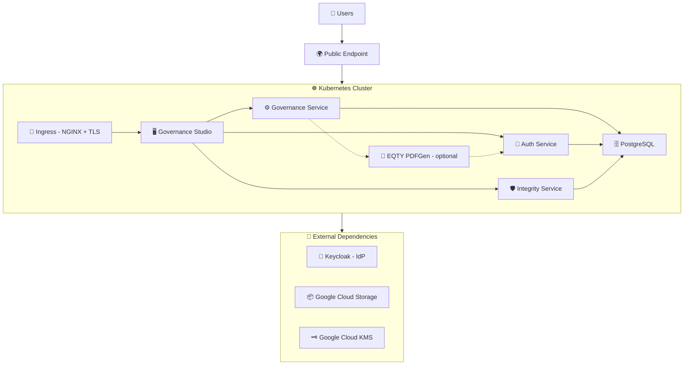

# Governance Platform Deployment Guide (Keycloak + GCP)

End-to-end guide for deploying the EQTY Lab Governance Platform on Kubernetes with Keycloak as the identity provider, Google Cloud Storage for object storage, and Google Cloud KMS for key management.

## Table of Contents

1. [Overview](#1-overview)
2. [Prerequisites](#2-prerequisites)
3. [Infrastructure Setup](#3-infrastructure-setup)
4. [Domain & TLS Configuration](#4-domain--tls-configuration)
5. [Deploying Keycloak](#5-deploying-keycloak)
6. [Generating Configuration with govctl](#6-generating-configuration-with-govctl)
7. [Running Keycloak Bootstrap](#7-running-keycloak-bootstrap)
8. [Creating Kubernetes Secrets](#8-creating-kubernetes-secrets)
9. [Configuring values.yaml](#9-configuring-valuesyaml)
10. [Deploying the Governance Platform](#10-deploying-the-governance-platform)
11. [Post-Install Setup & Verification](#11-post-install-setup--verification)

---

## 1. Overview

### What You're Deploying

The Governance Platform consists of four microservices deployed via a single Helm umbrella chart (`governance-platform`), backed by a PostgreSQL database, and integrated with an external Keycloak instance for identity and access management.

### Architecture



### Platform Services

| Service                | Language | Description                                   | Ingress Path          |
| ---------------------- | -------- | --------------------------------------------- | --------------------- |
| **auth-service**       | Go       | Authentication, authorization, token exchange | `/authService/`       |
| **eqty-pdfgen**        | Python   | Optional manifest → PDF/ZIP rendering         | Internal only         |
| **governance-service** | Go       | Backend API, workflow engine, worker          | `/governanceService/` |
| **governance-studio**  | React    | Web UI for governance workflows               | `/`                   |
| **integrity-service**  | Rust     | Verifiable credentials and lineage tracking   | `/integrityService/`  |
| **PostgreSQL**         | —        | Shared database (Bitnami Helm chart)          | Internal only         |

All four application services are exposed through a single domain via NGINX Ingress with path-based routing. PostgreSQL is internal to the cluster.

### External Dependencies

These components live **outside** the `governance-platform` Helm chart and must be provisioned separately before deploying.

| Dependency               | Purpose                                                            | Required? |
| ------------------------ | ------------------------------------------------------------------ | --------- |
| **Keycloak**             | Identity provider — manages users, realms, OAuth clients           | Yes       |
| **Google Cloud Storage** | Artifact and document storage                                      | Yes       |
| **Google Cloud KMS**     | DID signing key management for verifiable credentials              | Yes       |
| **DNS**                  | A-record or CNAME pointing your domain to the cluster ingress      | Yes       |
| **TLS Certificates**     | cert-manager with a ClusterIssuer/Issuer, or pre-provisioned certs | Yes       |

### Helm Chart Structure

The deployment uses an **umbrella chart pattern**. You deploy a single chart (`governance-platform`) which pulls in all subcharts as dependencies:

```
charts/
├── governance-platform/     # Umbrella chart — deploy this
│   ├── Chart.yaml           # Declares subchart dependencies
│   ├── values.yaml          # Default values for all services
│   ├── templates/           # Shared resources (secrets, config)
│   └── examples/            # Ready-to-use values files
│       ├── values-auth0.yaml       # Auth0 deployment example
│       ├── values-entra.yaml       # Microsoft Entra ID deployment example
│       ├── values-keycloak.yaml    # Keycloak deployment example
│       └── secrets-sample.yaml     # Secrets template
├── auth-service/            # Authentication subchart
├── governance-service/      # Backend API subchart
├── governance-studio/       # Frontend subchart
├── integrity-service/       # Credentials/lineage subchart
└── keycloak-bootstrap/      # Keycloak realm/client configuration (standalone)
```

The `keycloak-bootstrap` chart is deployed **separately** — it runs a one-time Kubernetes Job that configures the Keycloak realm, OAuth clients, scopes, and an initial admin user.

### OAuth Clients

The Keycloak bootstrap creates three OAuth clients in the `governance` realm:

| Client ID                      | Type                                | Purpose                                                                                |
| ------------------------------ | ----------------------------------- | -------------------------------------------------------------------------------------- |
| `governance-platform-frontend` | Public (SPA)                        | Browser-based authentication for governance-studio                                     |
| `governance-platform-backend`  | Confidential                        | Service-to-service auth, has service account with `query-users` and `view-users` roles |
| `governance-worker`            | Confidential (service account only) | Automated governance workflow execution                                                |

### Deployment Flow

The end-to-end deployment follows this order:

```
1. Provision infrastructure (Google Cloud Storage, Google Cloud KMS, DNS, TLS)
         │
2. Deploy Keycloak (if self-hosted)
         │
3. Generate configuration with govctl (bootstrap, secrets, values files)
         │
4. Run keycloak-bootstrap (creates realm, clients, admin user in Keycloak)
         │
5. Create Kubernetes secrets (uses Keycloak-generated client secrets)
         │
6. Configure values.yaml
         │
7. Deploy governance-platform (Helm umbrella chart)
         │
         ├── PostgreSQL starts, initializes databases
         ├── governance-service starts, runs migrations
         ├── auth-service, integrity-service, governance-studio start
         ├── Post-install hook creates organization + admin user in DB
         │
8. Post-install verification
```

> **Key ordering note:** The `keycloak-bootstrap` chart must be run **before** deploying the governance-platform, because the platform services need valid OAuth client credentials at startup. The governance-platform chart includes a Helm post-install hook that automatically creates the organization and platform-admin user in the database after deployment.

---

## 2. Prerequisites

### Tools

| Tool        | Minimum Version | Purpose                                  |
| ----------- | --------------- | ---------------------------------------- |
| **kubectl** | 1.29+           | Kubernetes cluster management            |
| **Helm**    | 4.0+            | Chart deployment                         |
| **gcloud**  | 400+            | Google Cloud CLI (for GCS and KMS)       |
| **jq**      | 1.6+            | JSON processing (used by helper scripts) |
| **curl**    | —               | API calls (used by helper scripts)       |
| **openssl** | —               | Generating random secrets                |

### Kubernetes Cluster

- Kubernetes **1.29+** with RBAC enabled
- **NGINX Ingress Controller** installed and configured as the default ingress class (see [`scripts/nginx.sh`](../../scripts/nginx.sh))
- **cert-manager** installed with a ClusterIssuer or Issuer configured for TLS (see [`scripts/cert-issuer.sh`](../../scripts/cert-issuer.sh))
- Sufficient resources for the platform (recommended minimums):

| Component          | CPU Request | Memory Request | Storage  |
| ------------------ | ----------- | -------------- | -------- |
| auth-service       | 250m        | 256Mi          | —        |
| eqty-pdfgen        | 100m        | 256Mi          | —        |
| governance-service | 250m        | 256Mi          | —        |
| governance-studio  | 100m        | 128Mi          | —        |
| integrity-service  | 250m        | 256Mi          | —        |
| PostgreSQL         | 500m        | 1Gi            | 10Gi PVC |

### Keycloak Instance

A running Keycloak server accessible from within the Kubernetes cluster. This can be:

- **Self-hosted in the same cluster** — deployed via the [Bitnami Keycloak Helm chart](https://github.com/bitnami/charts/tree/main/bitnami/keycloak) or the official [Keycloak Operator](https://www.keycloak.org/operator/installation)
- **Self-hosted on a separate cluster or VM**
- **Managed Keycloak service** (e.g., Red Hat SSO)

Requirements:

- Keycloak admin credentials available (username + password for the `master` realm)
- Network connectivity from the governance namespace pods to Keycloak's HTTP port
- If using an external Keycloak, a publicly accessible URL (e.g., `https://keycloak.your-domain.com`)
- If using an in-cluster Keycloak, internal service DNS is sufficient (e.g., `http://keycloak:8080/keycloak`)

### Container Registry Access

Platform images are hosted on GitHub Container Registry (GHCR). You need:

- A **GitHub Personal Access Token (PAT)** with `read:packages` scope
- Or access to a mirror registry containing the platform images

### Cloud Provider Resources

Provision the following **before** deployment:

- **Google Cloud Storage** — GCS buckets for governance artifacts and integrity store, plus a service account with appropriate permissions
- **Google Cloud KMS** — key ring + service account with KMS sign/verify permissions (or use Workload Identity)

### DNS

A domain name (or subdomain) that you control, with the ability to create A-records or CNAMEs pointing to your cluster's ingress controller external IP.

The platform uses a **single domain** with path-based routing:

| URL Path                                                | Service                  |
| ------------------------------------------------------- | ------------------------ |
| `https://governance.your-domain.com/authService/`       | auth-service             |
| `https://governance.your-domain.com/governanceService/` | governance-service (API) |
| `https://governance.your-domain.com/`                   | governance-studio (UI)   |
| `https://governance.your-domain.com/integrityService/`  | integrity-service        |

Keycloak typically runs on a **separate domain** (e.g., `https://keycloak.your-domain.com`) or on the **same domain** under a subpath (e.g., `https://governance.your-domain.com/keycloak`).

### Checklist

Before proceeding, confirm:

- [ ] Kubernetes cluster is running and `kubectl` is configured
- [ ] NGINX Ingress Controller is installed
- [ ] cert-manager is installed with a working Issuer/ClusterIssuer
- [ ] Keycloak is deployed and accessible
- [ ] Keycloak admin credentials are known
- [ ] Google Cloud Storage buckets are provisioned with a service account
- [ ] Google Cloud KMS key ring is provisioned with appropriate permissions
- [ ] DNS domain is available and you can create records
- [ ] GitHub PAT with `read:packages` scope is available
- [ ] Helm 4.0+ and kubectl 1.29+ are installed locally
- [ ] Google Cloud CLI (`gcloud`) is installed locally

---

## 3. Infrastructure Setup

Provision the following resources before deploying. A running Kubernetes cluster with `kubectl` configured is assumed.

> **Terraform alternative:** These resources can also be provisioned using Terraform instead of the CLI commands below.

### Set Environment Variables

Export these once so that every command in this guide is copy-paste-safe:

```bash
export NS=governance                                   # Kubernetes namespace
export DOMAIN=governance.your-domain.com                # Platform domain
export KC_DOMAIN=keycloak.your-domain.com               # Keycloak domain
export PROJECT=your-gcp-project                         # GCP project ID
export GCS_LOCATION=us-central1                         # GCS bucket location
export ARTIFACTS_BUCKET=your-governance-artifacts-bucket # GCS bucket for governance artifacts
export INTEGRITY_BUCKET=your-integrity-store-bucket      # GCS bucket for integrity store
export KMS_LOCATION=us-east1                            # GCP KMS location
export KMS_KEY_RING=eqtylab-did                         # GCP KMS key ring name
```

### Object Storage

Create two GCS buckets and a service account for access:

```bash
# Set your project
gcloud config set project $PROJECT

# Create buckets
gsutil mb -l $GCS_LOCATION gs://$ARTIFACTS_BUCKET
gsutil mb -l $GCS_LOCATION gs://$INTEGRITY_BUCKET

# Create a service account for the platform
gcloud iam service-accounts create governance-platform \
  --display-name="Governance Platform Storage"

# Grant the service account access to the buckets
gsutil iam ch serviceAccount:governance-platform@${PROJECT}.iam.gserviceaccount.com:objectAdmin \
  gs://$ARTIFACTS_BUCKET
gsutil iam ch serviceAccount:governance-platform@${PROJECT}.iam.gserviceaccount.com:objectAdmin \
  gs://$INTEGRITY_BUCKET

# Create and download a JSON key file (needed for secrets later)
gcloud iam service-accounts keys create service-account.json \
  --iam-account=governance-platform@${PROJECT}.iam.gserviceaccount.com
```

You'll need these values for your `values.yaml`:

| Value            | governance-service field | integrity-service field          |
| ---------------- | ------------------------ | -------------------------------- |
| Artifacts bucket | `gcsBucketName`          | —                                |
| Integrity bucket | —                        | `integrityAppBlobStoreGcsBucket` |
| Integrity folder | —                        | `integrityAppBlobStoreGcsFolder` |

### Key Management

The auth-service uses Google Cloud KMS for DID signing key management. It dynamically creates per-user signing keys in a KMS key ring.

```bash
# Enable the Cloud KMS API
gcloud services enable cloudkms.googleapis.com --project=$PROJECT

# Create a key ring
gcloud kms keyrings create $KMS_KEY_RING \
  --location=$KMS_LOCATION \
  --project=$PROJECT

# Grant the platform service account KMS permissions
gcloud kms keyrings add-iam-policy-binding $KMS_KEY_RING \
  --location=$KMS_LOCATION \
  --project=$PROJECT \
  --member="serviceAccount:governance-platform@${PROJECT}.iam.gserviceaccount.com" \
  --role="roles/cloudkms.cryptoKeyVersions.useToSign"

gcloud kms keyrings add-iam-policy-binding $KMS_KEY_RING \
  --location=$KMS_LOCATION \
  --project=$PROJECT \
  --member="serviceAccount:governance-platform@${PROJECT}.iam.gserviceaccount.com" \
  --role="roles/cloudkms.admin"
```

> **Note:** The service account requires `cloudkms.admin` (or granular permissions: `cloudkms.cryptoKeys.create`, `cloudkms.cryptoKeys.get`, `cloudkms.cryptoKeyVersions.useToSign`, `cloudkms.cryptoKeyVersions.viewPublicKey`) because the auth-service creates individual DID signing keys per user in the key ring at login time.

> **Note:** If your GKE cluster uses **Workload Identity**, you can bind the Kubernetes service account to the GCP service account instead of using a JSON key file. In that case, the `platform-gcp-kms` secret is not required. See the [GKE Workload Identity documentation](https://cloud.google.com/kubernetes-engine/docs/how-to/workload-identity) for details.

You'll need these values for your `values.yaml`:

| Value      | Field                                                  |
| ---------- | ------------------------------------------------------ |
| Project ID | `auth-service.config.keyManagement.gcp_kms.projectId`  |
| Location   | `auth-service.config.keyManagement.gcp_kms.locationId` |
| Key Ring   | `auth-service.config.keyManagement.gcp_kms.keyRingId`  |

If using explicit service account credentials (not Workload Identity), the same `service-account.json` created for GCS can be reused for the `platform-gcp-kms` secret.

### Summary of Provisioned Resources

After completing this section, you should have:

| Resource             | What You Need for Later                     |
| -------------------- | ------------------------------------------- |
| Google Cloud Storage | Bucket names, service account JSON key file |
| Google Cloud KMS     | Project ID, location, key ring name         |

These values will be used in [Section 8 (Creating Secrets)](#8-creating-kubernetes-secrets) and [Section 9 (Configuring values.yaml)](#9-configuring-valuesyaml).

---

## 4. Domain & TLS Configuration

### NGINX Ingress Controller

If not already installed, use the provided helper script:

```bash
./scripts/nginx.sh
```

This installs the `ingress-nginx` Helm chart into the `ingress-nginx` namespace.

### DNS Setup

The platform requires one domain for the governance services. Keycloak can run on a separate domain or on the same domain under `/keycloak`.

Create DNS records pointing to your NGINX Ingress Controller's external IP:

```bash
# Find your ingress controller's external IP or hostname in the EXTERNAL-IP column
kubectl get svc -n ingress-nginx ingress-nginx-controller
```

Then create A-records (or CNAME records if using an EKS load balancer hostname):

| Record                                          | Type | Value                   |
| ----------------------------------------------- | ---- | ----------------------- |
| `governance.your-domain.com`                    | A    | `<ingress-external-ip>` |
| `keycloak.your-domain.com` (if separate domain) | A    | `<ingress-external-ip>` |

### TLS with cert-manager

The platform uses cert-manager to automatically provision TLS certificates from Let's Encrypt.

#### Install cert-manager

If not already installed, use the provided helper script:

```bash
./scripts/cert-issuer.sh
```

By default this installs cert-manager into the `ingress-nginx` namespace. The recommended practice is to install it into its own `cert-manager` namespace:

```bash
./scripts/cert-issuer.sh --namespace cert-manager
```

#### Create a Let's Encrypt Issuer

cert-manager supports two issuer types:

- **Issuer** — namespace-scoped. Can only issue certificates for ingress resources within the same namespace. Use the `cert-manager.io/issuer` annotation in your ingress.
- **ClusterIssuer** — cluster-wide. Can issue certificates for ingress resources in any namespace. Use the `cert-manager.io/cluster-issuer` annotation in your ingress.

The example values files use a namespace-scoped **Issuer** with the `cert-manager.io/issuer` annotation. If you prefer a ClusterIssuer (e.g., to share one issuer across multiple namespaces), adjust the kind and ingress annotations accordingly.

**Option A: Namespace-scoped Issuer (used by example values)**

```bash
kubectl apply -f - <<EOF
apiVersion: cert-manager.io/v1
kind: Issuer
metadata:
  name: letsencrypt-prod
  namespace: governance
spec:
  acme:
    server: https://acme-v02.api.letsencrypt.org/directory
    email: <email address>
    privateKeySecretRef:
      name: letsencrypt-production
    solvers:
      - http01:
          ingress:
            ingressClassName: nginx
EOF
```

Ingress annotation: `cert-manager.io/issuer: "letsencrypt-prod"`

**Option B: ClusterIssuer**

```bash
kubectl apply -f - <<EOF
apiVersion: cert-manager.io/v1
kind: ClusterIssuer
metadata:
  name: letsencrypt-prod
spec:
  acme:
    server: https://acme-v02.api.letsencrypt.org/directory
    email: <email address>
    privateKeySecretRef:
      name: letsencrypt-production
    solvers:
      - http01:
          ingress:
            ingressClassName: nginx
EOF
```

Ingress annotation: `cert-manager.io/cluster-issuer: "letsencrypt-prod"`

Replace `<email address>` with your actual email address. This email is used by Let's Encrypt for certificate expiration notifications.

> **Note:** The Issuer name (`letsencrypt-prod`) must match the corresponding annotation in your ingress configuration. If you switch from Issuer to ClusterIssuer, update all `cert-manager.io/issuer` annotations to `cert-manager.io/cluster-issuer` in your values file.

### How TLS Works in the Platform

Each service's ingress is configured with:

1. A `cert-manager.io/issuer` annotation that references the Issuer
2. A `tls` block specifying the TLS secret name and hostname

For example, from [`values-keycloak.yaml`](../../charts/governance-platform/examples/values-keycloak.yaml):

```yaml
ingress:
  enabled: true
  className: "nginx"
  annotations:
    cert-manager.io/issuer: "letsencrypt-prod"
  hosts:
    - host: governance.your-domain.com
      paths:
        - path: "/authService(/|$)(.*)"
          pathType: ImplementationSpecific
  tls:
    - secretName: prod-tls-secret
      hosts:
        - governance.your-domain.com
```

cert-manager watches for ingress resources with the `cert-manager.io/issuer` annotation and automatically requests and renews certificates. The certificate is stored in the Kubernetes secret specified by `secretName` (e.g., `prod-tls-secret`).

All four services share the **same TLS secret name and hostname** since they run on the same domain with different paths.

### Verify DNS and TLS

After DNS propagation:

```bash
# Verify DNS resolution
dig $DOMAIN

# After deploying (Section 10), verify TLS certificate
kubectl get certificate -n $NS
```

Expected certificate status when ready:

```
NAME              READY   SECRET            AGE
prod-tls-secret   True    prod-tls-secret   2m
```

> **Tip:** If `READY` shows `False`, run `kubectl describe certificate -n $NS` and check the `Events` section for details. Common causes: DNS not yet propagated, Let's Encrypt rate limits, or incorrect Issuer configuration.

---

## 5. Deploying Keycloak

The Governance Platform requires a running Keycloak instance. This section covers deploying Keycloak into the same Kubernetes cluster. If you already have a Keycloak instance running, skip to [creating the required secrets](#pre-bootstrap-secrets) and then proceed to [Section 7](#7-running-keycloak-bootstrap).

### Create Namespace

If not already created:

```bash
kubectl create namespace $NS
```

### Deploy Keycloak with Bitnami Helm Chart

The recommended approach for in-cluster Keycloak is the Bitnami Helm chart:

```bash
helm repo add bitnami https://charts.bitnami.com/bitnami
helm repo update
```

Create a values file for your Keycloak deployment (e.g., `keycloak-values.yaml`):

```yaml
# Keycloak server configuration
auth:
  adminUser: admin
  adminPassword: "" # Will be set via existing secret
  existingSecret: "keycloak-admin"
  passwordSecretKey: "password"

# Run Keycloak under /keycloak subpath
httpRelativePath: "/keycloak/"

# Production mode with TLS termination at ingress
production: true

# PostgreSQL - use a dedicated database or the platform's shared database
postgresql:
  enabled: true
  auth:
    postgresPassword: "" # Set via secret or generate
    database: keycloak

# Ingress configuration
ingress:
  enabled: true
  ingressClassName: "nginx"
  hostname: governance.your-domain.com # Or keycloak.your-domain.com
  path: /keycloak
  annotations:
    cert-manager.io/issuer: "letsencrypt-prod"
  tls: true

# Resource limits
resources:
  requests:
    cpu: 500m
    memory: 512Mi
  limits:
    cpu: 1000m
    memory: 1Gi
```

### Pre-Bootstrap Secrets

Before deploying Keycloak, create the secrets that both Keycloak and the bootstrap job will need:

```bash
# Keycloak admin password (master realm)
kubectl create secret generic keycloak-admin \
  --from-literal=password="$(openssl rand -base64 32)" \
  --namespace $NS

# Platform admin password (governance realm user — created by bootstrap)
kubectl create secret generic platform-admin \
  --from-literal=password="$(openssl rand -base64 32)" \
  --namespace $NS
```

### Install Keycloak

```bash
helm upgrade --install keycloak bitnami/keycloak \
  --namespace $NS \
  --values keycloak-values.yaml \
  --wait \
  --timeout 10m
```

### Verify Keycloak is Running

```bash
# Check pod status
kubectl get pods -l app.kubernetes.io/name=keycloak -n $NS

# Check readiness
kubectl get pod -l app.kubernetes.io/name=keycloak -n $NS \
  -o jsonpath='{.items[0].status.conditions[?(@.type=="Ready")].status}'

# Test internal connectivity (should return HTML or redirect)
kubectl run curl-test --rm -it --image=curlimages/curl --restart=Never -n $NS -- \
  curl -s -o /dev/null -w "%{http_code}" http://keycloak:9000/keycloak/health/ready
```

You should see `Ready: True` and an HTTP 200 from the health endpoint.

### Using an External Keycloak

If Keycloak is running outside the cluster, you need to ensure:

1. **Network reachability** — pods in the governance namespace can reach the Keycloak URL
2. **Internal URL** — the bootstrap chart defaults to `http://keycloak:8080/keycloak`. Override this in the bootstrap values if your Keycloak uses a different internal URL:

```yaml
keycloak:
  url: "https://keycloak.your-domain.com"
```

3. **Admin credentials** — the `keycloak-admin` secret must still be created in the governance namespace with the external Keycloak's admin password

### What's Next

With Keycloak running, proceed to [Section 6](#6-generating-configuration-with-govctl) to generate your deployment configuration files, or skip ahead to [Section 7](#7-running-keycloak-bootstrap) if you prefer to configure files manually.

---

## 6. Generating Configuration with govctl

The `govctl` CLI tool generates the configuration files needed for the remaining deployment steps — bootstrap values, Helm values, and secrets. This is the recommended approach, as it produces a consistent, minimal configuration based on your environment.

> **Note:** This tool generates the minimum viable configuration to get up and running. For advanced or service-specific options, refer to the individual chart READMEs under `charts/`.

### Install govctl

Requires Python 3.10+. From the `govctl/` directory:

```bash
# With uv (recommended)
uv pip install -e .

# Or with pip
python3 -m venv env && source env/bin/activate
pip install -e .
```

Verify the installation:

```bash
govctl --help
```

### Run govctl init

The interactive wizard walks you through cloud provider, domain, environment, auth provider, and registry configuration:

```bash
govctl init
```

For non-interactive usage (all flags required):

```bash
govctl init -I \
  --cloud gcp \
  --domain $DOMAIN \
  --environment staging \
  --auth keycloak
```

| Flag                             | Short   | Description                                  |
| -------------------------------- | ------- | -------------------------------------------- |
| `--cloud`                        | `-c`    | Cloud provider (`gcp`, `aws`, `azure`)       |
| `--domain`                       | `-d`    | Deployment domain                            |
| `--environment`                  | `-e`    | Environment name                             |
| `--auth`                         | `-a`    | Auth provider (`auth0`, `keycloak`, `entra`) |
| `--output`                       | `-o`    | Output directory (default: `output`)         |
| `--interactive/--no-interactive` | `-i/-I` | Toggle interactive mode                      |

### Generated Files

govctl produces the following files in the output directory:

| File                   | Contents                                             | Used In                                                                   |
| ---------------------- | ---------------------------------------------------- | ------------------------------------------------------------------------- |
| `bootstrap-{env}.yaml` | Keycloak realm, clients, scopes, admin user config   | [Section 7 — Running Keycloak Bootstrap](#7-running-keycloak-bootstrap)   |
| `secrets-{env}.yaml`   | Secret values (some auto-generated, some to fill in) | [Section 8 — Creating Kubernetes Secrets](#8-creating-kubernetes-secrets) |
| `values-{env}.yaml`    | Helm values for all platform services                | [Section 9 — Configuring values.yaml](#9-configuring-valuesyaml)          |

### Next Steps

After generating your files:

1. **Review** `bootstrap-{env}.yaml` and `values-{env}.yaml` for correctness
2. **Fill in** any remaining placeholder values in `secrets-{env}.yaml` (marked with `# REQUIRED` comments)
3. Continue to [Section 7](#7-running-keycloak-bootstrap) to run the Keycloak bootstrap using your generated bootstrap file

> **Skipping govctl:** If you prefer to configure files manually, you can start from the example values files in `charts/governance-platform/examples/` and `charts/keycloak-bootstrap/examples/` instead. The subsequent sections cover both approaches.

---

## 7. Running Keycloak Bootstrap

The `keycloak-bootstrap` chart runs a Kubernetes Job that configures Keycloak via its Admin REST API. It creates the governance realm, OAuth clients, custom scopes, service account roles, and an initial platform-admin user.

### Prepare the Bootstrap Values

> If you generated files with govctl in [Section 6](#6-generating-configuration-with-govctl), use your `bootstrap-{env}.yaml` and skip to [Run the Bootstrap](#run-the-bootstrap).

Start from the example values file and customize it for your environment:

```bash
cp charts/keycloak-bootstrap/examples/values.yaml bootstrap-values.yaml
```

Edit `bootstrap-values.yaml` and replace all `CHANGE_ME_DOMAIN_HERE` placeholders with your actual domain:

```yaml
# Client redirect URIs and web origins
clients:
  frontend:
    redirectUris:
      - "https://governance.your-domain.com/*"
      - "http://localhost:5173/*"
    webOrigins:
      - "https://governance.your-domain.com"
      - "http://localhost:5173"

  backend:
    redirectUris:
      - "https://governance.your-domain.com/authService/*"
    webOrigins:
      - "https://governance.your-domain.com"

# Admin user email
users:
  admin:
    email: "admin@your-domain.com"
```

If your Keycloak is not reachable at the default `http://keycloak:8080/keycloak`, update the connection settings:

```yaml
keycloak:
  url: "https://keycloak.your-domain.com"  # External URL
  # or
  url: "http://keycloak.other-namespace.svc:8080/keycloak"  # Cross-namespace
```

Optionally, customize the Keycloak login page branding for the governance realm:

```yaml
keycloak:
  realm:
    displayName: "Governance Platform"
    displayNameHtml: '<div class="kc-logo-text"><span>Your Organization</span></div>'
```

The `displayNameHtml` field controls the HTML branding shown on the Keycloak login page for the governance realm. It defaults to a generic Keycloak logo text if not set.

### Run the Bootstrap

#### Option A: Using the Helper Script (Recommended)

```bash
./scripts/keycloak/bootstrap-keycloak.sh -f /path/to/bootstrap-values.yaml -n $NS
```

The script validates prerequisites (Keycloak running, secrets exist), runs the Helm chart, monitors the job, and displays the results.

#### Option B: Using Helm Directly

```bash
helm upgrade --install keycloak-bootstrap ./charts/keycloak-bootstrap \
  --namespace $NS \
  --values /path/to/bootstrap-values.yaml \
  --wait \
  --timeout 10m
```

Monitor the job:

```bash
# Watch job status
kubectl get jobs -l app.kubernetes.io/instance=keycloak-bootstrap -n $NS -w

# View logs
kubectl logs job/keycloak-bootstrap -n $NS -f
```

Expected job status when complete:

```
NAME                  COMPLETIONS   DURATION   AGE
keycloak-bootstrap    1/1           30s        1m
```

### What the Bootstrap Creates

| Resource                | Details                                                                                                 |
| ----------------------- | ------------------------------------------------------------------------------------------------------- |
| **Realm**               | `governance` with brute force protection, SSO sessions, token lifespans                                 |
| **Frontend client**     | `governance-platform-frontend` — public SPA client                                                      |
| **Backend client**      | `governance-platform-backend` — confidential, service account with `query-users` and `view-users` roles |
| **Worker client**       | `governance-worker` — confidential, service account only                                                |
| **Custom scopes**       | 8 authorization scopes (governance, integrity, organizations, projects, evaluations)                    |
| **Platform admin user** | `platform-admin` in the governance realm                                                                |

### Retrieve Auto-Generated Client Secrets

The backend and worker client secrets are **auto-generated by Keycloak** during bootstrap. You must retrieve them to create the platform's Kubernetes secrets in the next step.

#### Option A: Using port-forward and local curl (Recommended)

```bash
# Port-forward the Keycloak service
kubectl port-forward svc/keycloak 8080:8080 -n $NS &

# Get admin password
ADMIN_PASS=$(kubectl get secret keycloak-admin -n $NS -o jsonpath='{.data.password}' | base64 -d)

# Get admin token
TOKEN=$(curl -s -X POST "http://localhost:8080/keycloak/realms/master/protocol/openid-connect/token" \
  -d "username=admin" \
  -d "password=$ADMIN_PASS" \
  -d "grant_type=password" \
  -d "client_id=admin-cli" | jq -r '.access_token')

# Get backend client secret
curl -s -H "Authorization: Bearer $TOKEN" \
  "http://localhost:8080/keycloak/admin/realms/governance/clients?clientId=governance-platform-backend" \
  | jq -r '.[0].secret'

# Get worker client secret
curl -s -H "Authorization: Bearer $TOKEN" \
  "http://localhost:8080/keycloak/admin/realms/governance/clients?clientId=governance-worker" \
  | jq -r '.[0].secret'

# Stop port-forward
kill %1
```

If Keycloak is accessible via an external URL, you can skip the port-forward and use the external URL directly (e.g., `https://governance.your-domain.com/keycloak`).

#### Option B: Using the Keycloak Admin Console

1. Navigate to `https://governance.your-domain.com/keycloak/admin`
2. Select the **governance** realm
3. Go to **Clients** > **governance-platform-backend** > **Credentials** tab
4. Copy the **Client secret**
5. Repeat for **governance-worker**

> **Save these secrets** — you'll need them in [Section 8](#8-creating-kubernetes-secrets) to create the `platform-keycloak` and `platform-governance-worker` Kubernetes secrets.

### Verify the Bootstrap

```bash
# Test realm discovery endpoint
curl -s https://governance.your-domain.com/keycloak/realms/governance/.well-known/openid-configuration | jq '.issuer'

# Expected output: "https://governance.your-domain.com/keycloak/realms/governance"
```

### Troubleshooting

| Issue                                      | Solution                                                                                 |
| ------------------------------------------ | ---------------------------------------------------------------------------------------- |
| Job fails with "Failed to get admin token" | Verify `keycloak-admin` secret password matches the actual Keycloak admin password       |
| Job fails with connection refused          | Check `keycloak.url` in values — ensure Keycloak is reachable from within the cluster    |
| Realm already exists                       | The bootstrap is idempotent — it updates existing resources rather than failing          |
| Job times out                              | Check Keycloak pod logs: `kubectl logs -l app.kubernetes.io/name=keycloak -n governance` |

---

## 8. Creating Kubernetes Secrets

The governance-platform chart requires several Kubernetes secrets to be available at deploy time. There are three ways to create them — **choose one approach and follow only that subsection**.

> **Note:** Regardless of which approach you choose, the `keycloak-admin` and `platform-admin` secrets were already created in [Section 5](#pre-bootstrap-secrets). The instructions below cover all remaining secrets.

### Choose Your Approach

| Approach                                                              | Best For                                                            | What You Do                                                                                                                                   |
| --------------------------------------------------------------------- | ------------------------------------------------------------------- | --------------------------------------------------------------------------------------------------------------------------------------------- |
| **[Option A — kubectl](#option-a-manual-creation-with-kubectl)**      | Environments without file-based secrets management                  | Run `kubectl create secret` commands yourself. Secrets live outside of Helm and persist across `helm uninstall` / `helm install` cycles.      |
| **[Option B — Helm-managed secrets](#option-b-helm-managed-secrets)** | Teams with encrypted secrets workflows (SOPS, sealed-secrets, etc.) | Fill in a secrets values file and pass it to `helm install`. Helm creates the Secret objects for you. Keeps everything declarative.           |
| **[Option C — govctl](#option-c-govctl-generated-secrets)**           | Any environment (generates files for Option B)                      | Run `govctl init` to auto-generate random values; fill in provider credentials; then use the output as a Helm values file (same as Option B). |

> **Important:** Do not mix approaches. If you use Option B or C (Helm-managed), do **not** also create the same secrets with `kubectl` — Helm will fail if the Secret objects already exist. Conversely, if you use Option A (`kubectl`), leave `global.secrets.create` at its default value of `false`.

### Secret Reference

| Secret Name                  | Used By                                             | Keys                                                                                       |
| ---------------------------- | --------------------------------------------------- | ------------------------------------------------------------------------------------------ |
| `keycloak-admin`             | Keycloak, bootstrap                                 | `password`                                                                                 |
| `platform-admin`             | Bootstrap                                           | `password`                                                                                 |
| `platform-database`          | governance-service, auth-service, integrity-service | `username`, `password`                                                                     |
| `platform-keycloak`          | auth-service, governance-service                    | `service-account-client-id`, `service-account-client-secret`, `token-exchange-private-key` |
| `platform-auth-service`      | auth-service                                        | `api-secret`, `jwt-secret`                                                                 |
| `platform-encryption-key`    | governance-service, auth-service                    | `encryption-key`                                                                           |
| `platform-governance-worker` | governance-service worker                           | `encryption-key`, `client-id`, `client-secret`                                             |
| `platform-gcs`               | governance-service, integrity-service               | `service-account-json`                                                                     |
| `platform-gcp-kms`           | auth-service                                        | `service-account-json`                                                                     |
| `platform-image-pull-secret` | All services                                        | Docker registry credentials                                                                |

### Option A: Manual Creation with kubectl

Create each secret manually. Secrets are managed outside of Helm, so they persist across `helm uninstall` / `helm install` cycles.

Run these commands in order, replacing placeholder values with your actual credentials.

#### Database

```bash
kubectl create secret generic platform-database \
  --from-literal=username=postgres \
  --from-literal=password="$(openssl rand -hex 32)" \
  --namespace $NS
```

#### Keycloak (Service Account Credentials)

Use the backend client secret retrieved from Keycloak in [Section 7](#retrieve-auto-generated-client-secrets).

Generate an RSA private key for token exchange signing:

```bash
openssl genrsa -out token-exchange-key.pem 2048
```

Create the secret:

```bash
kubectl create secret generic platform-keycloak \
  --from-literal=service-account-client-id=governance-platform-backend \
  --from-literal=service-account-client-secret=YOUR_BACKEND_CLIENT_SECRET \
  --from-file=token-exchange-private-key=token-exchange-key.pem \
  --namespace $NS
```

> **Note:** The token exchange private key is used by auth-service to sign token exchange requests with Keycloak. If you used `govctl init`, this key is auto-generated in your secrets file.

#### Auth Service

```bash
kubectl create secret generic platform-auth-service \
  --from-literal=api-secret="$(openssl rand -base64 32)" \
  --from-literal=jwt-secret="$(openssl rand -base64 32)" \
  --namespace $NS
```

#### Encryption Key

```bash
kubectl create secret generic platform-encryption-key \
  --from-literal=encryption-key="$(openssl rand -base64 32)" \
  --namespace $NS
```

#### Governance Worker

Use the worker client secret retrieved from Keycloak in [Section 7](#retrieve-auto-generated-client-secrets):

```bash
kubectl create secret generic platform-governance-worker \
  --from-literal=encryption-key="$(openssl rand -base64 32)" \
  --from-literal=client-id=governance-worker \
  --from-literal=client-secret=YOUR_WORKER_CLIENT_SECRET \
  --namespace $NS
```

#### Google Cloud Storage Credentials

```bash
kubectl create secret generic platform-gcs \
  --from-file=service-account-json=service-account.json \
  --namespace $NS
```

#### GCP KMS Credentials

> **Note:** If using GKE Workload Identity, skip this step — the service account credentials are provided automatically.

```bash
kubectl create secret generic platform-gcp-kms \
  --from-file=service-account-json=service-account.json \
  --namespace $NS
```

#### Image Pull Secret

```bash
kubectl create secret docker-registry platform-image-pull-secret \
  --docker-server=ghcr.io \
  --docker-username=YOUR_GITHUB_USERNAME \
  --docker-password=YOUR_GITHUB_PAT \
  --docker-email=YOUR_EMAIL \
  --namespace $NS
```

After creating all secrets, skip ahead to [Verify Secrets](#verify-secrets).

### Option B: Helm-Managed Secrets

Instead of creating secrets with `kubectl`, you can declare secret values in a YAML file and let Helm create the Secret objects during `helm install`.

1. Copy the sample secrets file to a secure location **outside your repo**:

```bash
cp charts/governance-platform/examples/secrets-sample.yaml my-secrets.yaml
```

2. Open `my-secrets.yaml` and:
   - Ensure `global.secrets.create` is set to `true`
   - Set `global.secrets.auth.provider` to `keycloak`
   - Uncomment the `keycloak` block under `global.secrets.auth` and fill in the backend client secret from [Section 7](#retrieve-auto-generated-client-secrets)
   - Fill in all `REPLACE_WITH_*` values for GCS and GCP KMS
   - Generate random values where indicated (e.g., `openssl rand -base64 32` for encryption keys)

3. When deploying in [Section 10](#10-deploying-the-governance-platform), pass **both** your secrets file and values file to Helm:

```bash
helm upgrade --install governance-platform ./charts/governance-platform \
  --namespace $NS \
  --values my-secrets.yaml \
  --values my-values.yaml \
  --wait --timeout 15m
```

> **Warning:** Never commit `my-secrets.yaml` to version control. Add it to `.gitignore`.

### Option C: govctl-Generated Secrets

If you ran `govctl init` in [Section 6](#6-generating-configuration-with-govctl), it generated a `secrets-{env}.yaml` file with random values already filled in for database password, API secrets, JWT secret, encryption keys, and the RSA private key.

1. Open `secrets-{env}.yaml` and fill in the remaining values marked with `# REQUIRED` comments:
   - Keycloak backend client secret (from [Section 7](#retrieve-auto-generated-client-secrets))
   - Keycloak worker client secret (from [Section 7](#retrieve-auto-generated-client-secrets))
   - GCS service account JSON key
   - GCP KMS service account JSON (if not using Workload Identity)
   - Image registry credentials

2. The generated file has `global.secrets.create: true`, so Helm will create the secrets for you. When deploying in [Section 10](#10-deploying-the-governance-platform), pass it alongside your values file:

```bash
helm upgrade --install governance-platform ./charts/governance-platform \
  --namespace $NS \
  --values secrets-staging.yaml \
  --values values-staging.yaml \
  --wait --timeout 15m
```

### Verify Secrets (Option A only)

If you created secrets with `kubectl` (Option A), verify they exist before proceeding:

```bash
# List all platform secrets
kubectl get secrets -n $NS | grep platform

# Verify a specific secret has the expected keys
kubectl get secret platform-keycloak -n $NS -o jsonpath='{.data}' | jq 'keys'
```

If you used Option B or C, Helm creates the secrets during `helm install` — skip this step and continue to [Section 9](#9-configuring-valuesyaml).

---

## 9. Configuring values.yaml

The governance-platform Helm chart is configured through a single values file. Start from the Keycloak example and customize it for your environment.

### Start from the Example

You can either copy the example values file manually or use `govctl` to generate both values and secrets files interactively:

```bash
# Option A: Copy the example and customize manually
cp charts/governance-platform/examples/values-keycloak.yaml my-values.yaml

# Option B: Use govctl to generate values and secrets
govctl init
```

If using `govctl`, it will generate a `values-{env}.yaml` and `secrets-{env}.yaml` pre-configured for your cloud provider, domain, and auth provider. See the [`govctl` README](../../govctl/) for details.

If starting from the example file, [`values-keycloak.yaml`](../../charts/governance-platform/examples/values-keycloak.yaml) has all four services pre-configured for Keycloak with placeholder values you need to replace.

### Global Configuration

Set the domain and auth provider at the top of your values file:

```yaml
global:
  domain: "governance.your-domain.com"
  environmentType: "production" # Options: development, staging, production
```

The `global.secrets.create` setting controls how secrets are provided. Leave it at `false` (default) if you created secrets with `kubectl` ([Section 8, Option A](#option-a-manual-creation-with-kubectl)). Set it to `true` only if you are using Helm-managed secrets via a secrets file ([Section 8, Option B](#option-b-helm-managed-secrets) or [Option C](#option-c-govctl-generated-secrets)).

### Auth Service

The auth-service handles authentication, authorization, and token exchange. Key configuration areas:

```yaml
auth-service:
  config:
    # Identity Provider — must match your Keycloak setup
    idp:
      provider: "keycloak"
      issuer: "https://governance.your-domain.com/keycloak/realms/governance"
      keycloak:
        realm: "governance"
        adminUrl: "https://governance.your-domain.com/keycloak"
        clientId: "governance-platform-frontend"
        enableUserManagement: true

    # Token Exchange — enables service-to-service token exchange
    tokenExchange:
      enabled: true
      keyId: "auth-service-prod-001" # Unique key identifier

    # Key Management — GCP KMS for DID signing keys
    keyManagement:
      provider: "gcp_kms"
      gcp_kms:
        projectId: "your-gcp-project-id"
        locationId: "us-east1"
        keyRingId: "eqtylab-did"
        scheduledDestroyDays: 24
```

| Field                              | Description                                  | Where to Get It                                       |
| ---------------------------------- | -------------------------------------------- | ----------------------------------------------------- |
| `idp.issuer`                       | Keycloak realm issuer URL                    | `https://<domain>/keycloak/realms/governance`         |
| `idp.keycloak.adminUrl`            | Keycloak base URL (used for Admin API calls) | Your Keycloak URL without `/realms/...`               |
| `idp.keycloak.clientId`            | Frontend client ID                           | Set during [bootstrap](#7-running-keycloak-bootstrap) |
| `keyManagement.gcp_kms.projectId`  | GCP project ID                               | From [Section 3](#key-management)                     |
| `keyManagement.gcp_kms.locationId` | GCP KMS location                             | From [Section 3](#key-management)                     |
| `keyManagement.gcp_kms.keyRingId`  | KMS key ring name                            | From [Section 3](#key-management)                     |

### Governance Service

The governance-service is the main backend API. Configure storage and Keycloak:

```yaml
governance-service:
  config:
    # Storage — Google Cloud Storage
    storageProvider: "gcs"
    gcsBucketName: "your-governance-artifacts-bucket"

    # Keycloak — must match auth-service config
    keycloakUrl: "https://governance.your-domain.com/keycloak"
    keycloakRealm: "governance"
```

### Governance Studio

The frontend application. Configure Keycloak connection and feature flags:

```yaml
governance-studio:
  config:
    keycloakUrl: "https://governance.your-domain.com/keycloak"
    keycloakRealm: "governance"
    keycloakClientId: "governance-platform-frontend"

    # Feature flags
    features:
      governance: true # Governance workflows
      lineage: true # Lineage tracking
```

> **Important:** The `keycloakClientId` must match the frontend client ID created during [bootstrap](#7-running-keycloak-bootstrap) (`governance-platform-frontend`).

### Integrity Service

The integrity-service handles verifiable credentials. Configure its Google Cloud Storage:

```yaml
integrity-service:
  config:
    integrityAppBlobStoreType: "gcs"
    integrityAppBlobStoreGcsBucket: "your-integrity-store-bucket"
    integrityAppBlobStoreGcsFolder: "integrity"
```

### Ingress Configuration

Each service needs an ingress block. All four services share the same domain with path-based routing, but annotations vary per service. If you used `govctl` or started from [`values-keycloak.yaml`](../../charts/governance-platform/examples/values-keycloak.yaml), the ingress is already configured correctly.

Key differences between services:

| Service            | Path Pattern                   | Notes                                                                                                                           |
| ------------------ | ------------------------------ | ------------------------------------------------------------------------------------------------------------------------------- |
| auth-service       | `/authService(/\|$)(.*)`       | Regex rewrite + extra buffer size annotations (`proxy-buffer-size`, `client-header-buffer-size`, `large-client-header-buffers`) |
| governance-service | `/governanceService(/\|$)(.*)` | Regex rewrite to `/$2`                                                                                                          |
| governance-studio  | `/` (pathType: Prefix)         | No regex or rewrite annotations                                                                                                 |
| integrity-service  | `/integrityService(/\|$)(.*)`  | Regex rewrite + `proxy-body-size: "0"` (unlimited)                                                                              |

> **Note:** All four services must use the same `tls.secretName` (e.g., `prod-tls-secret`). cert-manager creates this secret automatically when it provisions the TLS certificate.

### PostgreSQL

The Bitnami PostgreSQL chart is included as a dependency. Configure storage and resources:

```yaml
postgresql:
  enabled: true
  primary:
    persistence:
      enabled: true
      size: 10Gi
      storageClass: "standard" # GKE default StorageClass
    resources:
      requests:
        cpu: 500m
        memory: 1Gi
      limits:
        cpu: 2000m
        memory: 2Gi
```

The database password is pulled from the `platform-database` secret created in [Section 8](#database).

### Keycloak Post-Install Hook

The governance-platform chart includes a Helm post-install/post-upgrade hook that automatically creates the organization and platform-admin user in the database after deployment. Enable it in your values file:

```yaml
keycloak:
  createOrganization: true
  realmName: "governance" # Must match your Keycloak realm name
  displayName: "Governance Studio" # Human-readable organization name
  createPlatformAdmin: true
  platformAdminEmail: "" # Defaults to admin@<global.domain>
```

| Field                 | Description                                         | Where to Get It                                     |
| --------------------- | --------------------------------------------------- | --------------------------------------------------- |
| `createOrganization`  | Enable organization creation in the database        | Set to `true`                                       |
| `realmName`           | Keycloak realm name (used as the organization name) | Must match `auth-service.config.idp.keycloak.realm` |
| `displayName`         | Human-readable organization display name            | Your choice                                         |
| `createPlatformAdmin` | Enable platform-admin user creation in the database | Set to `true`                                       |
| `platformAdminEmail`  | Email of the platform admin user in Keycloak        | Defaults to `admin@<global.domain>` if left empty   |

The hook runs as a Kubernetes Job after Helm install/upgrade. It waits for database migrations to complete, looks up the platform admin's Keycloak user ID by email, then creates (or updates) the organization and admin user records. The hook is idempotent — it's safe to run on every upgrade.

### Configuration Checklist

Before deploying, verify your values file has:

- [ ] `global.domain` set to your actual domain
- [ ] `auth-service.config.idp.issuer` pointing to your Keycloak realm
- [ ] `auth-service.config.idp.keycloak.adminUrl` pointing to your Keycloak
- [ ] `auth-service.config.keyManagement.provider` set to `gcp_kms`
- [ ] `auth-service.config.keyManagement.gcp_kms.projectId`, `locationId`, and `keyRingId` set
- [ ] `governance-service.config.storageProvider` set to `gcs`
- [ ] `governance-service.config.gcsBucketName` set to your GCS bucket name
- [ ] `governance-studio.config.keycloakUrl` and `keycloakRealm` set
- [ ] `integrity-service.config.integrityAppBlobStoreType` set to `gcs`
- [ ] `integrity-service.config.integrityAppBlobStoreGcsBucket` and `integrityAppBlobStoreGcsFolder` set
- [ ] All ingress `host` fields set to your domain
- [ ] All ingress `tls` blocks using the same `secretName`
- [ ] `keycloak.createOrganization` set to `true`
- [ ] `keycloak.platformAdminEmail` set (if `createPlatformAdmin` is `true`, or leave empty to default to `admin@<global.domain>`)

---

## 10. Deploying the Governance Platform

### Update Chart Dependencies

Before installing, pull the subchart dependencies:

```bash
helm dependency update ./charts/governance-platform
```

This downloads the Bitnami PostgreSQL chart and links the local subcharts (auth-service, governance-service, governance-studio, integrity-service).

### Install

**If you created secrets with kubectl (Section 8, Option A):**

```bash
helm upgrade --install governance-platform ./charts/governance-platform \
  --namespace $NS \
  --create-namespace \
  --values /path/to/my-values.yaml \
  --wait \
  --timeout 15m
```

**If you are using Helm-managed secrets (Section 8, Option B or C):** pass the secrets file _before_ the values file so that values can override if needed:

```bash
helm upgrade --install governance-platform ./charts/governance-platform \
  --namespace $NS \
  --create-namespace \
  --values /path/to/my-secrets.yaml \
  --values /path/to/my-values.yaml \
  --wait \
  --timeout 15m
```

### What Happens During Install

The Helm install proceeds in this order:

1. **PostgreSQL** starts and initializes the `governance` database
2. **governance-service** starts, runs database migrations on startup
3. **auth-service** and **integrity-service** start (depend on database being ready)
4. **governance-studio** starts (static frontend, no database dependency)
5. **Post-install hook** runs — waits for migrations to complete, then creates the organization and platform-admin user in the database (if `keycloak.createOrganization` is enabled)

The `--wait` flag ensures Helm waits for all pods to reach `Ready` state before returning.

### Monitor the Deployment

```bash
# Watch all pods come up
kubectl get pods -n $NS -w

# Check deployment status
kubectl get deployments -n $NS

```

Expected pod status once healthy:

```
NAME                                                    READY   STATUS      AGE
governance-platform-auth-service-xxxxx-xxxxx            1/1     Running     2m
governance-platform-governance-service-xxxxx-xxxxx      1/1     Running     2m
governance-platform-governance-studio-xxxxx-xxxxx       1/1     Running     2m
governance-platform-integrity-service-xxxxx-xxxxx       1/1     Running     2m
governance-platform-postgresql-0                        1/1     Running     3m
```

### Troubleshooting Deployment Issues

**Pod stuck in CrashLoopBackOff:**

```bash
# Check pod logs
kubectl logs -l app.kubernetes.io/instance=governance-platform -n $NS --all-containers

# Check specific service
kubectl logs deployment/governance-platform-auth-service -n $NS
```

**Pod stuck in ImagePullBackOff:**

```bash
# Verify image pull secret exists and is correct
kubectl get secret platform-image-pull-secret -n $NS -o jsonpath='{.data.\.dockerconfigjson}' | base64 -d | jq .
```

**Database connection errors:**

```bash
# Check PostgreSQL is running
kubectl get pod governance-platform-postgresql-0 -n $NS

# Verify database secret
kubectl get secret platform-database -n $NS -o jsonpath='{.data.password}' | base64 -d
```

**Ingress not working:**

```bash
# Check ingress resources were created
kubectl get ingress -n $NS

# Check cert-manager certificate status
kubectl get certificate -n $NS
kubectl describe certificate -n $NS
```

### Rollback & Uninstall

**Roll back to a previous revision:**

```bash
# List revision history
helm history governance-platform -n $NS

# Roll back to a specific revision
helm rollback governance-platform <revision-number> -n $NS
```

**Uninstall the platform:**

```bash
helm uninstall governance-platform -n $NS
```

> **What `helm uninstall` does and does not delete:**
>
> | Resource                                             | Deleted? | Notes                                                 |
> | ---------------------------------------------------- | -------- | ----------------------------------------------------- |
> | Deployments, Services, Ingress                       | Yes      | All Helm-managed workloads are removed                |
> | Helm-managed Secrets (`global.secrets.create: true`) | Yes      | Created by the chart, so Helm owns them               |
> | kubectl-created Secrets (Option A)                   | **No**   | Created outside Helm — persist until manually deleted |
> | PersistentVolumeClaims (PostgreSQL data)             | **No**   | Helm does not delete PVCs to prevent data loss        |
> | Namespace                                            | **No**   | Must be deleted manually if desired                   |
>
> To fully clean up after uninstall:
>
> ```bash
> # Delete PVCs (WARNING: destroys database data)
> kubectl delete pvc -l app.kubernetes.io/instance=governance-platform -n $NS
>
> # Delete manually-created secrets (Option A only)
> kubectl delete secret platform-database platform-keycloak platform-auth-service \
>   platform-encryption-key platform-governance-worker platform-gcs \
>   platform-gcp-kms platform-image-pull-secret platform-admin -n $NS 2>/dev/null
>
> # Delete the namespace (optional)
> kubectl delete namespace $NS
> ```

---

## 11. Post-Install Setup & Verification

### Verify the Post-Install Hook

If you enabled `keycloak.createOrganization` in your values file (see [Section 9](#keycloak-post-install-hook)), the Helm post-install hook automatically creates the organization and platform-admin user in the database. Verify the hook job completed successfully:

```bash
# Check the hook job status
kubectl get jobs -n $NS -l "app.kubernetes.io/component=keycloak-setup"

# View hook job logs if needed
kubectl logs -n $NS -l "app.kubernetes.io/component=keycloak-setup" --tail=50
```

The hook:

1. Waits for database migrations to complete (checks for required tables)
2. Creates (or updates) the organization in the database using the configured `realmName`
3. Looks up the platform admin's Keycloak user ID by email (using `platformAdminEmail` or defaulting to `admin@<global.domain>`)
4. Creates (or updates) the platform-admin user in the database with the resolved Keycloak ID
5. Sets up the organization membership with `organization_owner` role

The hook is idempotent — it runs on every `helm upgrade` and safely skips records that already exist.

### Verify Service Health

```bash
# All services should return healthy responses (uses $DOMAIN from environment variables)

# Auth Service health
curl -s https://$DOMAIN/authService/health | jq .

# Governance Service health
curl -s https://$DOMAIN/governanceService/health | jq .

# Governance Studio (should return 200)
curl -s -o /dev/null -w "%{http_code}" https://$DOMAIN/

# Integrity Service health
curl -s https://$DOMAIN/integrityService/health/v1 | jq .
```

### Verify Keycloak Integration

```bash
# OpenID Connect discovery endpoint (should return JSON with issuer)
curl -s https://$DOMAIN/keycloak/realms/governance/.well-known/openid-configuration | jq '.issuer'

# Test token exchange — get a token using the backend service account
BACKEND_SECRET=$(kubectl get secret platform-keycloak -n $NS -o jsonpath='{.data.service-account-client-secret}' | base64 -d)

curl -s -X POST "https://$DOMAIN/keycloak/realms/governance/protocol/openid-connect/token" \
  -d "grant_type=client_credentials" \
  -d "client_id=governance-platform-backend" \
  -d "client_secret=$BACKEND_SECRET" \
  | jq '.access_token | split(".") | .[1] | @base64d | fromjson | {sub, azp, realm_access}'
```

### Verify Database Records

```bash
# Check organization was created
kubectl exec -n $NS governance-platform-postgresql-0 -- \
  env PGPASSWORD=$(kubectl get secret platform-database -n $NS -o jsonpath='{.data.password}' | base64 -d) \
  psql -U postgres -d governance -c \
  "SELECT id, name, display_name, idp_provider FROM organization;"

# Check platform-admin user exists
kubectl exec -n $NS governance-platform-postgresql-0 -- \
  env PGPASSWORD=$(kubectl get secret platform-database -n $NS -o jsonpath='{.data.password}' | base64 -d) \
  psql -U postgres -d governance -c \
  "SELECT u.email, u.display_name, u.idp_provider, uom.roles
   FROM users u
   JOIN user_organization_memberships uom ON u.id = uom.user_id
   WHERE u.email LIKE 'admin@%';"
```

### Test Login

1. Navigate to `https://governance.your-domain.com` in your browser
2. You should be redirected to the Keycloak login page for the `governance` realm
3. Log in with the platform-admin credentials:
   - **Username:** `platform-admin`
   - **Password:** retrieve from the secret:
     ```bash
     kubectl get secret platform-admin -n $NS -o jsonpath='{.data.password}' | base64 -d
     ```
4. After login, you should be redirected back to Governance Studio with full access

### Deployment Complete

Your Governance Platform is now running with:

- Keycloak managing identity and access for the `governance` realm
- Three OAuth clients (frontend, backend, worker)
- Google Cloud Storage for document and artifact storage
- Google Cloud KMS for DID signing key management
- Platform-admin user with `organization_owner` role
- All four services accessible via path-based routing on a single domain
- TLS certificates managed by cert-manager
- PostgreSQL with all required schemas

### Next Steps

#### Adding Users

Users must be created in **Keycloak first** before they can be added to Governance Studio:

1. **Create the user in Keycloak:**
   - Go to the Keycloak Admin Console > **governance** realm > **Users** > **Add user**
   - Set username, email, first/last name, and enable the account
   - Under the **Credentials** tab, set a password (or configure email verification)

2. **Add the user in Governance Studio:**
   - Log in as `platform-admin`
   - Navigate to **Organization** > **Members** (`https://governance.your-domain.com/organization/members`)
   - Add the user by email and assign a role

The user can then log in to Governance Studio with their Keycloak credentials.

### Quick Reference

| Resource                | URL                                                                                              |
| ----------------------- | ------------------------------------------------------------------------------------------------ |
| Auth Service API        | `https://governance.your-domain.com/authService/`                                                |
| Governance Service API  | `https://governance.your-domain.com/governanceService/`                                          |
| Governance Studio       | `https://governance.your-domain.com/`                                                            |
| Integrity Service API   | `https://governance.your-domain.com/integrityService/`                                           |
| Keycloak Admin Console  | `https://governance.your-domain.com/keycloak/admin`                                              |
| Keycloak Realm Settings | `https://governance.your-domain.com/keycloak/admin/governance/console`                           |
| OIDC Discovery          | `https://governance.your-domain.com/keycloak/realms/governance/.well-known/openid-configuration` |
